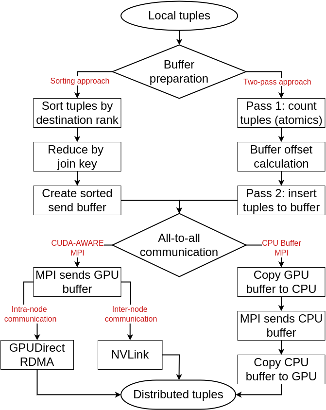

## MNMGDatalog

This repository hosts code for Datalog applications optimized for multi-node, multi-GPU environments:

- Transitive Closure (TC): [tc.cu](tc.cu)
- Same Generation (SG): [sg.cu](sg.cu)
- Weakly Connected Components (WCC): [wcc.cu](wcc.cu)
- Single join: [single_join.cu](single_join.cu)

Two buffer preparation strategies (sorting and two-pass based) and two all-to-all communication techniques (CUDA-Aware-MPI and traditional MPI) are supported:



### Requirements
- MPI
- GCC
- CUDA
- Python 3 (Optional for utility programs)

### System configuration

#### Local machine

- Processor: 13th Gen Intel® Core™ i9-13900HK × 20
- Memory: 32.0 GiB
- OS: Ubuntu 24.04.2 LTS
- GCC: gcc (Ubuntu 13.3.0-6ubuntu2~24.04) 13.3.0
- MPI: Open MPI 4.1.6
- CUDA: 12.8

### Dataset

#### Transitive Closure (TC) datasets

| Dataset        | # Input   | # Iterations | # TC          | # TC / Iteration | Path                                   |
|----------------|-----------|--------------|---------------|------------------|----------------------------------------|
| com-dblp       | 1,049,866 | 31           | 1,911,754,892 | 61,670,160       | data/com-dblpungraph.bin               |
| vsp_finan      | 552,020   | 520          | 910,070,918   | 1,750,136        | data/vsp_finan512_scagr7-2c_rlfddd.bin |
| fe_ocean       | 409,593   | 247          | 1,669,750,513 | 6,760,526        | data/data_409593.bin                   |
| usroad         | 165,435   | 606          | 871,365,688   | 1,437,840        | data/data_165435.bin                   |
| p2p-Gnutella31 | 147,892   | 31           | 884,179,859   | 28,522,576       | data/data_147892.bin                   |
| TG.cedge       | 23,874    | 58           | 481,121       | 8,295            | data/data_23874.bin                    |
| OL.cedge       | 7,035     | 64           | 146,120       | 2,283            | data/data_7035.bin                     |
| Small          | 10        | 3            | 18            | 6                | data/data_10.bin                       |
| Extra small    | 5         | 3            | 9             | 3                | data/hipc_2019.bin                     |

#### Same Generation (SG) datasets

| Dataset        | # Input | # Iterations | # SG          | # SG / Iteration | Path                                   |
|----------------|---------|--------------|---------------|------------------|----------------------------------------|
| vsp_finan      | 552,020 | 513          | 864,761,518   | 1,685,748        | data/vsp_finan512_scagr7-2c_rlfddd.bin |
| fe_ocean       | 409,593 | 77           | 65,941,441    | 856,380          | data/data_409593.bin                   |
| usroad         | 165,435 | 588          | 3,137,407,481 | 5,335,060        | data/data_165435.bin                   |
| fe_body        | 163,734 | 40           | 408,443,204   | 10,211,080       | data/data_163734.bin                   |
| p2p-Gnutella31 | 147,892 | 20           | 3,700,737,910 | 185,036,895      | data/data_147892.bin                   |
| OL.cedge       | 7,035   | 56           | 285,431       | 5,096            | data/data_7035.bin                     |
| Small          | 10      | 2            | 11            | 5.5              | data/data_10.bin                       |
| Extra small    | 5       | 3            | 4             | 1.33             | data/hipc_2019.bin                     |

#### Weakly Connected Component (CC) datasets

| Dataset                                                                                                   | # Input       | # Iterations | # CC (# Nodes in largest WCC) | Path                  |
|-----------------------------------------------------------------------------------------------------------|---------------|--------------|-------------------------------|-----------------------|
| [web-BerkStan](https://snap.stanford.edu/data/web-BerkStan.html)                                          | 7,600,595     | 415          | 1,062 (654,782)               | data/web-BerkStan.bin |
| [roadNet-CA](https://snap.stanford.edu/data/roadNet-CA.html)                                              | 5,533,214     | 556          | 2,638 (1,957,027)             | data/roadNet-CA.bin   |
| [WikiTalk](https://snap.stanford.edu/data/wiki-Talk.html)                                                 | 5,021,410     | 9            | 2,555 (2,388,953)             | data/WikiTalk.bin     |
| [loc-Brightkite](https://snap.stanford.edu/data/loc-Brightkite.html)                                      | 214,078       | 12           | 547 (56,739)                  | data/data_214078.bin  |
| [as-skitter](https://snap.stanford.edu/data/as-Skitter.html)                                              | 11,095,298    | 23           | 756 (1,694,616)               | data/as-skitter.bin   |
| [webbase-2001](https://sparse.tamu.edu/LAW/webbase-2001)                                                  | 1,019,903,190 | x            | x                             | data/webbase-2001.bin      |
| [arabic-2005](https://sparse.tamu.edu/LAW/arabic-2005)                                                    | 639,999,458   | x            | x                             | data/arabic-2005.bin      |
| [com-Orkut](https://sparse.tamu.edu/SNAP/com-Orkut) [snap](https://snap.stanford.edu/data/com-Orkut.html) | 117,185,083   | x            | x                             | data/com-Orkut.bin      |
| [stokes](https://sparse.tamu.edu/VLSI/stokes)                                                             | 349,321,980   | x            | x                             | data/stokes.bin      |
| [uk-2002](https://sparse.tamu.edu/VLSI/uk-2002)                                                           | 298,113,762   | x            | x                             | data/uk-2002.bin      |
| [twitter_rv](https://github.com/ANLAB-KAIST/traces/releases/tag/twitter_rv.net)                           | x             | x            | x                             | data/twitter_rv.bin      |


#### Additional datasets

| Dataset    | # Input     | # Iterations | # SG | # SG / Iteration | Path                                |
|------------|-------------|--------------|------|------------------|-------------------------------------|
| ego-Facebook | 88,234      | x            | x    | x                | data/data_88234.bin                 |
| CA-HepTh   | 51,971      | x            | x    | x                | data/data_51971.bin                 |
| fe_sphere  | 49,152      | x            | x    | x                | data/data_49152.bin                 |
| SF.cedge   | 223,001     | x            | x    | x                | data/data_223001.bin                |
| loc-Brightkite | 214,078     | x            | x    | x                | data/data_214078.bin                |
| [wiki-topcats](https://sparse.tamu.edu/SNAP/wiki-topcats) | 28,511,807  | x            | x    | x                | data/large_datasets/wiki-topcats.bin |
| [wb-edu](https://sparse.tamu.edu/Gleich/wb-edu) | 57,156,537  | x            | x    | x                | data/large_datasets/wb-edu.bin |
| [ML_Geer](https://sparse.tamu.edu/Janna/ML_Geer) | 110,879,972 | x            | x    | x                | data/large_datasets/ML_Geer.bin |


### Local run instructions

- Command like arguments for TC, SG, WCC:
    - `NPROCS=<n>` to set the number of processes
    - `DATA_FILE=<BINARY DATA FILE>` to set the binary datafile path
    - `CUDA_AWARE_MPI=<0/1>` to use CUDA AWARE MPI. Set it to `1` if system supports CUDA AWARE MPI, otherwise `0`.
    - `METHOD=<0/1>` to use two pass approach (0) or sorting technique (1) for buffer preparation of all to all communication.

#### Transitive Closure (TC)

- Run the `tc.cu` program to generate transitive closure for a given data file.

```shell
# METHOD 0 = two pass method, 1 = sorting method
make runtc DATA_FILE=data/data_7035.bin NPROCS=3 CUDA_AWARE_MPI=0 METHOD=0
nvcc tc.cu -o tc.out -I/usr/lib/x86_64-linux-gnu/openmpi -I/usr/lib/x86_64-linux-gnu/openmpi/include -L/usr/lib/x86_64-linux-gnu/openmpi/lib -lmpi -lm -O3 --extended-lambda
mpirun -np 3 ./tc.out data/data_7035.bin 0 0
Rank 2 wrote local tuples on file: data/data_7035.bin_tc.bin
Rank 0 wrote local tuples on file: data/data_7035.bin_tc.bin
Rank 1 wrote local tuples on file: data/data_7035.bin_tc.bin
# Input,# Process,# Iterations,# TC,Total Time,Join,Buffer preparation,Communication,Deduplication,Merge,Initialization,Hashtable,Finalization,Clear,File I/O
7035,3,64,146120,0.1524,0.0513,0.0189,0.0131,0.0169,0.0428,0.0002,0.0001,0.0002,0.0088,0.0034
```

It generated `data/data_7035.bin_tc.bin` file that contains all paths of the transitive closure for the input relation.

- Convert the generated binary to text file using `binary_file_utils.py`.

```shell
python3 binary_file_utils.py bin_to_txt data/data_7035.bin_tc.bin data/data_7035_tc.txt
```

#### Same Generation (SG)

- Run the `sg.cu` program to generate same generation graph for a given data file.

```shell
# METHOD 0 = two pass method, 1 = sorting method
make runsg DATA_FILE=data/data_7035.bin NPROCS=8 CUDA_AWARE_MPI=0 METHOD=0
nvcc sg.cu -o sg.out -I/usr/lib/x86_64-linux-gnu/openmpi -I/usr/lib/x86_64-linux-gnu/openmpi/include -L/usr/lib/x86_64-linux-gnu/openmpi/lib -lmpi -lm -O3 --extended-lambda
mpirun -np 8 ./sg.out data/data_7035.bin 0 0
Rank 1 wrote local tuples on file: data/data_7035.bin_sg.bin
Rank 2 wrote local tuples on file: data/data_7035.bin_sg.bin
# Input,# Process,# Iterations,# TC,Total Time,Join,Buffer preparation,Communication,Deduplication,Merge,Initialization,Hashtable,Finalization,Clear,File I/O
7035,8,56,285431,0.4885,0.1996,0.0649,0.0557,0.0605,0.0839,0.0005,0.0005,0.0000,0.0228,0.0097
Rank 3 wrote local tuples on file: data/data_7035.bin_sg.bin
Rank 4 wrote local tuples on file: data/data_7035.bin_sg.bin
Rank 5 wrote local tuples on file: data/data_7035.bin_sg.bin
Rank 6 wrote local tuples on file: data/data_7035.bin_sg.bin
Rank 7 wrote local tuples on file: data/data_7035.bin_sg.bin
Rank 0 wrote local tuples on file: data/data_7035.bin_sg.bin
```

It generated `data/data_7035.bin_sg.bin` file that contains all paths of the transitive closure for the input relation.

- Convert the generated binary to text file using `binary_file_utils.py`.

```shell
python3 binary_file_utils.py bin_to_txt data/data_7035.bin_sg.bin data/data_7035_sg.txt
```

#### Weakly Connected Component (WCC)

- Run the `wcc.cu` program to generate connected components for a given data file.

```shell
# Using two pass method for communication
make runwcc DATA_FILE=data/dummy.bin NPROCS=8 CUDA_AWARE_MPI=0 METHOD=0 
nvcc wcc.cu -o cc.out -I/usr/lib/x86_64-linux-gnu/openmpi -I/usr/lib/x86_64-linux-gnu/openmpi/include -L/usr/lib/x86_64-linux-gnu/openmpi/lib -lmpi -lm -O3 --extended-lambda
mpirun -np 8 ./cc.out data/dummy.bin 0 0
| # Input | # Process | # Iterations | # CC (# Largest WCC) | Total Time | Initialization | File I/O | Hashtable | Join | Buffer preparation | Communication | Deduplication | Merge | Finalization | Output |
| --- | --- | --- | --- | --- | --- | --- | --- | --- | --- | --- | --- | --- | --- | --- |
| 6 | 8 | 4 | 3 (3) |   0.0478 |   0.0014 |   0.0373 |   0.0007 |   0.0060 |   0.0087 |   0.0074 |   0.0143 |   0.0075 |   0.0017 | data/dummy.bin_cc.bin |

```

It generated `data/dummy.bin_cc.bin` file that contains all paths of the transitive closure for the input relation.

- Convert the generated binary to text file using `binary_file_utils.py`.

```shell
python3 binary_file_utils.py bin_to_txt data/dummy.bin_cc.bin data/dummy_cc.txt
```

#### Single Join

- Run the `single_join.cu` program to generate single join on a synthetic dataset.

```shell
# DATA_FILE>10M, strong scaling, otherwise weak scaling
# Strong scaling
make runsinglejoin DATA_FILE=10000001 NPROCS=4 CUDA_AWARE_MPI=0 METHOD=0 RAND_RANGE=1000000
# Weak scaling
make runsinglejoin DATA_FILE=10000 NPROCS=4 CUDA_AWARE_MPI=0 METHOD=0 RAND_RANGE=1000000
```


### Run on Polaris (interactive node)
```shell
ssh arsho@polaris.alcf.anl.gov
qsub -I -l select=1 -l filesystems=home:eagle -l walltime=1:00:00 -q debug -A dist_relational_alg
cd /eagle/dist_relational_alg/arsho/mnmgJOIN
chmod +x set_affinity_gpu_polaris.sh
## Traditional MPI
CC tc.cu -o tc_interactive.out -O3
CC sg.cu -o sg_interactive.out -O3
CC wcc.cu -o wcc_interactive.out -O3
CC single_join.cu -o single_join_interactive.out -O3

# Example Traditional MPI, Sorting-based buffer preparation, with JOB run:
# Last three parameters are: CUDA-Aware-MPI (0/1), Buffer preparation (0: two pass, 1: sorting), Job run (0, 1)
mpiexec --np 4 --ppn 1 --depth=1 --cpu-bind depth ./set_affinity_gpu_polaris.sh ./tc_interactive.out data/data_7035.bin 0 1 1

# CUDA-Aware-MPI
module load craype-accel-nvidia80
export MPICH_GPU_SUPPORT_ENABLED=1
CC tc.cu -o tc_interactive.out -O3
CC sg.cu -o sg_interactive.out -O3
CC wcc.cu -o wcc_interactive.out -O3
CC single_join.cu -o single_join_interactive.out -O3
mpiexec --np 4 --ppn 1 --depth=1 --cpu-bind depth ./set_affinity_gpu_polaris.sh ./tc_interactive.out data/data_7035.bin 1 1 1
```

### Run on Polaris (Job script)
```shell
ssh arsho@polaris.alcf.anl.gov
cd /eagle/dist_relational_alg/arsho/mnmgJOIN
chmod +x set_affinity_gpu_polaris.sh
qsub small-merged-job.sh
qsub single-join-small-job.sh
```


## Run using Docker (`CUDA_AWARE_MPI` = 1)

```shell
docker build -t mnmgjoindocker .
docker run --rm --entrypoint=bash -it --gpus all -v $(pwd):/opt/mnmgjoin mnmgjoindocker

# TC
mnmgjoin@afe1ab5e7adc:/opt/mnmgjoin$ /opt/nvidia/hpc_sdk/Linux_x86_64/24.1/comm_libs/hpcx/bin/mpicxx tc.cu -o tc.out -O3
## Two pass method
mnmgjoin@afe1ab5e7adc:/opt/mnmgjoin$ /opt/nvidia/hpc_sdk/Linux_x86_64/24.1/comm_libs/hpcx/bin/mpirun -np 4 ./tc.out data/data_23874.bin 1 0 1
## Sort method
mnmgjoin@afe1ab5e7adc:/opt/mnmgjoin$ /opt/nvidia/hpc_sdk/Linux_x86_64/24.1/comm_libs/hpcx/bin/mpirun -np 4 ./tc.out data/data_23874.bin 1 1 1

# SG
mnmgjoin@afe1ab5e7adc:/opt/mnmgjoin$ /opt/nvidia/hpc_sdk/Linux_x86_64/24.1/comm_libs/hpcx/bin/mpicxx sg.cu -o sg.out -O3
## Two pass method
mnmgjoin@afe1ab5e7adc:/opt/mnmgjoin$ /opt/nvidia/hpc_sdk/Linux_x86_64/24.1/comm_libs/hpcx/bin/mpirun -np 4 ./sg.out data/data_7035.bin 1 0 1
## Sort method
mnmgjoin@afe1ab5e7adc:/opt/mnmgjoin$ /opt/nvidia/hpc_sdk/Linux_x86_64/24.1/comm_libs/hpcx/bin/mpirun -np 4 ./sg.out data/data_7035.bin 1 1 1

# WCC
mnmgjoin@afe1ab5e7adc:/opt/mnmgjoin$ /opt/nvidia/hpc_sdk/Linux_x86_64/24.1/comm_libs/hpcx/bin/mpicxx wcc.cu -o cc.out -O3
## Two pass method
mnmgjoin@afe1ab5e7adc:/opt/mnmgjoin$ /opt/nvidia/hpc_sdk/Linux_x86_64/24.1/comm_libs/hpcx/bin/mpirun -np 4 ./cc.out data/dummy.bin 1 0 1
/opt/nvidia/hpc_sdk/Linux_x86_64/24.1/comm_libs/hpcx/bin/mpirun -np 8 ./cc.out data/roadNet-CA.bin 1 0 1
## Sort method
mnmgjoin@afe1ab5e7adc:/opt/mnmgjoin$ /opt/nvidia/hpc_sdk/Linux_x86_64/24.1/comm_libs/hpcx/bin/mpirun -np 4 ./cc.out data/dummy.bin 1 1
```

## Utility Programs

### Dataset Utility Program

When using `MPI_File_read_at` and `MPI_File_write_at` at offset in MPI programs, this utility program becomes essential
because these MPI functions operate directly on binary files. `MPI_File_read_at` reads binary data from a specified
offset, and `MPI_File_write_at` writes binary data to a specified offset.
The utility program provides the necessary functionality to convert between text and binary formats.
The utility program supports two main operations: converting text to binary (`txt_to_bin`) and converting binary to
text (`bin_to_txt`).

- To convert text to binary:

```shell
python3 binary_file_utils.py txt_to_bin input_text_file output_binary_file
# python3 binary_file_utils.py txt_to_bin data/data_23874.txt data/data_23874.bin
```

- To convert binary to text:

```shell
python3 binary_file_utils.py bin_to_txt input_binary_file output_text_file
# python3 binary_file_utils.py bin_to_txt data/data_23874.bin_tc.bin data/data_23874_tc.txt
```

### Chart Generation Utility Program

- To generate charts, create a virtual environment, install necessary packages, and use [
  `generate_graphs.py`](generate_graphs.py) program.

```shell
python3 -m venv venv
source venv/bin/activate
pip install -r requirements.txt
python generate_graphs.py
```

### Energy Consumption Utility Program
- Check the energy consumption of the applications:
```shell
python3 power.py tc_ol.csv mpirun -np 1 ./tc.out data/data_163734.bin 0 0 1
```
- On Polaris interactive node:
```shell

module use /soft/modulefiles
module load conda; conda activate base
export CUDA_VISIBLE_DEVICES=0
export MPICH_GPU_SUPPORT_ENABLED=0
python power.py sf.csv ./tc_interactive.out data/data_223001.bin 0 1 1
python power.py fe_body_sg.csv ./sg_interactive.out data/data_163734.bin 0 1 1
```


### References

- [Polaris User Guides](https://docs.alcf.anl.gov/polaris/getting-started/)
- [Polaris running jobs](https://docs.alcf.anl.gov/polaris/running-jobs/)
- [Polaris CUDA MPI job example](https://github.com/argonne-lcf/GettingStarted/tree/master/Examples/Polaris/affinity_gpu)
- [ALCF disk quota](https://docs.alcf.anl.gov/data-management/filesystem-and-storage/disk-quota/)
- [ALCF sbank Allocation Accounting System](https://docs.alcf.anl.gov/account-project-management/allocation-management/sbank-allocation-accounting-system/)
- [Stackoverflow answer for all gather vs all to all](https://stackoverflow.com/a/34113431/3129414)
- [Blog on MPI](https://www.codeproject.com/Articles/896437/A-Gentle-Introduction-to-the-Message-Passing-Inter)
- [MPI all to all](https://mpi.deino.net/mpi_functions/MPI_Alltoall.html)
- [Thrust: The C++ Parallel Algorithms Library](https://nvidia.github.io/cccl/thrust/)
- [Thrust reduce by key docs](https://nvidia.github.io/cccl/thrust/api/function_group__reductions_1ga561f079073556701066513f648f413d6.html)
- [SO question on CudaFree](https://stackoverflow.com/questions/13100615/cudafree-is-not-freeing-memory)
- [SO question on CudaMemset](https://stackoverflow.com/questions/62055890/does-cudamalloc-initialize-the-array-to-0)
- [NVHPC MPI docs](https://docs.nvidia.com/hpc-sdk//compilers/hpc-compilers-user-guide/index.html#mpi-use)