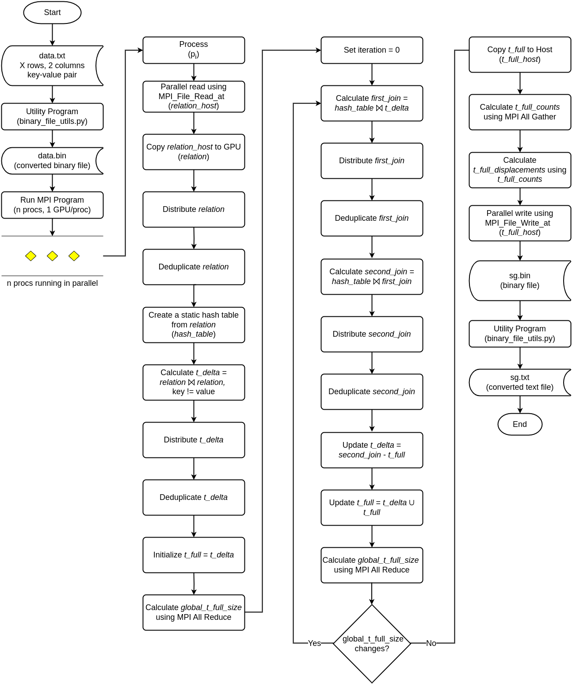
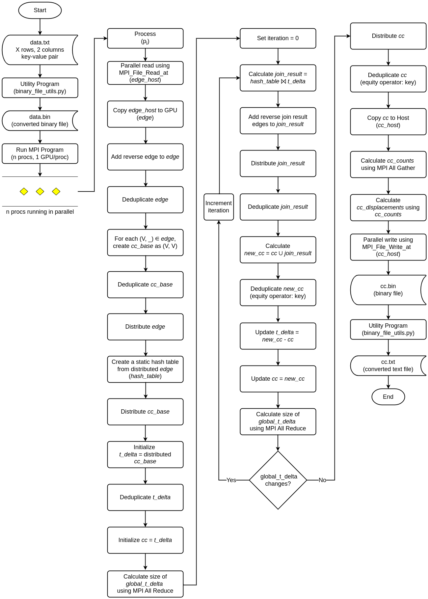
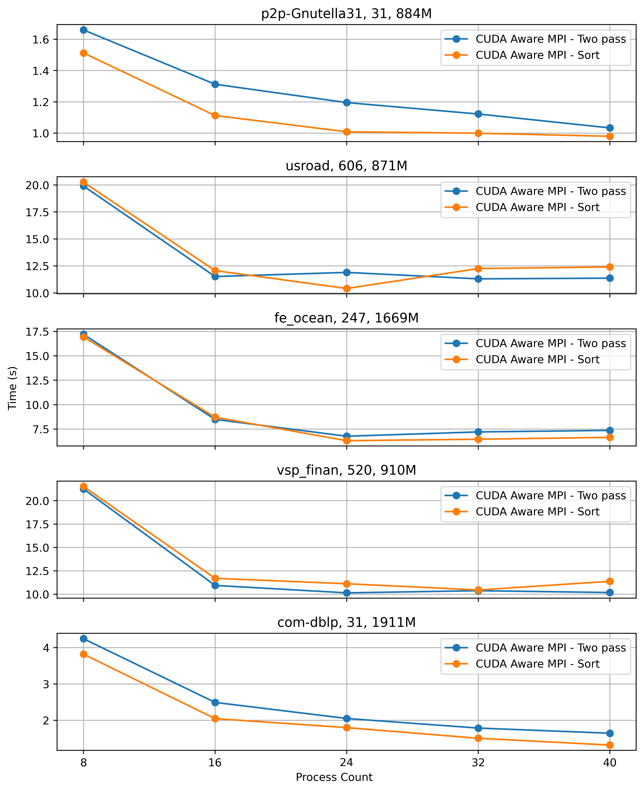
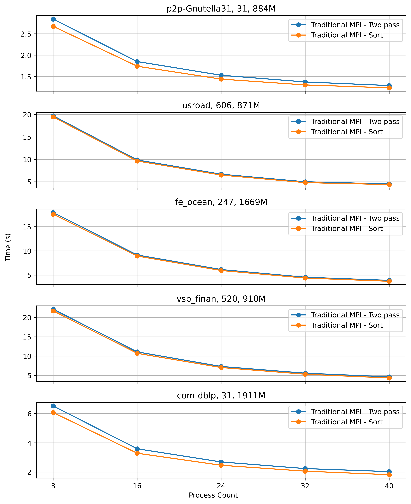
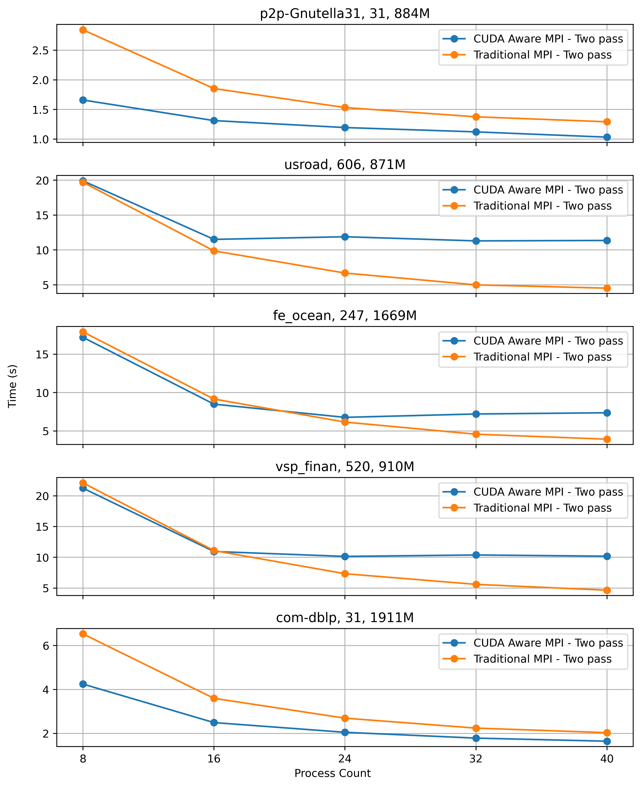
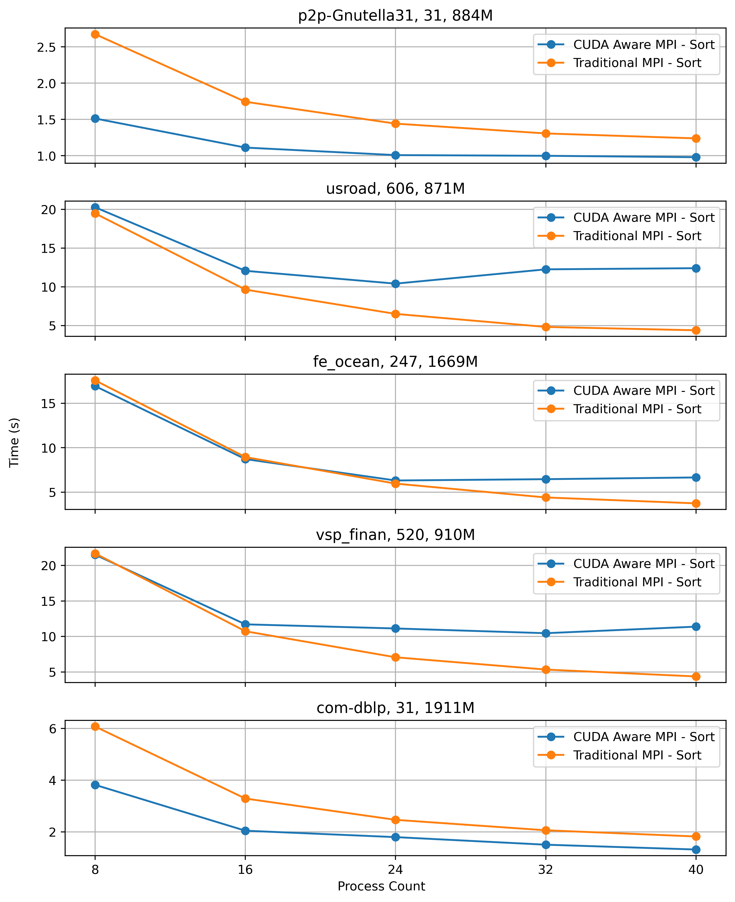
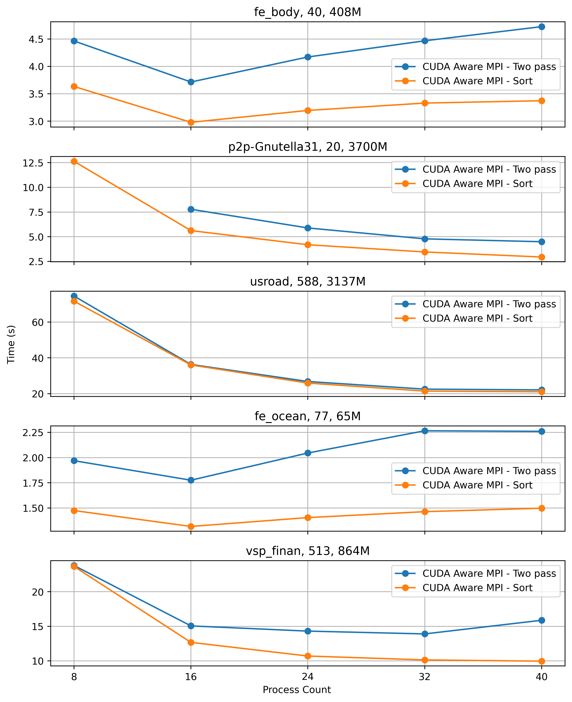
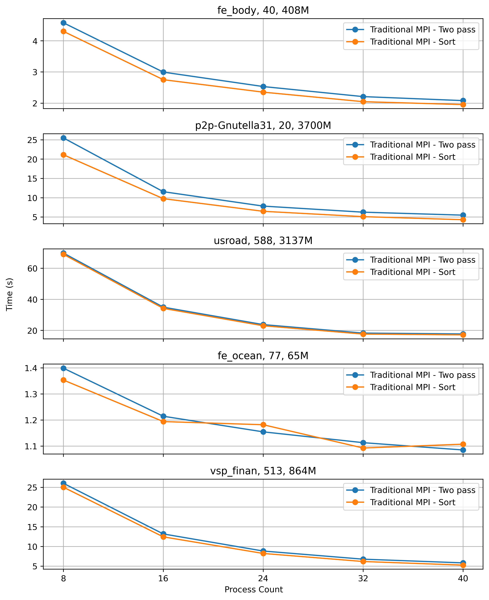
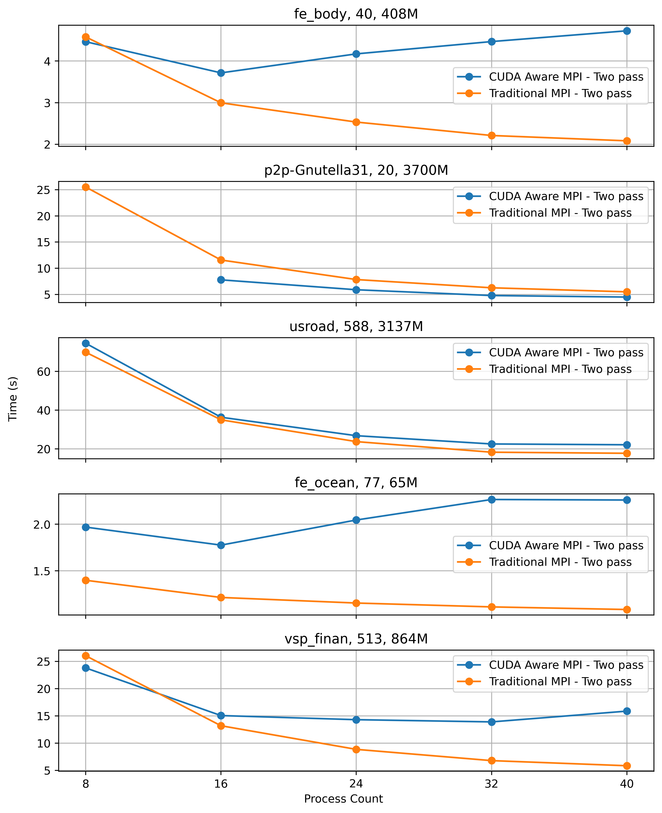
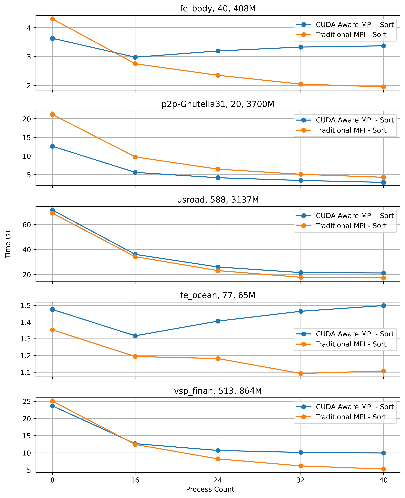

## Datalog Applications using CUDA and MPI

This repository hosts code for Datalog applications optimized for multi-node, multi-GPU environments:

- Transitive Closure (TC)
- Same Generation (SG)
- Connected Components (CC)

### Flowchart of Same Generation



### Flowchart of Connected Component



### Requirements

- `OpenMPI` package
- GCC
- Python 3 (for utility program)

### System configuration

#### Local machine

- Processor: 13th Gen Intel® Core™ i9-13900HK × 20
- Memory: 32.0 GiB
- OS: Ubuntu 22.04
- GCC: gcc (Ubuntu 11.4.0-1ubuntu1~22.04) 11.4.0
- MPI: Open MPI 4.1.2
- CUDA: 12.0

### Dataset

#### Transitive Closure (TC) datasets

| Dataset        | # Input   | # Iterations | # TC          | # TC / Iteration | Path                                   |
|----------------|-----------|--------------|---------------|------------------|----------------------------------------|
| com-dblp       | 1,049,866 | 31           | 1,911,754,892 | 61,670,160       | data/com-dblpungraph.bin               |
| vsp_finan      | 552,020   | 520          | 910,070,918   | 1,750,136        | data/vsp_finan512_scagr7-2c_rlfddd.bin |
| fe_ocean       | 409,593   | 247          | 1,669,750,513 | 6,760,526        | data/data_409593.bin                   |
| usroad         | 165,435   | 606          | 871,365,688   | 1,437,840        | data/data_165435.bin                   |
| p2p-Gnutella31 | 147,892   | 31           | 884,179,859   | 28,522,576       | data/data_147892.bin                   |
| TG.cedge       | 23,874    | 58           | 481,121       | 8,295            | data/data_23874.bin                    |
| OL.cedge       | 7,035     | 64           | 146,120       | 2,283            | data/data_7035.bin                     |
| Small          | 10        | 3            | 18            | 6                | data/data_10.bin                       |
| Extra small    | 5         | 3            | 9             | 3                | data/hipc_2019.bin                     |

#### Same Generation (SG) datasets

| Dataset        | # Input | # Iterations | # SG          | # SG / Iteration | Path                                   |
|----------------|---------|--------------|---------------|------------------|----------------------------------------|
| vsp_finan      | 552,020 | 513          | 864,761,518   | 1,685,748        | data/vsp_finan512_scagr7-2c_rlfddd.bin |
| fe_ocean       | 409,593 | 77           | 65,941,441    | 856,380          | data/data_409593.bin                   |
| usroad         | 165,435 | 588          | 3,137,407,481 | 5,335,060        | data/data_165435.bin                   |
| fe_body        | 163,734 | 40           | 408,443,204   | 10,211,080       | data/data_163734.bin                   |
| p2p-Gnutella31 | 147,892 | 20           | 3,700,737,910 | 185,036,895      | data/data_147892.bin                   |
| OL.cedge       | 7,035   | 56           | 285,431       | 5,096            | data/data_7035.bin                     |
| Small          | 10      | 2            | 11            | 5.5              | data/data_10.bin                       |
| Extra small    | 5       | 3            | 4             | 1.33             | data/hipc_2019.bin                     |

#### Weakly Connected Component (CC) datasets

| Dataset                                                                                                   | # Input       | # Iterations | # CC (# Nodes in largest WCC) | Path                  |
|-----------------------------------------------------------------------------------------------------------|---------------|--------------|-------------------------------|-----------------------|
| [web-BerkStan](https://snap.stanford.edu/data/web-BerkStan.html)                                          | 7,600,595     | 415          | 1,062 (654,782)               | data/web-BerkStan.bin |
| [roadNet-CA](https://snap.stanford.edu/data/roadNet-CA.html)                                              | 5,533,214     | 556          | 2,638 (1,957,027)             | data/roadNet-CA.bin   |
| [WikiTalk](https://snap.stanford.edu/data/wiki-Talk.html)                                                 | 5,021,410     | 9            | 2,555 (2,388,953)             | data/WikiTalk.bin     |
| [loc-Brightkite](https://snap.stanford.edu/data/loc-Brightkite.html)                                      | 214,078       | 12           | 547 (56,739)                  | data/data_214078.bin  |
| [as-skitter](https://snap.stanford.edu/data/as-Skitter.html)                                              | 11,095,298    | 23           | 756 (1,694,616)               | data/as-skitter.bin   |
| [webbase-2001](https://sparse.tamu.edu/LAW/webbase-2001)                                                  | 1,019,903,190 | x            | x                             | data/webbase-2001.bin      |
| [arabic-2005](https://sparse.tamu.edu/LAW/arabic-2005)                                                    | 639,999,458   | x            | x                             | data/arabic-2005.bin      |
| [com-Orkut](https://sparse.tamu.edu/SNAP/com-Orkut) [snap](https://snap.stanford.edu/data/com-Orkut.html) | 117,185,083   | x            | x                             | data/com-Orkut.bin      |
| [stokes](https://sparse.tamu.edu/VLSI/stokes)                                                             | 349,321,980   | x            | x                             | data/stokes.bin      |
| [uk-2002](https://sparse.tamu.edu/VLSI/uk-2002)                                                           | 298,113,762   | x            | x                             | data/uk-2002.bin      |
| [twitter_rv](https://github.com/ANLAB-KAIST/traces/releases/tag/twitter_rv.net)                           | x             | x            | x                             | data/twitter_rv.bin      |


#### Additional datasets

| Dataset    | # Input | # Iterations | # SG | # SG / Iteration | Path                 |
|------------|---------|--------------|------|------------------|----------------------|
| ego-Facebook | 88,234  | x            | x    | x                | data/data_88234.bin  |
| CA-HepTh   | 51,971  | x            | x    | x                | data/data_51971.bin  |
| fe_sphere  | 49,152  | x            | x    | x                | data/data_49152.bin  |
| SF.cedge   | 223,001 | x            | x    | x                | data/data_223001.bin |
| loc-Brightkite | 214,078 | x            | x    | x                | data/data_214078.bin |


## Utility Programs

### Dataset Utility Program

When using `MPI_File_read_at` and `MPI_File_write_at` at offset in MPI programs, this utility program becomes essential
because these MPI functions operate directly on binary files. `MPI_File_read_at` reads binary data from a specified
offset, and `MPI_File_write_at` writes binary data to a specified offset.
The utility program provides the necessary functionality to convert between text and binary formats.
The utility program supports two main operations: converting text to binary (`txt_to_bin`) and converting binary to
text (`bin_to_txt`).

- To convert text to binary:

```shell
python3 binary_file_utils.py txt_to_bin input_text_file output_binary_file
# python3 binary_file_utils.py txt_to_bin data/data_23874.txt data/data_23874.bin
```

- To convert binary to text:

```shell
python3 binary_file_utils.py bin_to_txt input_binary_file output_text_file
# python3 binary_file_utils.py bin_to_txt data/data_23874.bin_tc.bin data/data_23874_tc.txt
```

### Chart Generation Utility Program

- To parse Polaris results, use [`parse_results.py`](parse_results.py) program.
- To generate charts, create a virtual environment, install necessary packages, and use [
  `generate_graphs.py`](generate_graphs.py) program.

```shell
python3 -m venv venv
source venv/bin/activate
pip install -r requirements.txt
python generate_graphs.py
```

### Local run instructions

- Command like arguments:
    - `NPROCS=<n>` to set the number of processes
    - `DATA_FILE=<BINARY DATA FILE>` to set the binary datafile path
    - `CUDA_AWARE_MPI=<0/1>` to use CUDA AWARE MPI. Set it to `1` if system supports CUDA AWARE MPI, otherwise `0`.
    - `METHOD=<0/1>` to use two pass approach (0) or sorting technique (1) for all to all communication.

#### Transitive Closure (TC)

- Run the `tc.cu` program to generate transitive closure for a given data file.

```shell
# Using two pass method for communication
 make runtc DATA_FILE=data/data_23874.bin NPROCS=8 CUDA_AWARE_MPI=0 METHOD=0
nvcc tc.cu -o tc.out -I/usr/lib/x86_64-linux-gnu/openmpi -I/usr/lib/x86_64-linux-gnu/openmpi/include -L/usr/lib/x86_64-linux-gnu/openmpi/lib -lmpi -lm -O3 --extended-lambda
mpirun -np 8 ./tc.out data/data_23874.bin 0 0
| # Input | # Process | # Iterations | # TC | Total Time | Initialization | File I/O | Hashtable | Join | Buffer preparation | Communication | Deduplication | Merge | Finalization | Output |
| --- | --- | --- | --- | --- | --- | --- | --- | --- | --- | --- | --- | --- | --- | --- |
| 23,874 | 8 | 58 | 481,121 |   0.4023 |   0.0015 |   0.0332 |   0.0007 |   0.0877 |   0.0919 |   0.0267 |   0.0692 |   0.1207 |   0.0040 | data/data_23874.bin_tc.bin |

# Using sorting method for communication
make runtc DATA_FILE=data/data_23874.bin NPROCS=8 CUDA_AWARE_MPI=0 METHOD=1
nvcc tc.cu -o tc.out -I/usr/lib/x86_64-linux-gnu/openmpi -I/usr/lib/x86_64-linux-gnu/openmpi/include -L/usr/lib/x86_64-linux-gnu/openmpi/lib -lmpi -lm -O3 --extended-lambda
mpirun -np 8 ./tc.out data/data_23874.bin 0 1
| # Input | # Process | # Iterations | # TC | Total Time | Initialization | File I/O | Hashtable | Join | Buffer preparation | Communication | Deduplication | Merge | Finalization | Output |
| --- | --- | --- | --- | --- | --- | --- | --- | --- | --- | --- | --- | --- | --- | --- |
| 23,874 | 8 | 58 | 481,121 |   0.4971 |   0.0018 |   0.0433 |   0.0006 |   0.0827 |   0.2010 |   0.0274 |   0.0652 |   0.1147 |   0.0036 | data/data_23874.bin_tc.bin |

```

It generated `data/data_23874.bin_tc.bin` file that contains all paths of the transitive closure for the input relation.

- Convert the generated binary to text file using `binary_file_utils.py`.

```shell
python3 binary_file_utils.py bin_to_txt data/data_23874.bin_tc.bin data/data_23874_tc.txt
```
- Polaris 1 node interactive
```shell
3126113.polaris-pbs-01.hsn.cm.polaris.alcf.anl.gov
cd mnmgJOIN
chmod +x set_affinity_gpu_polaris.sh
module load craype-accel-nvidia80
export MPICH_GPU_SUPPORT_ENABLED=1
CC tc.cu -o tc_interactive.out -O3

#com-dblp - 14.30
mpiexec --np 1 --ppn 1 --depth=1 --cpu-bind depth ./set_affinity_gpu_polaris.sh ./tc_interactive.out data/com-dblpungraph.bin 1 1 1
| 1,049,866 | 1 | 31 | 1,911,754,892 |  20.1979 |   0.2017 |   0.0188 |   0.0002 |   1.3893 |   0.0000 |   0.0000 |   2.9334 |   1.4300 |  14.2434 | data/com-dblpungraph.bin_tc.bin |
terminate called after throwing an instance of 'thrust::system::detail::bad_alloc'
  what():  std::bad_alloc: cudaErrorMemoryAllocation: out of memory
x3006c0s19b1n0.hsn.cm.polaris.alcf.anl.gov: rank 0 died from signal 6 and dumped core
| 1,049,866 | 1 | 27 | 1,011,443,166 |   4.2598 |   0.2090 |   0.0058 |   0.0002 |   0.3042 |   0.0000 |   0.0000 |   1.6898 |   0.6828 |   1.3740 | data/com-dblpungraph.bin_tc.bin |
| 1,049,866 | 1 | 31 | 1,911,754,892 |  20.1021 |   0.2057 |   0.0063 |   0.0002 |   1.3897 |   0.0000 |   0.0000 |   2.9332 |   1.4511 |  14.1222 | data/com-dblpungraph.bin_tc.bin |
| 1,049,866 | 1 | 27 | 1,019,585,527 |   3.9884 |   0.2069 |   0.0167 |   0.0002 |   0.2611 |   0.0000 |   0.0000 |   1.3571 |   0.6271 |   1.5360 | data/com-dblpungraph.bin_tc.bin |
mpiexec --np 8 --ppn 4 ./set_affinity_gpu_polaris.sh ./tc_interactive.out data/com-dblpungraph.bin 1 1 1 

CC tc.cu -o tc_interactive.out -O3
arsho::x3104c0s1b1n0 { ~/mnmgJOIN }-> mpiexec --np 1 --ppn 1 --depth=1 --cpu-bind depth ./set_affinity_gpu_polaris.sh ./tc_interactive.out data/com-dblpungraph.bin 1 1 1
| 1,049,866 | 1 | 31 | 1,911,754,892 |  18.8999 |   0.2022 |   0.0191 |   0.0002 |   1.1083 |   0.0000 |   0.0000 |   2.3365 |   1.5259 |  13.7268 | data/com-dblpungraph.bin_tc.bin |
arsho::x3104c0s1b1n0 { ~/mnmgJOIN }-> mpiexec --np 2 --ppn 2 --depth=2 --cpu-bind depth ./set_affinity_gpu_polaris.sh ./tc_interactive.out data/com-dblpungraph.bin 1 1 1
| 1,049,866 | 2 | 31 | 1,911,754,892 |  13.6110 |   0.2039 |   0.0050 |   0.0002 |   0.2268 |   0.4538 |   7.8429 |   1.1555 |   1.7960 |   1.9319 | data/com-dblpungraph.bin_tc.bin |
arsho::x3104c0s1b1n0 { ~/mnmgJOIN }-> mpiexec --np 4 --ppn 4 --depth=4 --cpu-bind depth ./set_affinity_gpu_polaris.sh ./tc_interactive.out data/com-dblpungraph.bin 1 1 1
| 1,049,866 | 4 | 31 | 1,911,754,892 |   8.2607 |   0.5250 |   0.3803 |   0.0003 |   0.1284 |   0.1215 |   4.9298 |   0.5946 |   1.0587 |   0.9024 | data/com-dblpungraph.bin_tc.bin |
arsho::x3104c0s1b1n0 { ~/mnmgJOIN }-> mpiexec --np 8 --ppn 8 --depth=1 --cpu-bind depth ./set_affinity_gpu_polaris.sh ./tc_interactive.out data/com-dblpungraph.bin 1 1 1
| 1,049,866 | 8 | 31 | 1,911,754,892 |  11.4128 |   1.2253 |   0.0069 |   0.0005 |   0.1585 |   0.1310 |   6.7658 |   0.6399 |   0.5335 |   1.9584 | data/com-dblpungraph.bin_tc.bin |

arsho::x3006c0s1b1n0 { ~/mnmgJOIN }-> mpiexec --np 1 --ppn 1 --depth=1 --cpu-bind depth ./set_affinity_gpu_polaris.sh ./tc_interactive.out data/com-dblpungraph.bin 1 1 1
| 1,049,866 | 1 | 31 | 1,911,754,892 |  18.9352 |   0.2012 |   0.0058 |   0.0002 |   1.1120 |   0.0000 |   0.0000 |   2.3377 |   1.5288 |  13.7554 | data/com-dblpungraph.bin_tc.bin |
arsho::x3006c0s1b1n0 { ~/mnmgJOIN }-> mpiexec --np 2 --ppn 2 --depth=1 --cpu-bind depth ./set_affinity_gpu_polaris.sh ./tc_interactive.out data/com-dblpungraph.bin 1 1 1
| 1,049,866 | 2 | 31 | 1,911,754,892 |  12.9632 |   0.0352 |   0.4245 |   0.0002 |   0.2354 |   0.4494 |   7.9797 |   1.1617 |   1.1316 |   1.9700 | data/com-dblpungraph.bin_tc.bin |
arsho::x3006c0s1b1n0 { ~/mnmgJOIN }-> mpiexec --np 4 --ppn 4 --depth=1 --cpu-bind depth ./set_affinity_gpu_polaris.sh ./tc_interactive.out data/com-dblpungraph.bin 1 1 1
| 1,049,866 | 4 | 31 | 1,911,754,892 |   9.0869 |   0.5318 |   0.0038 |   0.0003 |   0.1241 |   0.1144 |   4.9327 |   0.5804 |   0.9790 |   1.8241 | data/com-dblpungraph.bin_tc.bin |
arsho::x3006c0s1b1n0 { ~/mnmgJOIN }-> mpiexec --np 8 --ppn 8 --depth=1 --cpu-bind depth ./set_affinity_gpu_polaris.sh ./tc_interactive.out data/com-dblpungraph.bin 1 1 1
| 1,049,866 | 8 | 31 | 1,911,754,892 |  11.3944 |   1.2386 |   0.0068 |   0.0009 |   0.1613 |   0.1485 |   6.7672 |   0.6464 |   0.5067 |   1.9248 | data/com-dblpungraph.bin_tc.bin |

CC tc.cu -o tc_interactive.out -O3
arsho::x3006c0s13b1n0 { ~/mnmgJOIN }-> mpiexec --np 1 --ppn 1 --depth=1 --cpu-bind depth ./set_affinity_gpu_polaris.sh ./tc_interactive.out data/com-dblpungraph.bin 0 1 1
RANK= 0 LOCAL_RANK= 0 gpu= 3
| 1,049,866 | 1 | 31 | 1,911,754,892 |  18.9947 |   0.2044 |   0.0060 |   0.0001 |   1.1145 |   0.0000 |   0.0000 |   2.3580 |   1.5343 |  13.7834 | data/com-dblpungraph.bin_tc.bin |
arsho::x3006c0s13b1n0 { ~/mnmgJOIN }-> mpiexec --np 2 --ppn 1 --depth=1 --cpu-bind depth ./set_affinity_gpu_polaris.sh ./tc_interactive.out data/com-dblpungraph.bin 0 1 1
RANK= 1 LOCAL_RANK= 0 gpu= 3
RANK= 0 LOCAL_RANK= 0 gpu= 3
| 1,049,866 | 2 | 31 | 1,911,754,892 |  12.4145 |   0.2119 |   0.0050 |   0.0001 |   0.2281 |   0.1673 |   8.5237 |   1.1540 |   0.8472 |   1.2821 | data/com-dblpungraph.bin_tc.bin |
arsho::x3006c0s13b1n0 { ~/mnmgJOIN }-> mpiexec --np 2 --ppn 2 --depth=1 --cpu-bind depth ./set_affinity_gpu_polaris.sh ./tc_interactive.out data/com-dblpungraph.bin 0 1 1
RANK= 0 LOCAL_RANK= 0 gpu= 3
RANK= 1 LOCAL_RANK= 1 gpu= 2
| 1,049,866 | 2 | 31 | 1,911,754,892 |  20.2785 |   0.3613 |   0.3385 |   0.0002 |   0.2340 |   0.1712 |  13.9818 |   1.1732 |   2.3627 |   1.9942 | data/com-dblpungraph.bin_tc.bin |
arsho::x3006c0s13b1n0 { ~/mnmgJOIN }-> mpiexec --np 4 --ppn 2 --depth=1 --cpu-bind depth ./set_affinity_gpu_polaris.sh ./tc_interactive.out data/com-dblpungraph.bin 0 1 1
RANK= 2 LOCAL_RANK= 0 gpu= 3
RANK= 0 LOCAL_RANK= 0 gpu= 3
RANK= 3 LOCAL_RANK= 1 gpu= 2
RANK= 1 LOCAL_RANK= 1 gpu= 2
| 1,049,866 | 4 | 31 | 1,911,754,892 |   9.2999 |   0.3588 |   0.0048 |   0.0002 |   0.1272 |   0.1014 |   6.5271 |   0.5847 |   0.7129 |   0.8876 | data/com-dblpungraph.bin_tc.bin |
arsho::x3006c0s13b1n0 { ~/mnmgJOIN }-> mpiexec --np 4 --ppn 4 --depth=1 --cpu-bind depth ./set_affinity_gpu_polaris.sh ./tc_interactive.out data/com-dblpungraph.bin 0 1 1
RANK= 1 LOCAL_RANK= 1 gpu= 2
RANK= 2 LOCAL_RANK= 2 gpu= 1
RANK= 3 LOCAL_RANK= 3 gpu= 0
RANK= 0 LOCAL_RANK= 0 gpu= 3
| 1,049,866 | 4 | 31 | 1,911,754,892 |  17.0297 |   0.6917 |   0.7700 |   0.0003 |   0.1337 |   0.1166 |  12.5810 |   0.6482 |   1.1038 |   1.7545 | data/com-dblpungraph.bin_tc.bin |
arsho::x3006c0s13b1n0 { ~/mnmgJOIN }-> mpiexec --np 8 --ppn 4 --depth=1 --cpu-bind depth ./set_affinity_gpu_polaris.sh ./tc_interactive.out data/com-dblpungraph.bin 0 1 1
RANK= 6 LOCAL_RANK= 2 gpu= 1
RANK= 4 LOCAL_RANK= 0 gpu= 3
RANK= 7 LOCAL_RANK= 3 gpu= 0
RANK= 3 LOCAL_RANK= 3 gpu= 0
RANK= 0 LOCAL_RANK= 0 gpu= 3
RANK= 5 LOCAL_RANK= 1 gpu= 2
RANK= 1 LOCAL_RANK= 1 gpu= 2
RANK= 2 LOCAL_RANK= 2 gpu= 1
| 1,049,866 | 8 | 31 | 1,911,754,892 |   8.6747 |   0.6892 |   0.0045 |   0.0003 |   0.0747 |   0.0618 |   6.3112 |   0.2970 |   0.3286 |   0.9119 | data/com-dblpungraph.bin_tc.bin |


#fe_ocean - 23.36
mpiexec --np 1 --ppn 1 --depth=1 --cpu-bind depth ./set_affinity_gpu_polaris.sh ./tc_interactive.out data/data_409593.bin 1 1 1
| 409,593 | 1 | 247 | 1,669,750,513 |  21.8135 |   0.2091 |   0.0127 |   0.0001 |   0.3486 |   0.0000 |   0.0000 |   2.1447 |   8.5031 |  10.6078 | data/data_409593.bin_tc.bin |
| 409,593 | 1 | 247 | 1,669,750,513 |  21.9415 |   0.2000 |   0.0108 |   0.0001 |   0.3286 |   0.0000 |   0.0000 |   2.1519 |   8.5073 |  10.7537 | data/data_409593.bin_tc.bin |
| 409,593 | 1 | 247 | 1,669,750,513 |  20.2177 |   0.2073 |   0.0105 |   0.0001 |   0.2899 |   0.0000 |   0.0000 |   1.7266 |   7.7905 |  10.2033 | data/data_409593.bin_tc.bin |
mpiexec --np 1 --ppn 1 --depth=1 --cpu-bind depth ./set_affinity_gpu_polaris.sh ./tc_interactive.out data/data_409593.bin 1 1 1
mpiexec --np 2 --ppn 2 --depth=2 --cpu-bind depth ./set_affinity_gpu_polaris.sh ./tc_interactive.out data/data_409593.bin 1 1 1
mpiexec --np 4 --ppn 4 --depth=4 --cpu-bind depth ./set_affinity_gpu_polaris.sh ./tc_interactive.out data/data_409593.bin 1 1 1
mpiexec --np 8 --ppn 4 --depth=4 --cpu-bind depth ./set_affinity_gpu_polaris.sh ./tc_interactive.out data/data_409593.bin 1 1 1


#vsp_finan - 21.91
mpiexec --np 1 --ppn 1 --depth=1 --cpu-bind depth ./set_affinity_gpu_polaris.sh ./tc_interactive.out data/vsp_finan512_scagr7-2c_rlfddd.bin 1 1 1
| 552,020 | 1 | 520 | 910,070,918 |  14.2646 |   0.2021 |   0.0131 |   0.0001 |   0.4662 |   0.0000 |   0.0000 |   1.2426 |  11.1180 |   1.2356 | data/vsp_finan512_scagr7-2c_rlfddd.bin_tc.bin |
| 552,020 | 1 | 520 | 910,070,918 |  14.2217 |   0.2000 |   0.0111 |   0.0001 |   0.4312 |   0.0000 |   0.0000 |   1.2365 |  11.1372 |   1.2167 | data/vsp_finan512_scagr7-2c_rlfddd.bin_tc.bin |


#Gnutella31 - 5.58
mpiexec --np 1 --ppn 1 --depth=1 --cpu-bind depth ./set_affinity_gpu_polaris.sh ./tc_interactive.out data/data_147892.bin 1 1 1
| 147,892 | 1 | 31 | 884,179,859 |   3.2809 |   0.2048 |   0.0073 |   0.0001 |   0.2065 |   0.0000 |   0.0000 |   1.0148 |   0.6502 |   1.2045 | data/data_147892.bin_tc.bin |
terminate called after throwing an instance of 'thrust::system::detail::bad_alloc'
  what():  std::bad_alloc: cudaErrorMemoryAllocation: out of memory
x3006c0s19b1n0.hsn.cm.polaris.alcf.anl.gov: rank 0 died from signal 6 and dumped core
| 147,892 | 1 | 31 | 884,179,859 |   3.2601 |   0.2001 |   0.0025 |   0.0001 |   0.1947 |   0.0000 |   0.0000 |   1.0087 |   0.6427 |   1.2138 | data/data_147892.bin_tc.bin |

#fe body - 3.76
mpiexec --np 1 --ppn 1 --depth=1 --cpu-bind depth ./set_affinity_gpu_polaris.sh ./tc_interactive.out data/data_163734.bin 1 1 1
| 163,734 | 1 | 188 | 156,120,489 |   1.4591 |   0.1998 |   0.0066 |   0.0001 |   0.0935 |   0.0000 |   0.0000 |   0.3116 |   0.6891 |   0.1650 | data/data_163734.bin_tc.bin |
| 163,734 | 1 | 188 | 156,120,489 |   1.6100 |   0.2050 |   0.0026 |   0.0001 |   0.0777 |   0.0000 |   0.0000 |   0.2996 |   0.6849 |   0.3426 | data/data_163734.bin_tc.bin |

#SF.cedge - 1.63
mpiexec --np 1 --ppn 1 --depth=1 --cpu-bind depth ./set_affinity_gpu_polaris.sh ./tc_interactive.out data/data_223001.bin 1 1 1
| 223,001 | 1 | 287 | 80,498,014 |   1.0177 |   0.2050 |   0.0094 |   0.0001 |   0.0846 |   0.0000 |   0.0000 |   0.1312 |   0.5108 |   0.0860 | data/data_223001.bin_tc.bin |
| 223,001 | 1 | 287 | 80,498,014 |   1.0105 |   0.2019 |   0.0031 |   0.0001 |   0.0801 |   0.0000 |   0.0000 |   0.1311 |   0.5114 |   0.0860 | data/data_223001.bin_tc.bin |


```
#### Same Generation (SG)

- Run the `sg.cu` program to generate same generation graph for a given data file.

```shell
# Using two pass method for communication
make runsg DATA_FILE=data/data_7035.bin NPROCS=8 CUDA_AWARE_MPI=0 METHOD=0
nvcc sg.cu -o sg.out -I/usr/lib/x86_64-linux-gnu/openmpi -I/usr/lib/x86_64-linux-gnu/openmpi/include -L/usr/lib/x86_64-linux-gnu/openmpi/lib -lmpi -lm -O3 --extended-lambda
mpirun -np 8 ./sg.out data/data_7035.bin 0 0
| # Input | # Process | # Iterations | # SG | Total Time | Initialization | File I/O | Hashtable | Join | Buffer preparation | Communication | Deduplication | Merge | Finalization | Output |
| --- | --- | --- | --- | --- | --- | --- | --- | --- | --- | --- | --- | --- | --- | --- |
| 7,035 | 8 | 56 | 285,431 |   0.5489 |   0.0031 |   0.0635 |   0.0007 |   0.1703 |   0.1664 |   0.0504 |   0.0645 |   0.0922 |   0.0013 | data/data_7035.bin_sg.bin |


# Using sorting method for communication
make runsg DATA_FILE=data/data_7035.bin NPROCS=8 CUDA_AWARE_MPI=0 METHOD=1
nvcc sg.cu -o sg.out -I/usr/lib/x86_64-linux-gnu/openmpi -I/usr/lib/x86_64-linux-gnu/openmpi/include -L/usr/lib/x86_64-linux-gnu/openmpi/lib -lmpi -lm -O3 --extended-lambda
mpirun -np 8 ./sg.out data/data_7035.bin 0 1
| # Input | # Process | # Iterations | # SG | Total Time | Initialization | File I/O | Hashtable | Join | Buffer preparation | Communication | Deduplication | Merge | Finalization | Output |
| --- | --- | --- | --- | --- | --- | --- | --- | --- | --- | --- | --- | --- | --- | --- |
| 7,035 | 8 | 56 | 285,431 |   0.7463 |   0.0024 |   0.0510 |   0.0007 |   0.1615 |   0.3778 |   0.0509 |   0.0615 |   0.0903 |   0.0012 | data/data_7035.bin_sg.bin |
```

It generated `data/data_7035.bin_sg.bin` file that contains all paths of the transitive closure for the input relation.

- Convert the generated binary to text file using `binary_file_utils.py`.

```shell
python3 binary_file_utils.py bin_to_txt data/data_7035.bin_sg.bin data/data_7035_sg.txt
```

- Polaris 2 nodes interactive
```shell
cd mnmgJOIN
chmod +x set_affinity_gpu_polaris.sh
module load craype-accel-nvidia80
export MPICH_GPU_SUPPORT_ENABLED=1
CC sg.cu -o sg_interactive.out -O3

#fe body - 5.05
mpiexec --np 1 --ppn 1 --depth=1 --cpu-bind depth ./set_affinity_gpu_polaris.sh ./sg_interactive.out data/data_163734.bin 1 1 1
| 163,734 | 1 | 125 | 408,443,204 |   5.5708 |   0.2013 |   0.0084 |   0.0001 |   0.2675 |   0.0000 |   0.0000 |   1.6325 |   2.9163 |   0.5532 | data/data_163734.bin_sg.bin |
| 163,734 | 1 | 125 | 408,443,204 |   5.6140 |   0.2017 |   0.0026 |   0.0001 |   0.2816 |   0.0000 |   0.0000 |   1.6384 |   2.9219 |   0.5703 | data/data_163734.bin_sg.bin |
| 163,734 | 1 | 125 | 408,443,204 |   6.6550 |   0.2038 |   0.0075 |   0.0001 |   0.3069 |   0.0000 |   0.0000 |   2.0244 |   3.5404 |   0.5794 | data/data_163734.bin_sg.bin |

#loc-Brightkite - 3.42
mpiexec --np 1 --ppn 1 --depth=1 --cpu-bind depth ./set_affinity_gpu_polaris.sh ./sg_interactive.out data/data_214078.bin 1 1 1
| 214,078 | 1 | 18 | 92,398,050 |   1.8324 |   0.2029 |   0.0083 |   0.0001 |   0.2452 |   0.0000 |   0.0000 |   1.2248 |   0.0542 |   0.1052 | data/data_214078.bin_sg.bin |
| 214,078 | 1 | 18 | 92,398,050 |   1.8317 |   0.2046 |   0.0030 |   0.0001 |   0.2443 |   0.0000 |   0.0000 |   1.2238 |   0.0544 |   0.1044 | data/data_214078.bin_sg.bin |
| 214,078 | 1 | 18 | 92,398,050 |   2.1486 |   0.2007 |   0.0077 |   0.0001 |   0.2847 |   0.0000 |   0.0000 |   1.4990 |   0.0602 |   0.1039 | data/data_214078.bin_sg.bin |

#fe_sphere - 2.36
mpiexec --np 1 --ppn 1 --depth=1 --cpu-bind depth ./set_affinity_gpu_polaris.sh ./sg_interactive.out data/data_49152.bin 1 1 1
| 49,152 | 1 | 127 | 205,814,096 |   1.8048 |   0.2022 |   0.0056 |   0.0001 |   0.1425 |   0.0000 |   0.0000 |   0.7244 |   0.5023 |   0.2333 | data/data_49152.bin_sg.bin |
| 49,152 | 1 | 127 | 205,814,096 |   1.7949 |   0.2005 |   0.0020 |   0.0001 |   0.1422 |   0.0000 |   0.0000 |   0.7216 |   0.5019 |   0.2286 | data/data_49152.bin_sg.bin |
| 49,152 | 1 | 127 | 205,814,096 |   2.0049 |   0.2010 |   0.0054 |   0.0001 |   0.1564 |   0.0000 |   0.0000 |   0.8721 |   0.5534 |   0.2219 | data/data_49152.bin_sg.bin |

#SF.cedge - 5.54
mpiexec --np 1 --ppn 1 --depth=1 --cpu-bind depth ./set_affinity_gpu_polaris.sh ./sg_interactive.out data/data_223001.bin 1 1 1
| 223,001 | 1 | 269 | 382,418,182 |   6.1150 |   0.2040 |   0.0089 |   0.0001 |   0.2055 |   0.0000 |   0.0000 |   0.5715 |   4.6278 |   0.5062 | data/data_223001.bin_sg.bin |
| 223,001 | 1 | 269 | 382,418,182 |   6.1083 |   0.2022 |   0.0031 |   0.0001 |   0.2158 |   0.0000 |   0.0000 |   0.5597 |   4.6178 |   0.5127 | data/data_223001.bin_sg.bin |
| 223,001 | 1 | 269 | 382,418,182 |   7.5101 |   0.2011 |   0.0030 |   0.0001 |   0.2115 |   0.0000 |   0.0000 |   0.6655 |   5.9154 |   0.5165 | data/data_223001.bin_sg.bin |


#CA-HepTh - 2.79
mpiexec --np 1 --ppn 1 --depth=1 --cpu-bind depth ./set_affinity_gpu_polaris.sh ./sg_interactive.out data/data_51971.bin 1 1 1
| 51,971 | 1 | 9 | 74,618,689 |   0.8156 |   0.2028 |   0.0056 |   0.0001 |   0.0789 |   0.0000 |   0.0000 |   0.4295 |   0.0215 |   0.0828 | data/data_51971.bin_sg.bin |
| 51,971 | 1 | 9 | 74,618,689 |   0.8158 |   0.2020 |   0.0019 |   0.0001 |   0.0787 |   0.0000 |   0.0000 |   0.4294 |   0.0214 |   0.0842 | data/data_51971.bin_sg.bin |
| 51,971 | 1 | 9 | 74,618,689 |   0.9230 |   0.2005 |   0.0054 |   0.0001 |   0.0896 |   0.0000 |   0.0000 |   0.5168 |   0.0238 |   0.0921 | data/data_51971.bin_sg.bin |

#ego facebook - 1.23
mpiexec --np 1 --ppn 1 --depth=1 --cpu-bind depth ./set_affinity_gpu_polaris.sh ./sg_interactive.out data/data_88234.bin 1 1 1
| 88,234 | 1 | 13 | 15,018,986 |   0.6668 |   0.2051 |   0.0022 |   0.0001 |   0.0963 |   0.0000 |   0.0000 |   0.3365 |   0.0105 |   0.0182 | data/data_88234.bin_sg.bin |
| 88,234 | 1 | 13 | 15,018,986 |   0.6555 |   0.2023 |   0.0022 |   0.0001 |   0.0938 |   0.0000 |   0.0000 |   0.3311 |   0.0105 |   0.0176 | data/data_88234.bin_sg.bin |
| 88,234 | 1 | 13 | 15,018,986 |   0.7453 |   0.2005 |   0.0065 |   0.0001 |   0.1091 |   0.0000 |   0.0000 |   0.4069 |   0.0115 |   0.0172 | data/data_88234.bin_sg.bin |
```

#### Connected Component (CC)

- Run the `wcc.cu` program to generate connected components for a given data file.

```shell
# Using two pass method for communication
make runwcc DATA_FILE=data/dummy.bin NPROCS=8 CUDA_AWARE_MPI=0 METHOD=0 
nvcc wcc.cu -o cc.out -I/usr/lib/x86_64-linux-gnu/openmpi -I/usr/lib/x86_64-linux-gnu/openmpi/include -L/usr/lib/x86_64-linux-gnu/openmpi/lib -lmpi -lm -O3 --extended-lambda
mpirun -np 8 ./cc.out data/dummy.bin 0 0
| # Input | # Process | # Iterations | # CC (# Largest WCC) | Total Time | Initialization | File I/O | Hashtable | Join | Buffer preparation | Communication | Deduplication | Merge | Finalization | Output |
| --- | --- | --- | --- | --- | --- | --- | --- | --- | --- | --- | --- | --- | --- | --- |
| 6 | 8 | 4 | 3 (3) |   0.0478 |   0.0014 |   0.0373 |   0.0007 |   0.0060 |   0.0087 |   0.0074 |   0.0143 |   0.0075 |   0.0017 | data/dummy.bin_cc.bin |

# Dataset: roadNet-CA https://snap.stanford.edu/data/roadNet-CA.html
make runwcc DATA_FILE=data/roadNet-CA.bin NPROCS=8 CUDA_AWARE_MPI=0 METHOD=0
nvcc wcc.cu -o cc.out -I/usr/lib/x86_64-linux-gnu/openmpi -I/usr/lib/x86_64-linux-gnu/openmpi/include -L/usr/lib/x86_64-linux-gnu/openmpi/lib -lmpi -lm -O3 --extended-lambda
mpirun -np 8 ./cc.out data/roadNet-CA.bin 0 0
| # Input | # Process | # Iterations | # CC (# Nodes in largest WCC) | Total Time | Initialization | File I/O | Hashtable | Join | Buffer preparation | Communication | Deduplication | Merge | Finalization | Output |
| --- | --- | --- | --- | --- | --- | --- | --- | --- | --- | --- | --- | --- | --- | --- |
| 5,533,214 | 8 | 556 | 2,638 (1,957,027) |  10.9719 |   0.0117 |   0.0434 |   0.0039 |   0.6249 |   1.3159 |   2.2648 |   2.3716 |   4.3665 |   0.0125 | data/roadNet-CA.bin_cc.bin |


# Using sorting method for communication
make runwcc DATA_FILE=data/dummy.bin NPROCS=8 CUDA_AWARE_MPI=0 METHOD=1
```

It generated `data/dummy.bin_cc.bin` file that contains all paths of the transitive closure for the input relation.

- Convert the generated binary to text file using `binary_file_utils.py`.

```shell
python3 binary_file_utils.py bin_to_txt data/dummy.bin_cc.bin data/dummy_cc.txt
```
- Polaris 2 nodes interactive
```shell
cd mnmgJOIN
chmod +x set_affinity_gpu_polaris.sh
module load craype-accel-nvidia80
export MPICH_GPU_SUPPORT_ENABLED=1
CC wcc.cu -o wcc_interactive.out -O3

# com-Orkut
mpiexec --np 8 --ppn 4 --depth=4 --cpu-bind depth ./set_affinity_gpu_polaris.sh ./wcc_interactive.out data/large_datasets/com-Orkut.bin 1 1 1
| 117,185,083 | 8 | 9 | 1 (3,072,441) |   1.2998 |   0.0268 |   0.1772 |   0.0026 |   0.4890 |   0.0177 |   0.4939 |   0.1021 |   0.1477 |   0.0198 | data/large_datasets/com-Orkut.bin_cc.bin |
arsho::x3006c0s19b1n0 { ~/mnmgJOIN }-> mpiexec --np 4 --ppn 4 --depth=4 --cpu-bind depth ./set_affinity_gpu_polaris.sh ./wcc_interactive.out data/large_datasets/com-Orkut.bin 1 1 1
| 117,185,083 | 4 | 9 | 1 (3,072,441) |   2.8721 |   0.5793 |   0.9730 |   0.0034 |   0.9084 |   0.0299 |   1.1042 |   0.1938 |   0.0460 |   0.0071 | data/large_datasets/com-Orkut.bin_cc.bin |
arsho::x3006c0s19b1n0 { ~/mnmgJOIN }-> mpiexec --np 2 --ppn 2 --depth=2 --cpu-bind depth ./set_affinity_gpu_polaris.sh ./wcc_interactive.out data/large_datasets/com-Orkut.bin 1 1 1
| 117,185,083 | 2 | 9 | 1 (3,072,441) |   4.1715 |   0.2706 |   0.2071 |   0.0028 |   1.4599 |   0.0471 |   1.9622 |   0.3650 |   0.0575 |   0.0064 | data/large_datasets/com-Orkut.bin_cc.bin |
arsho::x3006c0s19b1n0 { ~/mnmgJOIN }-> mpiexec --np 1 --ppn 1 --depth=1 --cpu-bind depth ./set_affinity_gpu_polaris.sh ./wcc_interactive.out data/large_datasets/com-Orkut.bin 1 1 1
| 117,185,083 | 1 | 9 | 1 (3,072,441) |  10.1011 |   0.2695 |   0.3955 |   0.0041 |   3.3361 |   0.0877 |   5.4889 |   0.8764 |   0.0294 |   0.0090 | data/large_datasets/com-Orkut.bin_cc.bin |

# without scan chunk
arsho::x3006c0s1b1n0 { ~/mnmgJOIN }-> mpiexec --np 8 --ppn 4 --depth=1 --cpu-bind depth ./set_affinity_gpu_polaris.sh ./wcc_interactive.out data/large_datasets/com-Orkut.bin 1 1 1
| 117,185,083 | 8 | 9 | 1 (3,072,441) |   1.2908 |   0.0458 |   0.1573 |   0.0025 |   0.4730 |   0.0190 |   0.5292 |   0.1021 |   0.1013 |   0.0179 | data/large_datasets/com-Orkut.bin_cc.bin |
arsho::x3006c0s1b1n0 { ~/mnmgJOIN }-> mpiexec --np 4 --ppn 4 --depth=1 --cpu-bind depth ./set_affinity_gpu_polaris.sh ./wcc_interactive.out data/large_datasets/com-Orkut.bin 1 1 1
| 117,185,083 | 4 | 9 | 1 (3,072,441) |   2.7515 |   0.5941 |   0.4889 |   0.0030 |   0.9006 |   0.0293 |   1.0061 |   0.1876 |   0.0241 |   0.0067 | data/large_datasets/com-Orkut.bin_cc.bin |
arsho::x3006c0s1b1n0 { ~/mnmgJOIN }-> mpiexec --np 2 --ppn 2 --depth=1 --cpu-bind depth ./set_affinity_gpu_polaris.sh ./wcc_interactive.out data/large_datasets/com-Orkut.bin 1 1 1
| 117,185,083 | 2 | 9 | 1 (3,072,441) |   3.7114 |   0.2472 |   0.1885 |   0.0028 |   1.4531 |   0.0473 |   1.5621 |   0.3721 |   0.0210 |   0.0058 | data/large_datasets/com-Orkut.bin_cc.bin |
arsho::x3006c0s1b1n0 { ~/mnmgJOIN }-> mpiexec --np 1 --ppn 1 --depth=1 --cpu-bind depth ./set_affinity_gpu_polaris.sh ./wcc_interactive.out data/large_datasets/com-Orkut.bin 1 1 1
| 117,185,083 | 1 | 9 | 1 (3,072,441) |   8.7129 |   0.2709 |   0.3644 |   0.0055 |   2.7477 |   0.0839 |   4.8167 |   0.7507 |   0.0286 |   0.0089 | data/large_datasets/com-Orkut.bin_cc.bin |


mpiexec --np 8 --ppn 4 --depth=4 --cpu-bind depth ./set_affinity_gpu_polaris.sh ./wcc_interactive.out data/large_datasets/com-Orkut.bin 1 1 1
| 117,185,083 | 8 | 9 | 1 (3,072,441) |   1.2685 |   0.0270 |   0.0521 |   0.0026 |   0.4941 |   0.0186 |   0.4853 |   0.1030 |   0.1197 |   0.0181 | data/large_datasets/com-Orkut.bin_cc.bin |
arsho::x3006c0s19b1n0 { ~/mnmgJOIN }-> mpiexec --np 4 --ppn 4 --depth=4 --cpu-bind depth ./set_affinity_gpu_polaris.sh ./wcc_interactive.out data/large_datasets/com-Orkut.bin 1 1 1
| 117,185,083 | 4 | 9 | 1 (3,072,441) |   2.8543 |   0.5563 |   0.4734 |   0.0032 |   0.8910 |   0.0295 |   1.1320 |   0.1878 |   0.0472 |   0.0072 | data/large_datasets/com-Orkut.bin_cc.bin |
arsho::x3006c0s19b1n0 { ~/mnmgJOIN }-> mpiexec --np 2 --ppn 2 --depth=2 --cpu-bind depth ./set_affinity_gpu_polaris.sh ./wcc_interactive.out data/large_datasets/com-Orkut.bin 1 1 1
| 117,185,083 | 2 | 9 | 1 (3,072,441) |   4.1878 |   0.2683 |   0.1934 |   0.0028 |   1.4250 |   0.0470 |   2.0135 |   0.3677 |   0.0573 |   0.0062 | data/large_datasets/com-Orkut.bin_cc.bin |
arsho::x3006c0s19b1n0 { ~/mnmgJOIN }-> mpiexec --np 1 --ppn 1 --depth=1 --cpu-bind depth ./set_affinity_gpu_polaris.sh ./wcc_interactive.out data/large_datasets/com-Orkut.bin 1 1 1
| 117,185,083 | 1 | 9 | 1 (3,072,441) |  10.1171 |   0.2686 |   0.3785 |   0.0058 |   3.3745 |   0.0880 |   5.4646 |   0.8776 |   0.0305 |   0.0074 | data/large_datasets/com-Orkut.bin_cc.bin |


arsho::x3006c0s1b1n0 { ~/mnmgJOIN }-> mpiexec --np 8 --ppn 8 --depth=1 --cpu-bind depth ./set_affinity_gpu_polaris.sh ./wcc_interactive.out data/data_223001.bin 1 1 1
| 223,001 | 8 | 306 | 17 (115,921) |  13.7426 |   1.2358 |   0.0284 |   0.0007 |   0.4593 |   0.7464 |  10.4917 |   0.3734 |   0.4339 |   0.0013 | data/data_223001.bin_cc.bin |
arsho::x3006c0s1b1n0 { ~/mnmgJOIN }-> mpiexec --np 8 --ppn 8 --depth=8 --cpu-bind depth ./set_affinity_gpu_polaris.sh ./wcc_interactive.out data/data_223001.bin 1 1 1
| 223,001 | 8 | 306 | 17 (115,921) |  13.8059 |   1.2655 |   0.0251 |   0.0007 |   0.4575 |   0.7638 |  10.5083 |   0.3700 |   0.4386 |   0.0014 | data/data_223001.bin_cc.bin |
arsho::x3006c0s1b1n0 { ~/mnmgJOIN }-> mpiexec --np 4 --ppn 4 --depth=1 --cpu-bind depth ./set_affinity_gpu_polaris.sh ./wcc_interactive.out data/data_223001.bin 1 1 1
| 223,001 | 4 | 306 | 17 (115,921) |   4.2328 |   0.5257 |   0.3885 |   0.0003 |   0.0350 |   0.0596 |   3.4471 |   0.0686 |   0.0959 |   0.0006 | data/data_223001.bin_cc.bin |
arsho::x3006c0s1b1n0 { ~/mnmgJOIN }-> mpiexec --np 2 --ppn 2 --depth=1 --cpu-bind depth ./set_affinity_gpu_polaris.sh ./wcc_interactive.out data/data_223001.bin 1 1 1
| 223,001 | 2 | 306 | 17 (115,921) |   0.9828 |   0.2027 |   0.0025 |   0.0002 |   0.0383 |   0.0749 |   0.4826 |   0.0726 |   0.1110 |   0.0006 | data/data_223001.bin_cc.bin |
arsho::x3006c0s1b1n0 { ~/mnmgJOIN }-> mpiexec --np 1 --ppn 1 --depth=1 --cpu-bind depth ./set_affinity_gpu_polaris.sh ./wcc_interactive.out data/data_223001.bin 1 1 1
| 223,001 | 1 | 306 | 17 (115,921) |   0.6414 |   0.2022 |   0.0028 |   0.0001 |   0.0450 |   0.0783 |   0.1000 |   0.0809 |   0.1341 |   0.0008 | data/data_223001.bin_cc.bin |


mpiexec --np 8 --ppn 4 --depth=4 --cpu-bind depth ./set_affinity_gpu_polaris.sh ./wcc_interactive.out data/large_datasets/web-Stanford.bin 1 1 1
MPICH ERROR [Rank 1] [job id f3126f45-3cda-4447-9206-b2d7a042ec95] [Tue Dec 31 05:41:01 2024] [x3006c0s19b1n0] - Abort(69804303) (rank 1 in comm 0): Fatal error in PMPI_Alltoallv: Other MPI error, error stack:
PMPI_Alltoallv(386)......: MPI_Alltoallv(sbuf=0x145507000000, scnts=0x3b19610, sdispls=0x3b17a30, dtype=0x4c00083e, rbuf=0x145507033c00, rcnts=0x3b19640, rdispls=0x3b193a0, datatype=dtype=0x4c00083e, comm=MPI_COMM_WORLD) failed
MPIR_CRAY_Alltoallv(1168): 
MPIC_Irecv(594)..........: 
MPID_Irecv(529)..........: 
MPIDI_irecv_unsafe(163)..: 
MPIDI_OFI_do_irecv(356)..: OFI tagged recv failed (ofi_recv.h:356:MPIDI_OFI_do_irecv:Resource temporarily unavailable)

aborting job:
Fatal error in PMPI_Alltoallv: Other MPI error, error stack:
PMPI_Alltoallv(386)......: MPI_Alltoallv(sbuf=0x145507000000, scnts=0x3b19610, sdispls=0x3b17a30, dtype=0x4c00083e, rbuf=0x145507033c00, rcnts=0x3b19640, rdispls=0x3b193a0, datatype=dtype=0x4c00083e, comm=MPI_COMM_WORLD) failed
MPIR_CRAY_Alltoallv(1168): 
MPIC_Irecv(594)..........: 
MPID_Irecv(529)..........: 
MPIDI_irecv_unsafe(163)..: 
MPIDI_OFI_do_irecv(356)..: OFI tagged recv failed (ofi_recv.h:356:MPIDI_OFI_do_irecv:Resource temporarily unavailable)
MPICH ERROR [Rank 4] [job id f3126f45-3cda-4447-9206-b2d7a042ec95] [Tue Dec 31 05:41:01 2024] [x3006c0s1b0n0] - Abort(606675215) (rank 4 in comm 0): Fatal error in PMPI_Alltoallv: Other MPI error, error stack:
PMPI_Alltoallv(386)......: MPI_Alltoallv(sbuf=0x14b38d200000, scnts=0x33daa50, sdispls=0x33a8230, dtype=0x4c00083e, rbuf=0x14b38d22c800, rcnts=0x33b2130, rdispls=0x33c0fa0, datatype=dtype=0x4c00083e, comm=MPI_COMM_WORLD) failed
MPIR_CRAY_Alltoallv(1168): 
MPIC_Irecv(594)..........: 
MPID_Irecv(529)..........: 
MPIDI_irecv_unsafe(163)..: 
MPIDI_OFI_do_irecv(356)..: OFI tagged recv failed (ofi_recv.h:356:MPIDI_OFI_do_irecv:Resource temporarily unavailable)

aborting job:
Fatal error in PMPI_Alltoallv: Other MPI error, error stack:
PMPI_Alltoallv(386)......: MPI_Alltoallv(sbuf=0x14b38d200000, scnts=0x33daa50, sdispls=0x33a8230, dtype=0x4c00083e, rbuf=0x14b38d22c800, rcnts=0x33b2130, rdispls=0x33c0fa0, datatype=dtype=0x4c00083e, comm=MPI_COMM_WORLD) failed
MPIR_CRAY_Alltoallv(1168): 
MPIC_Irecv(594)..........: 
MPID_Irecv(529)..........: 
MPIDI_irecv_unsafe(163)..: 
MPIDI_OFI_do_irecv(356)..: OFI tagged recv failed (ofi_recv.h:356:MPIDI_OFI_do_irecv:Resource temporarily unavailable)
x3006c0s1b0n0.hsn.cm.polaris.alcf.anl.gov: rank 4 exited with code 255
x3006c0s1b0n0.hsn.cm.polaris.alcf.anl.gov: rank 7 died from signal 15

arsho::x3006c0s19b1n0 { ~/mnmgJOIN }-> mpiexec --np 8 --ppn 4 --depth=4 --cpu-bind depth ./set_affinity_gpu_polaris.sh ./wcc_interactive.out data/large_datasets/web-Google.bin 1 1 1
| 5,105,039 | 8 | 17 | 2,746 (855,802) |   0.3724 |   0.0077 |   0.0196 |   0.0003 |   0.0552 |   0.0077 |   0.2643 |   0.0134 |   0.0210 |   0.0029 | data/large_datasets/web-Google.bin_cc.bin |
arsho::x3006c0s19b1n0 { ~/mnmgJOIN }-> mpiexec --np 4 --ppn 4 --depth=4 --cpu-bind depth ./set_affinity_gpu_polaris.sh ./wcc_interactive.out data/large_datasets/web-Google.bin 1 1 1
| 5,105,039 | 4 | 17 | 2,746 (855,802) |   0.9053 |   0.5305 |   0.3966 |   0.0003 |   0.1024 |   0.0087 |   0.2283 |   0.0150 |   0.0185 |   0.0016 | data/large_datasets/web-Google.bin_cc.bin |
arsho::x3006c0s19b1n0 { ~/mnmgJOIN }-> mpiexec --np 2 --ppn 2 --depth=2 --cpu-bind depth ./set_affinity_gpu_polaris.sh ./wcc_interactive.out data/large_datasets/web-Google.bin 1 1 1
| 5,105,039 | 2 | 17 | 2,746 (855,802) |   0.4793 |   0.2081 |   0.0115 |   0.0002 |   0.1213 |   0.0097 |   0.0989 |   0.0245 |   0.0155 |   0.0012 | data/large_datasets/web-Google.bin_cc.bin |
arsho::x3006c0s19b1n0 { ~/mnmgJOIN }-> mpiexec --np 1 --ppn 1 --depth=1 --cpu-bind depth ./set_affinity_gpu_polaris.sh ./wcc_interactive.out data/large_datasets/web-Google.bin 1 1 1
| 5,105,039 | 1 | 17 | 2,746 (855,802) |   0.6451 |   0.2052 |   0.0190 |   0.0003 |   0.1937 |   0.0104 |   0.1824 |   0.0385 |   0.0135 |   0.0012 | data/large_datasets/web-Google.bin_cc.bin |

mpiexec --np 8 --ppn 4 --depth=4 --cpu-bind depth ./set_affinity_gpu_polaris.sh ./wcc_interactive.out data/large_datasets/web-BerkStan.bin 1 1 1
| 7,600,595 | 8 | 415 | 1,062 (654,782) |  11.9438 |   0.0076 |   0.0256 |   0.0003 |   5.9112 |   0.0569 |   5.6887 |   0.0567 |   0.2181 |   0.0043 | data/large_datasets/web-BerkStan.bin_cc.bin |
arsho::x3006c0s19b1n0 { ~/mnmgJOIN }-> mpiexec --np 4 --ppn 4 --depth=4 --cpu-bind depth ./set_affinity_gpu_polaris.sh ./wcc_interactive.out data/large_datasets/web-BerkStan.bin 1 1 1
| 7,600,595 | 4 | 415 | 1,062 (654,782) |  14.1927 |   0.5352 |   0.7663 |   0.0004 |   6.1700 |   0.0590 |   7.0381 |   0.0634 |   0.3250 |   0.0017 | data/large_datasets/web-BerkStan.bin_cc.bin |
arsho::x3006c0s19b1n0 { ~/mnmgJOIN }-> mpiexec --np 2 --ppn 2 --depth=2 --cpu-bind depth ./set_affinity_gpu_polaris.sh ./wcc_interactive.out data/large_datasets/web-BerkStan.bin 1 1 1
| 7,600,595 | 2 | 415 | 1,062 (654,782) |  20.6240 |   0.2060 |   0.0157 |   0.0003 |  19.0949 |   0.0607 |   0.9582 |   0.0765 |   0.2260 |   0.0014 | data/large_datasets/web-BerkStan.bin_cc.bin |
arsho::x3006c0s19b1n0 { ~/mnmgJOIN }-> mpiexec --np 1 --ppn 1 --depth=1 --cpu-bind depth ./set_affinity_gpu_polaris.sh ./wcc_interactive.out data/large_datasets/web-BerkStan.bin 1 1 1
| 7,600,595 | 1 | 415 | 1,062 (654,782) |  18.5480 |   0.2109 |   0.0286 |   0.0004 |  17.7052 |   0.0716 |   0.2506 |   0.1145 |   0.1936 |   0.0014 | data/large_datasets/web-BerkStan.bin_cc.bin |


mpiexec --np 8 --ppn 4 --depth=4 --cpu-bind depth ./set_affinity_gpu_polaris.sh ./wcc_interactive.out data/large_datasets/WikiTalk.bin 1 1 1
| 5,021,410 | 8 | 9 | 2,555 (2,388,953) |   1.3098 |   0.0095 |   0.0201 |   0.0003 |   0.3356 |   0.0069 |   0.9173 |   0.0153 |   0.0219 |   0.0029 | data/large_datasets/WikiTalk.bin_cc.bin |
mpiexec --np 4 --ppn 4 --depth=4 --cpu-bind depth ./set_affinity_gpu_polaris.sh ./wcc_interactive.out data/large_datasets/WikiTalk.bin 1 1 1
| 5,021,410 | 4 | 9 | 2,555 (2,388,953) |   2.6532 |   0.5292 |   0.0192 |   0.0003 |   1.9380 |   0.0071 |   0.1432 |   0.0170 |   0.0164 |   0.0020 | data/large_datasets/WikiTalk.bin_cc.bin |
arsho::x3006c0s19b1n0 { ~/mnmgJOIN }-> mpiexec --np 2 --ppn 2 --depth=2 --cpu-bind depth ./set_affinity_gpu_polaris.sh ./wcc_interactive.out data/large_datasets/WikiTalk.bin 1 1 1
| 5,021,410 | 2 | 9 | 2,555 (2,388,953) |   2.8883 |   0.2072 |   0.0112 |   0.0002 |   2.5651 |   0.0065 |   0.0778 |   0.0191 |   0.0112 |   0.0012 | data/large_datasets/WikiTalk.bin_cc.bin |
arsho::x3006c0s19b1n0 { ~/mnmgJOIN }-> mpiexec --np 1 --ppn 1 --depth=1 --cpu-bind depth ./set_affinity_gpu_polaris.sh ./wcc_interactive.out data/large_datasets/WikiTalk.bin 1 1 1
| 5,021,410 | 1 | 9 | 2,555 (2,388,953) |   4.5979 |   0.2069 |   0.0191 |   0.0003 |   4.1794 |   0.0077 |   0.1580 |   0.0352 |   0.0091 |   0.0014 | data/large_datasets/WikiTalk.bin_cc.bin |


```

## Run using Docker (`CUDA_AWARE_MPI` = 1)

```shell
docker build -t mnmgjoindocker .
docker run --rm --entrypoint=bash -it --gpus all -v $(pwd):/opt/mnmgjoin mnmgjoindocker

# TC
mnmgjoin@afe1ab5e7adc:/opt/mnmgjoin$ /opt/nvidia/hpc_sdk/Linux_x86_64/24.1/comm_libs/hpcx/bin/mpicxx tc.cu -o tc.out -O3
## Two pass method
mnmgjoin@afe1ab5e7adc:/opt/mnmgjoin$ /opt/nvidia/hpc_sdk/Linux_x86_64/24.1/comm_libs/hpcx/bin/mpirun -np 4 ./tc.out data/data_23874.bin 1 0
## Sort method
mnmgjoin@afe1ab5e7adc:/opt/mnmgjoin$ /opt/nvidia/hpc_sdk/Linux_x86_64/24.1/comm_libs/hpcx/bin/mpirun -np 4 ./tc.out data/data_23874.bin 1 1

# SG
mnmgjoin@afe1ab5e7adc:/opt/mnmgjoin$ /opt/nvidia/hpc_sdk/Linux_x86_64/24.1/comm_libs/hpcx/bin/mpicxx sg.cu -o sg.out -O3
## Two pass method
mnmgjoin@afe1ab5e7adc:/opt/mnmgjoin$ /opt/nvidia/hpc_sdk/Linux_x86_64/24.1/comm_libs/hpcx/bin/mpirun -np 4 ./sg.out data/data_7035.bin 1 0
## Sort method
mnmgjoin@afe1ab5e7adc:/opt/mnmgjoin$ /opt/nvidia/hpc_sdk/Linux_x86_64/24.1/comm_libs/hpcx/bin/mpirun -np 4 ./sg.out data/data_7035.bin 1 1

# CC
mnmgjoin@afe1ab5e7adc:/opt/mnmgjoin$ /opt/nvidia/hpc_sdk/Linux_x86_64/24.1/comm_libs/hpcx/bin/mpicxx wcc.cu -o cc.out -O3
## Two pass method
mnmgjoin@afe1ab5e7adc:/opt/mnmgjoin$ /opt/nvidia/hpc_sdk/Linux_x86_64/24.1/comm_libs/hpcx/bin/mpirun -np 4 ./cc.out data/dummy.bin 1 0
/opt/nvidia/hpc_sdk/Linux_x86_64/24.1/comm_libs/hpcx/bin/mpirun -np 8 ./cc.out data/roadNet-CA.bin 1 0
## Sort method
mnmgjoin@afe1ab5e7adc:/opt/mnmgjoin$ /opt/nvidia/hpc_sdk/Linux_x86_64/24.1/comm_libs/hpcx/bin/mpirun -np 4 ./cc.out data/dummy.bin 1 1
```

## Run in Polaris

### 1 node interactive node
```shell
qsub -I -l select=1 -l filesystems=home:eagle -l walltime=1:00:00 -q debug -A dist_relational_alg
cd mnmgJOIN
chmod +x set_affinity_gpu_polaris.sh
## Traditional MPI
CC tc.cu -o tc_interactive.out
CC sg.cu -o sg_interactive.out
CC wcc.cu -o wcc_interactive.out
CC single_join.cu -o single_join_interactive.out 
./single_join_interactive.out data/data_165435.bin 0 1
mpiexec --np 4 --ppn 4 --depth=4 --cpu-bind depth ./set_affinity_gpu_polaris.sh ./single_join_interactive.out data/data_165435.bin 0 1
mpiexec --np 4 --ppn 4 --depth=4 --cpu-bind depth ./set_affinity_gpu_polaris.sh ./tc_interactive.out data/data_165435.bin 0 1


./tc_interactive.out data/data_163734.bin 0 1  
```

### Transitive Closure Computation (TC)

The job script [tc-merged.sh](tc-merged.sh) contains the multi node multi GPU configuration for Polaris.
Change this file to change the number of nodes in `PBS -l select=10:system=polaris` (default 10).
Also change the path of the source repository.
Currently, it is spawning 4 ranks per node and sets 1 GPU per MPI rank.

```shell
ssh arsho@polaris.alcf.anl.gov
cd mnmgJOIN/
make clean
git fetch
git reset --hard origin/main
chmod +x set_affinity_gpu_polaris.sh
chmod +x tc-merged.sh
rm tc-merged.output 
rm tc-merged.error 
qsub tc-merged.sh 
qstat -u $USER
qstat -Qf small
cat tc-merged.error
cat tc-merged.output

# Interactive 1 node run tc
ssh arsho@polaris.alcf.anl.gov
# 1 node
qsub -I -l select=1 -l filesystems=home:eagle -l walltime=1:00:00 -q debug -A dist_relational_alg
cd mnmgJOIN
chmod +x set_affinity_gpu_polaris.sh
## Traditional MPI
CC tc.cu -o tc_interactive.out 
mpiexec --np 4 --ppn 4 --depth=4 --cpu-bind depth ./set_affinity_gpu_polaris.sh ./tc_interactive.out data/data_165435.bin 0 0

module load craype-accel-nvidia80
export MPICH_GPU_SUPPORT_ENABLED=1
## CUDA-AWARE-MPI
CC tc.cu -o tc_interactive.out -g -O1
mpiexec --np 4 --ppn 4 --depth=4 --cpu-bind depth ./set_affinity_gpu_polaris.sh ./tc_interactive.out data/data_165435.bin 1 0
| # Input | # Process | # Iterations | # TC | Total Time | Initialization | File I/O | Hashtable | Join | Buffer preparation | Communication | Deduplication | Merge | Finalization | Output |
| --- | --- | --- | --- | --- | --- | --- | --- | --- | --- | --- | --- | --- | --- | --- |
| 165,435 | 4 | 606 | 871,365,688 |  40.5196 |   0.5299 |   6.0761 |   0.0003 |   0.2900 |   0.7357 |  12.1137 |   0.5656 |  25.8573 |   0.4270 | data/data_165435.bin_tc.bin |
mpiexec --np 4 --ppn 4 --depth=4 --cpu-bind depth ./set_affinity_gpu_polaris.sh ./tc_interactive.out data/data_165435.bin 1 1

# Debugging on 4 nodes
# 4 nodes
qsub -I -l select=4 -l filesystems=home:eagle -l walltime=1:00:00 -q debug-scaling -A dist_relational_alg
arsho::x3106c0s25b1n0 { ~/mnmgJOIN }-> module load craype-accel-nvidia80
arsho::x3106c0s25b1n0 { ~/mnmgJOIN }-> export MPICH_GPU_SUPPORT_ENABLED=1
arsho::x3106c0s25b1n0 { ~/mnmgJOIN }-> 
arsho::x3106c0s25b1n0 { ~/mnmgJOIN }-> CC tc.cu -o tc_interactive.out -g -O1
arsho::x3106c0s25b1n0 { ~/mnmgJOIN }-> mpiexec --np 16 --ppn 4 --depth=4 --cpu-bind depth ./set_affinity_gpu_polaris.sh ./tc_interactive.out data/data_147892.bin 1 0
MPICH ERROR [Rank 3] [job id 7b36a3f1-595c-422e-8040-8c8a3bb3eec1] [Mon Sep 23 22:55:29 2024] [x3106c0s25b1n0] - Abort(875110671) (rank 3 in comm 0): Fatal error in PMPI_Alltoallv: Other MPI error, error stack:
PMPI_Alltoallv(386).........: MPI_Alltoallv(sbuf=0x152f532f9000, scnts=0x2bde4c0, sdispls=0x2b70230, dtype=0x4c00083e, rbuf=0x152f53344400, rcnts=0x2b712d0, rdispls=0x2bb63c0, datatype=dtype=0x4c00083e, comm=MPI_COMM_WORLD) failed
MPIR_CRAY_Alltoallv(1180)...: 
MPIC_Isend(511).............: 
MPID_Isend_coll(610)........: 
MPIDI_isend_coll_unsafe(176): 
MPIDI_OFI_send_normal(372)..: OFI tagged senddata failed (ofi_send.h:372:MPIDI_OFI_send_normal:Resource temporarily unavailable)

aborting job:
Fatal error in PMPI_Alltoallv: Other MPI error, error stack:
PMPI_Alltoallv(386).........: MPI_Alltoallv(sbuf=0x152f532f9000, scnts=0x2bde4c0, sdispls=0x2b70230, dtype=0x4c00083e, rbuf=0x152f53344400, rcnts=0x2b712d0, rdispls=0x2bb63c0, datatype=dtype=0x4c00083e, comm=MPI_COMM_WORLD) failed
MPIR_CRAY_Alltoallv(1180)...: 
MPIC_Isend(511).............: 
MPID_Isend_coll(610)........: 
MPIDI_isend_coll_unsafe(176): 
MPIDI_OFI_send_normal(372)..: OFI tagged senddata failed (ofi_send.h:372:MPIDI_OFI_send_normal:Resource temporarily unavailable)
x3106c0s25b1n0.hsn.cm.polaris.alcf.anl.gov: rank 3 exited with code 255
x3106c0s25b1n0.hsn.cm.polaris.alcf.anl.gov: rank 0 died from signal 15
arsho::x3106c0s25b1n0 { ~/mnmgJOIN }-> mpiexec --np 16 --ppn 4 --depth=4 --cpu-bind depth ./set_affinity_gpu_polaris.sh ./tc_interactive.out data/data_147892.bin 0 0
| # Input | # Process | # Iterations | # TC | Total Time | Initialization | File I/O | Hashtable | Join | Buffer preparation | Communication | Deduplication | Merge | Finalization | Output |
| --- | --- | --- | --- | --- | --- | --- | --- | --- | --- | --- | --- | --- | --- | --- |
| 147,892 | 16 | 31 | 884,179,859 |   1.1596 |   0.0057 |   2.5608 |   0.0001 |   0.0247 |   0.1434 |   0.6399 |   0.0690 |   0.1587 |   0.1181 | data/data_147892.bin_tc.bin |

arsho::x3106c0s25b1n0 { ~/mnmgJOIN }-> mpiexec --np 8 --ppn 4 --depth=4 --cpu-bind depth ./set_affinity_gpu_polaris.sh ./tc_interactive.out data/data_147892.bin 1 0
| # Input | # Process | # Iterations | # TC | Total Time | Initialization | File I/O | Hashtable | Join | Buffer preparation | Communication | Deduplication | Merge | Finalization | Output |
| --- | --- | --- | --- | --- | --- | --- | --- | --- | --- | --- | --- | --- | --- | --- |
| 147,892 | 8 | 31 | 884,179,859 |   1.7675 |   0.0058 |   5.9972 |   0.0001 |   0.0385 |   0.2590 |   0.7708 |   0.1249 |   0.3405 |   0.2281 | data/data_147892.bin_tc.bin |


```

### Same Generation (SG)

The job script [sg-merged.sh](sg-merged.sh) contains the multi node multi GPU configuration for Polaris.
Change this file to change the number of nodes in `PBS -l select=10:system=polaris` (default 10).
Also change the path of the source repository.
Currently, it is spawning 4 ranks per node and sets 1 GPU per MPI rank.

```shell
ssh arsho@polaris.alcf.anl.gov
cd mnmgJOIN/
make clean
git fetch
git reset --hard origin/main
chmod +x set_affinity_gpu_polaris.sh
chmod +x sg-merged.sh
rm sg-merged.output 
rm sg-merged.error 
qsub sg-merged.sh 

qstat -u $USER
qstat -Qf small
cat sg-merged.error
cat sg-merged.output

# Interactive 1 node run sg
ssh arsho@polaris.alcf.anl.gov
qsub -I -l select=1 -l filesystems=home:eagle -l walltime=1:00:00 -q debug -A dist_relational_alg
cd mnmgJOIN
chmod +x set_affinity_gpu_polaris.sh
## Traditional MPI
CC sg.cu -o sg_interactive.out
mpiexec --np 4 --ppn 4 --depth=4 --cpu-bind depth ./set_affinity_gpu_polaris.sh ./sg_interactive.out data/data_7035.bin 0 0
## CUDA-AWARE-MPI
module load craype-accel-nvidia80
export MPICH_GPU_SUPPORT_ENABLED=1
CC sg.cu -o sg_interactive.out
mpiexec --np 4 --ppn 4 --depth=4 --cpu-bind depth ./set_affinity_gpu_polaris.sh ./sg_interactive.out data/data_7035.bin 1 0
| 7,035 | 4 | 56 | 285,431 |   1.6210 |   0.5389 |   1.3432 |   0.0001 |   0.0091 |   0.0106 |   1.0314 |   0.0060 |   0.0243 |   0.0006 | data/data_7035.bin_sg.bin |
```

### Single Join

The job script [single-join-small2.sh](single-join-small2.sh) contains the multi node multi GPU configuration for Polaris.
Change this file to change the number of nodes in `PBS -l select=10:system=polaris` (default 10).
Also change the path of the source repository.
Currently, it is spawning 4 ranks per node and sets 1 GPU per MPI rank.

```shell
qsub single-join-small3.sh 
3117548.polaris-pbs-01.hsn.cm.polaris.alcf.anl.gov
qstat -u $USER
qstat -Qf small

ssh arsho@polaris.alcf.anl.gov
cd mnmgJOIN/
make clean
git fetch
git reset --hard origin/main
chmod +x set_affinity_gpu_polaris.sh
chmod +x sg-merged.sh
rm sg-merged.output 
rm sg-merged.error 
qsub sg-merged.sh 

qstat -u $USER
qstat -Qf small
cat sg-merged.error
cat sg-merged.output

# Interactive 1 node run sg
ssh arsho@polaris.alcf.anl.gov
qsub -I -l select=1 -l filesystems=home:eagle -l walltime=1:00:00 -q debug -A dist_relational_alg
cd mnmgJOIN
chmod +x set_affinity_gpu_polaris.sh
## Traditional MPI
arsho::x3005c0s7b1n0 { ~/mnmgJOIN }-> CC single_join.cu -o single_join_interactive.out
// weak scaling
arsho::x3005c0s7b1n0 { ~/mnmgJOIN }-> MPICH_GPU_SUPPORT_ENABLED=0 mpiexec --np 1 --ppn 1 --depth=1 --cpu-bind depth ./set_affinity_gpu_polaris.sh ./single_join_interactive.out 10000000 0 0 1
| 10,000,000 | 1 | 1 | 99,998,429 |   0.9946 |   0.2085 |   0.1526 |   0.0002 |   0.0143 |   0.2720 |   0.3330 |   0.0419 |   0.0000 |   0.0031 | 10000000_singlejoin.bin |
arsho::x3005c0s7b1n0 { ~/mnmgJOIN }-> MPICH_GPU_SUPPORT_ENABLED=0 mpiexec --np 2 --ppn 2 --depth=2 --cpu-bind depth ./set_affinity_gpu_polaris.sh ./single_join_interactive.out 10000000 0 0 1
| 20,000,000 | 2 | 1 | 399,908,167 |   2.2055 |   0.3825 |   0.1573 |   0.0003 |   0.0301 |   0.2880 |   1.0749 |   0.0795 |   0.0000 |   0.0095 | 10000000_singlejoin.bin |
arsho::x3005c0s7b1n0 { ~/mnmgJOIN }-> MPICH_GPU_SUPPORT_ENABLED=0 mpiexec --np 4 --ppn 4 --depth=4 --cpu-bind depth ./set_affinity_gpu_polaris.sh ./single_join_interactive.out 10000000 0 0 1
| 40,000,000 | 4 | 1 | 1,598,655,482 |   3.8989 |   0.7167 |   0.1628 |   0.0004 |   0.0610 |   0.3246 |   1.9279 |   0.1575 |   0.0000 |   0.0294 | 10000000_singlejoin.bin |
arsho::x3005c0s7b1n0 { ~/mnmgJOIN }-> MPICH_GPU_SUPPORT_ENABLED=0 mpiexec --np 1 --ppn 1 --depth=1 --cpu-bind depth ./set_affinity_gpu_polaris.sh ./single_join_interactive.out 10000000 0 1 1
| 10,000,000 | 1 | 1 | 99,998,429 |   0.7296 |   0.2123 |   0.1578 |   0.0003 |   0.0132 |   0.0083 |   0.3337 |   0.0412 |   0.0000 |   0.0032 | 10000000_singlejoin.bin |
arsho::x3005c0s7b1n0 { ~/mnmgJOIN }-> MPICH_GPU_SUPPORT_ENABLED=0 mpiexec --np 2 --ppn 2 --depth=2 --cpu-bind depth ./set_affinity_gpu_polaris.sh ./single_join_interactive.out 10000000 0 1 1
| 20,000,000 | 2 | 1 | 399,908,167 |   1.9264 |   0.3793 |   0.1595 |   0.0003 |   0.0301 |   0.0150 |   1.0506 |   0.0790 |   0.0000 |   0.0095 | 10000000_singlejoin.bin |
arsho::x3005c0s7b1n0 { ~/mnmgJOIN }-> MPICH_GPU_SUPPORT_ENABLED=0 mpiexec --np 4 --ppn 4 --depth=4 --cpu-bind depth ./set_affinity_gpu_polaris.sh ./single_join_interactive.out 10000000 0 1 1
| 40,000,000 | 4 | 1 | 1,598,655,482 |   3.6223 |   0.7062 |   0.1572 |   0.0004 |   0.0610 |   0.0308 |   1.9221 |   0.1665 |   0.0000 |   0.0294 | 10000000_singlejoin.bin |

// strong scaling
MPICH_GPU_SUPPORT_ENABLED=0 mpiexec --np 1 --ppn 1 --depth=1 --cpu-bind depth ./set_affinity_gpu_polaris.sh ./single_join_interactive.out 20000000 0 0 1
| 20,000,000 | 1 | 1 | 399,913,369 |   3.0199 |   0.2136 |   0.3054 |   0.0005 |   0.0498 |   0.8476 |   1.2527 |   0.1582 |   0.0000 |   0.0113 | 20000000_singlejoin.bin |
arsho::x3005c0s7b1n0 { ~/mnmgJOIN }-> MPICH_GPU_SUPPORT_ENABLED=0 mpiexec --np 2 --ppn 2 --depth=2 --cpu-bind depth ./set_affinity_gpu_polaris.sh ./single_join_interactive.out 20000000 0 0 1
| 20,000,000 | 2 | 1 | 399,908,167 |   2.1988 |   0.3786 |   0.1570 |   0.0003 |   0.0300 |   0.2968 |   1.0786 |   0.0793 |   0.0000 |   0.0095 | 20000000_singlejoin.bin |
arsho::x3005c0s7b1n0 { ~/mnmgJOIN }-> MPICH_GPU_SUPPORT_ENABLED=0 mpiexec --np 4 --ppn 4 --depth=4 --cpu-bind depth ./set_affinity_gpu_polaris.sh ./single_join_interactive.out 20000000 0 0 1
| 20,000,000 | 4 | 1 | 399,890,633 |   1.5690 |   0.7057 |   0.0794 |   0.0004 |   0.0156 |   0.1051 |   0.5228 |   0.0407 |   0.0000 |   0.0086 | 20000000_singlejoin.bin |
arsho::x3005c0s7b1n0 { ~/mnmgJOIN }-> MPICH_GPU_SUPPORT_ENABLED=0 mpiexec --np 1 --ppn 1 --depth=1 --cpu-bind depth ./set_affinity_gpu_polaris.sh ./single_join_interactive.out 20000000 0 1 1
| 20,000,000 | 1 | 1 | 399,913,369 |   2.1045 |   0.2171 |   0.3049 |   0.0003 |   0.0598 |   0.0250 |   1.1969 |   0.1600 |   0.0000 |   0.0109 | 20000000_singlejoin.bin |
arsho::x3005c0s7b1n0 { ~/mnmgJOIN }-> MPICH_GPU_SUPPORT_ENABLED=0 mpiexec --np 2 --ppn 2 --depth=2 --cpu-bind depth ./set_affinity_gpu_polaris.sh ./single_join_interactive.out 20000000 0 1 1
| 20,000,000 | 2 | 1 | 399,908,167 |   1.8989 |   0.3729 |   0.1569 |   0.0003 |   0.0301 |   0.0150 |   1.0546 |   0.0799 |   0.0000 |   0.0094 | 20000000_singlejoin.bin |
arsho::x3005c0s7b1n0 { ~/mnmgJOIN }-> MPICH_GPU_SUPPORT_ENABLED=0 mpiexec --np 4 --ppn 4 --depth=4 --cpu-bind depth ./set_affinity_gpu_polaris.sh ./single_join_interactive.out 20000000 0 1 1
| 20,000,000 | 4 | 1 | 399,890,633 |   1.4620 |   0.6942 |   0.0793 |   0.0003 |   0.0152 |   0.0093 |   0.5194 |   0.0416 |   0.0000 |   0.0086 | 20000000_singlejoin.bin |


## CUDA-AWARE-MPI
module load craype-accel-nvidia80
export MPICH_GPU_SUPPORT_ENABLED=1
CC single_join.cu -o single_join_interactive.out
// 12/03/2024
// weak scaling
mpiexec --np 1 --ppn 1 --depth=1 --cpu-bind depth ./set_affinity_gpu_polaris.sh ./single_join_interactive.out 10000000 1 0 100000
| 10,000,000 | 1 | 1 | 950,725,901 |   6.3978 |   0.2090 |   0.1566 |   0.0002 |   0.1377 |   0.0483 |   0.0564 |   1.8798 |   2.5842 |   0.3831 |   0.0246 |   1.0741 |   0.0005 | 10000000_singlejoin.bin |
arsho::x3006c0s1b0n0 { ~/mnmgJOIN }-> mpiexec --np 2 --ppn 2 --depth=2 --cpu-bind depth ./set_affinity_gpu_polaris.sh ./single_join_interactive.out 10000000 1 0 200000
| 20,000,000 | 2 | 1 | 1,949,821,541 |   5.4102 |   0.2163 |   0.1558 |   0.0002 |   0.1402 |   0.0294 |   0.0558 |   1.1003 |   1.6775 |   0.3817 |   0.0434 |   1.7646 |   0.0006 | 10000000_singlejoin.bin |
arsho::x3006c0s1b0n0 { ~/mnmgJOIN }-> mpiexec --np 4 --ppn 4 --depth=4 --cpu-bind depth ./set_affinity_gpu_polaris.sh ./single_join_interactive.out 10000000 1 0 400000
| 40,000,000 | 4 | 1 | 3,949,369,160 |   5.4904 |   0.0846 |   0.1584 |   0.0002 |   0.1532 |   0.0543 |   0.5516 |   0.6769 |   1.7996 |   0.3885 |   0.0721 |   1.7086 |   0.0008 | 10000000_singlejoin.bin |
arsho::x3006c0s1b0n0 { ~/mnmgJOIN }-> mpiexec --np 8 --ppn 4 --depth=4 --cpu-bind depth ./set_affinity_gpu_polaris.sh ./single_join_interactive.out 10000000 1 0 800000
| 80,000,000 | 8 | 1 | 7,949,098,464 |   5.0200 |   0.0157 |   0.1575 |   0.0004 |   0.1514 |   0.0172 |   0.1066 |   0.6669 |   1.5968 |   0.4167 |   0.2192 |   1.8281 |   0.0010 | 10000000_singlejoin.bin |


arsho::x3003c0s7b0n0 { ~/mnmgJOIN }-> mpiexec --np 1 --ppn 1 --depth=1 --cpu-bind depth ./set_affinity_gpu_polaris.sh ./single_join_interactive.out 10000000 1 0 100000
| 10,000,000 | 1 | 1 | 950,725,901 |   6.4307 |   0.2094 |   0.1564 |   0.0003 |   0.1513 |   0.0497 |   0.0570 |   1.8982 |   2.5841 |   0.3837 |   0.0244 |   1.0720 |   0.0005 | 10000000_singlejoin.bin |
arsho::x3003c0s7b0n0 { ~/mnmgJOIN }-> mpiexec --np 2 --ppn 2 --depth=2 --cpu-bind depth ./set_affinity_gpu_polaris.sh ./single_join_interactive.out 10000000 1 0 200000
| 20,000,000 | 2 | 1 | 1,949,821,541 |   5.2831 |   0.2085 |   0.1557 |   0.0003 |   0.1419 |   0.0295 |   0.0531 |   1.1020 |   1.6805 |   0.3826 |   0.0428 |   1.6414 |   0.0006 | 10000000_singlejoin.bin |
arsho::x3003c0s7b0n0 { ~/mnmgJOIN }-> mpiexec --np 4 --ppn 4 --depth=4 --cpu-bind depth ./set_affinity_gpu_polaris.sh ./single_join_interactive.out 10000000 1 0 400000
| 40,000,000 | 4 | 1 | 3,949,369,160 |   5.4713 |   0.1131 |   0.1585 |   0.0003 |   0.1425 |   0.0182 |   0.5544 |   0.6842 |   1.8170 |   0.3802 |   0.0728 |   1.6840 |   0.0044 | 10000000_singlejoin.bin |


// strong scaling
mpiexec --np 1 --ppn 1 --depth=1 --cpu-bind depth ./set_affinity_gpu_polaris.sh ./single_join_interactive.out 25000000 1 0 600000
| 25,000,000 | 1 | 1 | 1,040,085,195 |   6.8031 |   0.2232 |   0.3896 |   0.0011 |   0.1162 |   0.1107 |   0.1350 |   1.9607 |   2.6909 |   0.4077 |   0.0287 |   1.1282 |   0.0005 | 25000000_singlejoin.bin |
arsho::x3006c0s1b0n0 { ~/mnmgJOIN }-> mpiexec --np 2 --ppn 2 --depth=2 --cpu-bind depth ./set_affinity_gpu_polaris.sh ./single_join_interactive.out 25000000 1 0 600000
| 25,000,000 | 2 | 1 | 1,040,045,356 |   3.0516 |   0.2127 |   0.1950 |   0.0003 |   0.0689 |   0.0361 |   0.0638 |   0.5770 |   0.8965 |   0.1963 |   0.0234 |   0.9763 |   0.0004 | 25000000_singlejoin.bin |
arsho::x3006c0s1b0n0 { ~/mnmgJOIN }-> mpiexec --np 4 --ppn 4 --depth=4 --cpu-bind depth ./set_affinity_gpu_polaris.sh ./single_join_interactive.out 25000000 1 0 600000
| 25,000,000 | 4 | 1 | 1,040,025,762 |   2.0496 |   0.5331 |   0.0993 |   0.0003 |   0.0352 |   0.0165 |   0.0963 |   0.2029 |   0.5867 |   0.0972 |   0.0203 |   0.4607 |   0.0003 | 25000000_singlejoin.bin |
arsho::x3006c0s1b0n0 { ~/mnmgJOIN }-> mpiexec --np 8 --ppn 4 --depth=4 --cpu-bind depth ./set_affinity_gpu_polaris.sh ./single_join_interactive.out 25000000 1 0 600000
| 25,000,000 | 8 | 1 | 1,040,068,949 |   0.7638 |   0.0094 |   0.0499 |   0.0003 |   0.0183 |   0.0077 |   0.0778 |   0.1041 |   0.2191 |   0.0487 |   0.0374 |   0.2338 |   0.0072 | 25000000_singlejoin.bin |

arsho::x3006c0s1b0n0 { ~/mnmgJOIN }-> mpiexec --np 1 --ppn 1 --depth=1 --cpu-bind depth ./set_affinity_gpu_polaris.sh ./single_join_interactive.out 10000001 1 0 90000
| 10,000,001 | 1 | 1 | 1,037,050,773 |   6.9916 |   0.2100 |   0.1565 |   0.0003 |   0.1457 |   0.0496 |   0.0572 |   2.0903 |   2.8797 |   0.4404 |   0.0268 |   1.0910 |   0.0005 | 10000001_singlejoin.bin |
arsho::x3006c0s1b0n0 { ~/mnmgJOIN }-> mpiexec --np 2 --ppn 2 --depth=2 --cpu-bind depth ./set_affinity_gpu_polaris.sh ./single_join_interactive.out 10000001 1 0 90000
| 10,000,000 | 2 | 1 | 1,037,135,566 |   3.0584 |   0.2083 |   0.0786 |   0.0002 |   0.0830 |   0.0149 |   0.0360 |   0.6155 |   0.9361 |   0.2119 |   0.0239 |   0.9284 |   0.0004 | 10000001_singlejoin.bin |
arsho::x3006c0s1b0n0 { ~/mnmgJOIN }-> mpiexec --np 4 --ppn 4 --depth=4 --cpu-bind depth ./set_affinity_gpu_polaris.sh ./single_join_interactive.out 10000001 1 0 90000
| 10,000,000 | 4 | 1 | 1,037,065,333 |   2.0923 |   0.5375 |   0.0403 |   0.0003 |   0.0425 |   0.0080 |   0.0869 |   0.2305 |   0.6064 |   0.1023 |   0.0201 |   0.4532 |   0.0045 | 10000001_singlejoin.bin |
arsho::x3006c0s1b0n0 { ~/mnmgJOIN }-> mpiexec --np 8 --ppn 4 --depth=4 --cpu-bind depth ./set_affinity_gpu_polaris.sh ./single_join_interactive.out 10000001 1 0 90000
| 10,000,000 | 8 | 1 | 1,037,152,902 |   0.7877 |   0.0060 |   0.0201 |   0.0003 |   0.0223 |   0.0043 |   0.0731 |   0.1097 |   0.2451 |   0.0508 |   0.0384 |   0.2270 |   0.0107 | 10000001_singlejoin.bin |

// sold


mpiexec --np 1 --ppn 1 --depth=1 --cpu-bind depth ./set_affinity_gpu_polaris.sh ./single_join_interactive.out 20000000 1 0 250000
GPUassert: out of memory single_join.cu 250
x3006c0s1b0n0.hsn.cm.polaris.alcf.anl.gov: rank 0 exited with code 2
arsho::x3006c0s1b0n0 { ~/mnmgJOIN }-> mpiexec --np 2 --ppn 2 --depth=2 --cpu-bind depth ./set_affinity_gpu_polaris.sh ./single_join_interactive.out 20000000 1 0 250000
| 20,000,000 | 2 | 1 | 1,579,218,042 |   4.3675 |   0.0470 |   0.1565 |   0.0002 |   0.1215 |   0.0295 |   0.2229 |   0.8919 |   1.3471 |   0.3038 |   0.0348 |   1.3653 |   0.0034 | 20000000_singlejoin.bin |
arsho::x3006c0s1b0n0 { ~/mnmgJOIN }-> mpiexec --np 4 --ppn 4 --depth=4 --cpu-bind depth ./set_affinity_gpu_polaris.sh ./single_join_interactive.out 20000000 1 0 250000
| 20,000,000 | 4 | 1 | 1,579,189,785 |   2.7462 |   0.0875 |   0.0794 |   0.0003 |   0.0615 |   0.0422 |   0.5273 |   0.2908 |   0.8703 |   0.1507 |   0.0294 |   0.6861 |   0.0004 | 20000000_singlejoin.bin |
arsho::x3006c0s1b0n0 { ~/mnmgJOIN }-> mpiexec --np 8 --ppn 8 --depth=4 --cpu-bind depth ./set_affinity_gpu_polaris.sh ./single_join_interactive.out 20000000 1 0 250000
| 20,000,000 | 8 | 1 | 1,579,170,357 |   3.6407 |   1.2937 |   0.0397 |   0.0024 |   0.0728 |   0.0098 |   0.2120 |   0.2117 |   1.2947 |   0.1595 |   0.0283 |   0.3521 |   0.0036 | 20000000_singlejoin.bin |
arsho::x3006c0s1b0n0 { ~/mnmgJOIN }-> mpiexec --np 8 --ppn 8 --depth=4 --cpu-bind depth ./set_affinity_gpu_polaris.sh ./single_join_interactive.out 20000000 1 1 250000
| 20,000,000 | 8 | 1 | 1,579,170,357 |   3.5352 |   0.0401 |   0.0415 |   0.0006 |   0.0585 |   0.2519 |   1.2215 |   0.0301 |   1.3845 |   0.1711 |   0.0188 |   0.3571 |   0.0011 | 20000000_singlejoin.bin |


arsho::x3003c0s7b0n0 { ~/mnmgJOIN }-> mpiexec --np 1 --ppn 1 --depth=1 --cpu-bind depth ./set_affinity_gpu_polaris.sh ./single_join_interactive.out 25000000 1 0 1000000
| 25,000,000 | 1 | 1 | 624,794,306 |   4.2975 |   0.2192 |   0.3909 |   0.0010 |   0.0722 |   0.1127 |   0.1349 |   1.1870 |   1.6116 |   0.2502 |   0.0192 |   0.6892 |   0.0004 | 25000000_singlejoin.bin |
arsho::x3003c0s7b0n0 { ~/mnmgJOIN }-> mpiexec --np 2 --ppn 2 --depth=2 --cpu-bind depth ./set_affinity_gpu_polaris.sh ./single_join_interactive.out 25000000 1 0 1000000
| 25,000,000 | 2 | 1 | 624,789,421 |   1.9098 |   0.0457 |   0.1960 |   0.0004 |   0.0408 |   0.0363 |   0.2305 |   0.3603 |   0.5260 |   0.1201 |   0.0141 |   0.5341 |   0.0014 | 25000000_singlejoin.bin |
arsho::x3003c0s7b0n0 { ~/mnmgJOIN }-> mpiexec --np 4 --ppn 4 --depth=4 --cpu-bind depth ./set_affinity_gpu_polaris.sh ./single_join_interactive.out 25000000 1 0 1000000
| 25,000,000 | 4 | 1 | 624,766,007 |   1.4980 |   0.5365 |   0.0988 |   0.0003 |   0.0212 |   0.0168 |   0.0910 |   0.1416 |   0.3430 |   0.0597 |   0.0133 |   0.2741 |   0.0004 | 25000000_singlejoin.bin |


make runsinglejoin DATA_FILE=5000000 NPROCS=1 CUDA_AWARE_MPI=0 METHOD=0 RAND_RANGE=1000000
mpiexec --np 1 --ppn 1 --depth=1 --cpu-bind depth ./set_affinity_gpu_polaris.sh ./single_join_interactive.out 10000000 1 0 1
| 10,000,000 | 1 | 1 | 99,998,429 |   0.9461 |   0.2151 |   0.1531 |   0.0003 |   0.0142 |   0.2433 |   0.3159 |   0.0416 |   0.0000 |   0.0034 | 10000000_singlejoin.bin |
arsho::x3005c0s7b1n0 { ~/mnmgJOIN }-> mpiexec --np 2 --ppn 2 --depth=2 --cpu-bind depth ./set_affinity_gpu_polaris.sh ./single_join_interactive.out 10000000 1 0 1
| 20,000,000 | 2 | 1 | 399,908,167 |   1.3714 |   0.2134 |   0.1579 |   0.0003 |   0.0299 |   0.2909 |   0.5646 |   0.0769 |   0.0000 |   0.0095 | 10000000_singlejoin.bin |
arsho::x3005c0s7b1n0 { ~/mnmgJOIN }-> mpiexec --np 4 --ppn 4 --depth=4 --cpu-bind depth ./set_affinity_gpu_polaris.sh ./single_join_interactive.out 10000000 1 0 1
| 40,000,000 | 4 | 1 | 1,598,655,482 |   2.8059 |   0.5440 |   0.1586 |   0.0003 |   0.0613 |   0.3473 |   1.4377 |   0.1526 |   0.0000 |   0.0300 | 10000000_singlejoin.bin |
arsho::x3005c0s7b1n0 { ~/mnmgJOIN }-> mpiexec --np 1 --ppn 1 --depth=1 --cpu-bind depth ./set_affinity_gpu_polaris.sh ./single_join_interactive.out 10000000 1 1 1
| 10,000,000 | 1 | 1 | 99,998,429 |   0.7626 |   0.2169 |   0.1573 |   0.0002 |   0.0143 |   0.0085 |   0.3607 |   0.0415 |   0.0000 |   0.0036 | 10000000_singlejoin.bin |
arsho::x3005c0s7b1n0 { ~/mnmgJOIN }-> mpiexec --np 2 --ppn 2 --depth=2 --cpu-bind depth ./set_affinity_gpu_polaris.sh ./single_join_interactive.out 10000000 1 1 1
| 20,000,000 | 2 | 1 | 399,908,167 |   1.1807 |   0.2104 |   0.1625 |   0.0003 |   0.0300 |   0.0179 |   0.6248 |   0.0790 |   0.0000 |   0.0082 | 10000000_singlejoin.bin |
arsho::x3005c0s7b1n0 { ~/mnmgJOIN }-> mpiexec --np 4 --ppn 4 --depth=4 --cpu-bind depth ./set_affinity_gpu_polaris.sh ./single_join_interactive.out 10000000 1 1 1
| 40,000,000 | 4 | 1 | 1,598,655,482 |   2.6139 |   0.5433 |   0.1590 |   0.0004 |   0.0611 |   0.0428 |   1.5121 |   0.1595 |   0.0000 |   0.0244 | 10000000_singlejoin.bin |

// strong scaling
arsho::x3005c0s7b1n0 { ~/mnmgJOIN }-> mpiexec --np 1 --ppn 1 --depth=1 --cpu-bind depth ./set_affinity_gpu_polaris.sh ./single_join_interactive.out 20000000 1 0 1
| 20,000,000 | 1 | 1 | 399,913,369 |   2.8520 |   0.2149 |   0.3051 |   0.0003 |   0.0497 |   0.8487 |   1.1439 |   0.1584 |   0.0000 |   0.0113 | 20000000_singlejoin.bin |
arsho::x3005c0s7b1n0 { ~/mnmgJOIN }-> mpiexec --np 2 --ppn 2 --depth=2 --cpu-bind depth ./set_affinity_gpu_polaris.sh ./single_join_interactive.out 20000000 1 0 1
| 20,000,000 | 2 | 1 | 399,908,167 |   1.3823 |   0.2103 |   0.1573 |   0.0003 |   0.0298 |   0.2966 |   0.5512 |   0.0767 |   0.0000 |   0.0099 | 20000000_singlejoin.bin |
arsho::x3005c0s7b1n0 { ~/mnmgJOIN }-> mpiexec --np 4 --ppn 4 --depth=4 --cpu-bind depth ./set_affinity_gpu_polaris.sh ./single_join_interactive.out 20000000 1 0 1
| 20,000,000 | 4 | 1 | 399,890,633 |   1.1807 |   0.5391 |   0.0808 |   0.0004 |   0.0155 |   0.1097 |   0.7120 |   0.0385 |   0.0000 |   0.0093 | 20000000_singlejoin.bin |
arsho::x3005c0s7b1n0 { ~/mnmgJOIN }-> mpiexec --np 1 --ppn 1 --depth=1 --cpu-bind depth ./set_affinity_gpu_polaris.sh ./single_join_interactive.out 20000000 1 1 1
| 20,000,000 | 1 | 1 | 399,913,369 |   2.1892 |   0.2230 |   0.3146 |   0.0003 |   0.0599 |   0.0252 |   1.2640 |   0.1602 |   0.0000 |   0.0113 | 20000000_singlejoin.bin |
arsho::x3005c0s7b1n0 { ~/mnmgJOIN }-> mpiexec --np 2 --ppn 2 --depth=2 --cpu-bind depth ./set_affinity_gpu_polaris.sh ./single_join_interactive.out 20000000 1 1 1
| 20,000,000 | 2 | 1 | 399,908,167 |   1.1459 |   0.2094 |   0.1578 |   0.0003 |   0.0303 |   0.0169 |   0.6214 |   0.0788 |   0.0000 |   0.0081 | 20000000_singlejoin.bin |
arsho::x3005c0s7b1n0 { ~/mnmgJOIN }-> mpiexec --np 4 --ppn 4 --depth=4 --cpu-bind depth ./set_affinity_gpu_polaris.sh ./single_join_interactive.out 20000000 1 1 1
| 20,000,000 | 4 | 1 | 399,890,633 |   1.1213 |   0.5387 |   0.0804 |   0.0003 |   0.0154 |   0.0491 |   0.7433 |   0.0427 |   0.0000 |   0.0074 | 20000000_singlejoin.bin |


// weak scaling
mpiexec --np 1 --ppn 1 --depth=1 --cpu-bind depth ./set_affinity_gpu_polaris.sh ./single_join_interactive.out 10000000 1 0 1
| 10,000,000 | 1 | 1 | 99,998,429 |   0.9461 |   0.2151 |   0.1531 |   0.0003 |   0.0142 |   0.2433 |   0.3159 |   0.0416 |   0.0000 |   0.0034 | 10000000_singlejoin.bin |
arsho::x3005c0s7b1n0 { ~/mnmgJOIN }-> mpiexec --np 2 --ppn 2 --depth=2 --cpu-bind depth ./set_affinity_gpu_polaris.sh ./single_join_interactive.out 10000000 1 0 1
| 20,000,000 | 2 | 1 | 399,908,167 |   1.3714 |   0.2134 |   0.1579 |   0.0003 |   0.0299 |   0.2909 |   0.5646 |   0.0769 |   0.0000 |   0.0095 | 10000000_singlejoin.bin |
arsho::x3005c0s7b1n0 { ~/mnmgJOIN }-> mpiexec --np 4 --ppn 4 --depth=4 --cpu-bind depth ./set_affinity_gpu_polaris.sh ./single_join_interactive.out 10000000 1 0 1
| 40,000,000 | 4 | 1 | 1,598,655,482 |   2.8059 |   0.5440 |   0.1586 |   0.0003 |   0.0613 |   0.3473 |   1.4377 |   0.1526 |   0.0000 |   0.0300 | 10000000_singlejoin.bin |
arsho::x3005c0s7b1n0 { ~/mnmgJOIN }-> mpiexec --np 1 --ppn 1 --depth=1 --cpu-bind depth ./set_affinity_gpu_polaris.sh ./single_join_interactive.out 10000000 1 1 1
| 10,000,000 | 1 | 1 | 99,998,429 |   0.7626 |   0.2169 |   0.1573 |   0.0002 |   0.0143 |   0.0085 |   0.3607 |   0.0415 |   0.0000 |   0.0036 | 10000000_singlejoin.bin |
arsho::x3005c0s7b1n0 { ~/mnmgJOIN }-> mpiexec --np 2 --ppn 2 --depth=2 --cpu-bind depth ./set_affinity_gpu_polaris.sh ./single_join_interactive.out 10000000 1 1 1
| 20,000,000 | 2 | 1 | 399,908,167 |   1.1807 |   0.2104 |   0.1625 |   0.0003 |   0.0300 |   0.0179 |   0.6248 |   0.0790 |   0.0000 |   0.0082 | 10000000_singlejoin.bin |
arsho::x3005c0s7b1n0 { ~/mnmgJOIN }-> mpiexec --np 4 --ppn 4 --depth=4 --cpu-bind depth ./set_affinity_gpu_polaris.sh ./single_join_interactive.out 10000000 1 1 1
| 40,000,000 | 4 | 1 | 1,598,655,482 |   2.6139 |   0.5433 |   0.1590 |   0.0004 |   0.0611 |   0.0428 |   1.5121 |   0.1595 |   0.0000 |   0.0244 | 10000000_singlejoin.bin |

// strong scaling
arsho::x3005c0s7b1n0 { ~/mnmgJOIN }-> mpiexec --np 1 --ppn 1 --depth=1 --cpu-bind depth ./set_affinity_gpu_polaris.sh ./single_join_interactive.out 20000000 1 0 1
| 20,000,000 | 1 | 1 | 399,913,369 |   2.8520 |   0.2149 |   0.3051 |   0.0003 |   0.0497 |   0.8487 |   1.1439 |   0.1584 |   0.0000 |   0.0113 | 20000000_singlejoin.bin |
arsho::x3005c0s7b1n0 { ~/mnmgJOIN }-> mpiexec --np 2 --ppn 2 --depth=2 --cpu-bind depth ./set_affinity_gpu_polaris.sh ./single_join_interactive.out 20000000 1 0 1
| 20,000,000 | 2 | 1 | 399,908,167 |   1.3823 |   0.2103 |   0.1573 |   0.0003 |   0.0298 |   0.2966 |   0.5512 |   0.0767 |   0.0000 |   0.0099 | 20000000_singlejoin.bin |
arsho::x3005c0s7b1n0 { ~/mnmgJOIN }-> mpiexec --np 4 --ppn 4 --depth=4 --cpu-bind depth ./set_affinity_gpu_polaris.sh ./single_join_interactive.out 20000000 1 0 1
| 20,000,000 | 4 | 1 | 399,890,633 |   1.1807 |   0.5391 |   0.0808 |   0.0004 |   0.0155 |   0.1097 |   0.7120 |   0.0385 |   0.0000 |   0.0093 | 20000000_singlejoin.bin |
arsho::x3005c0s7b1n0 { ~/mnmgJOIN }-> mpiexec --np 1 --ppn 1 --depth=1 --cpu-bind depth ./set_affinity_gpu_polaris.sh ./single_join_interactive.out 20000000 1 1 1
| 20,000,000 | 1 | 1 | 399,913,369 |   2.1892 |   0.2230 |   0.3146 |   0.0003 |   0.0599 |   0.0252 |   1.2640 |   0.1602 |   0.0000 |   0.0113 | 20000000_singlejoin.bin |
arsho::x3005c0s7b1n0 { ~/mnmgJOIN }-> mpiexec --np 2 --ppn 2 --depth=2 --cpu-bind depth ./set_affinity_gpu_polaris.sh ./single_join_interactive.out 20000000 1 1 1
| 20,000,000 | 2 | 1 | 399,908,167 |   1.1459 |   0.2094 |   0.1578 |   0.0003 |   0.0303 |   0.0169 |   0.6214 |   0.0788 |   0.0000 |   0.0081 | 20000000_singlejoin.bin |
arsho::x3005c0s7b1n0 { ~/mnmgJOIN }-> mpiexec --np 4 --ppn 4 --depth=4 --cpu-bind depth ./set_affinity_gpu_polaris.sh ./single_join_interactive.out 20000000 1 1 1
| 20,000,000 | 4 | 1 | 399,890,633 |   1.1213 |   0.5387 |   0.0804 |   0.0003 |   0.0154 |   0.0491 |   0.7433 |   0.0427 |   0.0000 |   0.0074 | 20000000_singlejoin.bin |


```


### Connected Component (CC)

The job script [cc-merged.sh](cc-merged.sh) contains the multi node multi GPU configuration for Polaris.
Change this file to change the number of nodes in `PBS -l select=10:system=polaris` (default 10).
Also change the path of the source repository.
Currently, it is spawning 4 ranks per node and sets 1 GPU per MPI rank.

```shell
ssh arsho@polaris.alcf.anl.gov
cd mnmgJOIN/
make clean
git fetch
git reset --hard origin/main
chmod +x set_affinity_gpu_polaris.sh
chmod +x wcc-merged.sh
rm wcc-merged.output 
rm wcc-merged.error 
qsub wcc-merged.sh 
2084089.polaris-pbs-01.hsn.cm.polaris.alcf.anl.gov
qstat -u $USER
qstat -Qf small
cat wcc-merged.error
cat wcc-merged.output

# Interactive 1 node run sg
ssh arsho@polaris.alcf.anl.gov
qsub -I -l select=1 -l filesystems=home:eagle -l walltime=1:00:00 -q debug -A dist_relational_alg
cd mnmgJOIN
chmod +x set_affinity_gpu_polaris.sh

# Debugging memory leak
CC wcc.cu -o cc_interactive.out -g -O1
mpiexec --np 4 ./cc_interactive.out data/flickr.bin 0 0
mpiexec --np 20 ./cc_interactive.out data/flickr.bin 0 0


## Traditional MPI
CC wcc.cu -o cc_interactive.out
mpiexec --np 4 --ppn 4 --depth=4 --cpu-bind depth ./set_affinity_gpu_polaris.sh ./cc_interactive.out data/flickr.bin 0 0
## CUDA-AWARE-MPI
module load craype-accel-nvidia80
export MPICH_GPU_SUPPORT_ENABLED=1


module load valgrind4hpc/2.13.2

mpiexec --np 4 --ppn 4 --depth=4 --cpu-bind depth ./set_affinity_gpu_polaris.sh ./cc_interactive.out data/flickr.bin 1 0


valgrind4hpc -n4 --launcher-args="--ppn 4 --depth=4 --cpu-bind" --valgrind-args="--track-origins=yes --leak-check=full" ./cc_interactive.out -- data/dummy.bin 1 0

valgrind4hpc --np 4  --ppn 4 --depth=4 --cpu-bind ./set_affinity_gpu_polaris.sh --valgrind-args="--leak-check=yes" ./cc_interactive.out data/dummy.bin 1 0

mpiexec --np 4  --ppn 4 --depth=4 --cpu-bind depth /opt/cray/pe/valgrind4hpc/2.13.2/bin/valgrind --leak-check=full --track-origins=yes ./set_affinity_gpu_polaris.sh ./cc_interactive.out data/dummy.bin 1 0


mpiexec --np 4  --ppn 4 --depth=4 --cpu-bind depth ./set_affinity_gpu_polaris.sh /opt/cray/pe/valgrind4hpc/2.13.2/bin/valgrind --leak-check=full --track-origins=yes ./cc_interactive.out data/dummy.bin 1 0

mpiexec --np 1 valgrind --leak-check=full --track-origins=yes --ppn 1 --depth=1 --cpu-bind depth ./set_affinity_gpu_polaris.sh ./cc_interactive.out data/dummy.bin 1 0
mpiexec --np 4 valgrind --leak-check=full --track-origins=yes --ppn 4 --depth=4 --cpu-bind depth ./set_affinity_gpu_polaris.sh ./cc_interactive.out data/dummy.bin 1 0

CC wcc.cu -o cc_interactive.out
mpiexec --np 4 --ppn 4 --depth=4 --cpu-bind depth ./set_affinity_gpu_polaris.sh ./cc_interactive.out data/dummy.bin 1 0
mpiexec --np 4 --ppn 4 --depth=4 --cpu-bind depth ./set_affinity_gpu_polaris.sh ./cc_interactive.out data/flickr.bin 1 0
mpiexec --np 4 --ppn 4 --depth=4 --cpu-bind depth ./set_affinity_gpu_polaris.sh ./cc_interactive.out data/dummy.bin 1 0
| # Input | # Process | # Iterations | # CC (# Nodes in largest WCC) | Total Time | Initialization | File I/O | Hashtable | Join | Buffer preparation | Communication | Deduplication | Merge | Finalization | Output |
| --- | --- | --- | --- | --- | --- | --- | --- | --- | --- | --- | --- | --- | --- | --- |
| 6 | 4 | 4 | 3 (3) |   1.0739 |   0.5312 |   1.5309 |   0.0001 |   0.0003 |   0.0007 |   0.5399 |   0.0008 |   0.0006 |   0.0003 | data/dummy.bin_cc.bin |
arsho::x3006c0s13b1n0 { ~/mnmgJOIN }-> mpiexec --np 4 --ppn 4 --depth=4 --cpu-bind depth ./set_affinity_gpu_polaris.sh ./cc_interactive.out data/flickr.bin 1 0
| # Input | # Process | # Iterations | # CC (# Nodes in largest WCC) | Total Time | Initialization | File I/O | Hashtable | Join | Buffer preparation | Communication | Deduplication | Merge | Finalization | Output |
| --- | --- | --- | --- | --- | --- | --- | --- | --- | --- | --- | --- | --- | --- | --- |
| 9,837,214 | 4 | 14 | 1 (820,878) |   1.4206 |   0.5367 |   1.5833 |   0.0004 |   0.1688 |   0.0432 |   0.5833 |   0.0653 |   0.0204 |   0.0025 | data/flickr.bin_cc.bin |
arsho::x3006c0s13b1n0 { ~/mnmgJOIN }-> mpiexec --np 4 --ppn 4 --depth=4 --cpu-bind depth ./set_affinity_gpu_polaris.sh ./cc_interactive.out data/web-BerkStan.bin 1 0
| # Input | # Process | # Iterations | # CC (# Nodes in largest WCC) | Total Time | Initialization | File I/O | Hashtable | Join | Buffer preparation | Communication | Deduplication | Merge | Finalization | Output |
| --- | --- | --- | --- | --- | --- | --- | --- | --- | --- | --- | --- | --- | --- | --- |
| 7,600,595 | 4 | 415 | 1,062 (654,782) |  13.8135 |   0.5438 |   1.6101 |   0.0004 |   6.9784 |   0.0695 |   5.7377 |   0.0704 |   0.4109 |   0.0024 | data/web-BerkStan.bin_cc.bin |
arsho::x3006c0s13b1n0 { ~/mnmgJOIN }-> mpiexec --np 4 --ppn 4 --depth=4 --cpu-bind depth ./set_affinity_gpu_polaris.sh ./cc_interactive.out data/roadNet-CA.bin 1 0
| # Input | # Process | # Iterations | # CC (# Nodes in largest WCC) | Total Time | Initialization | File I/O | Hashtable | Join | Buffer preparation | Communication | Deduplication | Merge | Finalization | Output |
| --- | --- | --- | --- | --- | --- | --- | --- | --- | --- | --- | --- | --- | --- | --- |
| 5,533,214 | 4 | 556 | 2,638 (1,957,027) |   7.4511 |   0.5386 |   1.5518 |   0.0003 |   0.1153 |   0.3076 |   5.4717 |   0.2795 |   0.7356 |   0.0024 | data/roadNet-CA.bin_cc.bin |
arsho::x3006c0s13b1n0 { ~/mnmgJOIN }-> mpiexec --np 4 --ppn 4 --depth=4 --cpu-bind depth ./set_affinity_gpu_polaris.sh ./cc_interactive.out data/data_163734.bin 1 0
| # Input | # Process | # Iterations | # CC (# Nodes in largest WCC) | Total Time | Initialization | File I/O | Hashtable | Join | Buffer preparation | Communication | Deduplication | Merge | Finalization | Output |
| --- | --- | --- | --- | --- | --- | --- | --- | --- | --- | --- | --- | --- | --- | --- |
| 163,734 | 4 | 70 | 39 (30,581) |   1.7916 |   0.5406 |   1.5357 |   0.0003 |   0.0086 |   0.0128 |   1.0932 |   0.1130 |   0.0223 |   0.0008 | data/data_163734.bin_cc.bin |
arsho::x3006c0s13b1n0 { ~/mnmgJOIN }-> mpiexec --np 4 --ppn 4 --depth=4 --cpu-bind depth ./set_affinity_gpu_polaris.sh ./cc_interactive.out data/data_165435.bin 1 0
| # Input | # Process | # Iterations | # CC (# Nodes in largest WCC) | Total Time | Initialization | File I/O | Hashtable | Join | Buffer preparation | Communication | Deduplication | Merge | Finalization | Output |
| --- | --- | --- | --- | --- | --- | --- | --- | --- | --- | --- | --- | --- | --- | --- |
| 165,435 | 4 | 483 | 58 (121,129) |   8.7789 |   0.5365 |   1.5135 |   0.0003 |   0.0458 |   0.0832 |   7.6779 |   0.1896 |   0.2447 |   0.0009 | data/data_165435.bin_cc.bin |
arsho::x3006c0s13b1n0 { ~/mnmgJOIN }-> mpiexec --np 4 --ppn 4 --depth=4 --cpu-bind depth ./set_affinity_gpu_polaris.sh ./cc_interactive.out data/data_409593.bin 1 0
| # Input | # Process | # Iterations | # CC (# Nodes in largest WCC) | Total Time | Initialization | File I/O | Hashtable | Join | Buffer preparation | Communication | Deduplication | Merge | Finalization | Output |
| --- | --- | --- | --- | --- | --- | --- | --- | --- | --- | --- | --- | --- | --- | --- |
| 409,593 | 4 | 175 | 1 (143,437) |   2.6412 |   0.5297 |   1.5373 |   0.0003 |   0.0367 |   0.0660 |   1.8516 |   0.0635 |   0.0920 |   0.0013 | data/data_409593.bin_cc.bin |
arsho::x3006c0s13b1n0 { ~/mnmgJOIN }-> mpiexec --np 4 --ppn 4 --depth=4 --cpu-bind depth ./set_affinity_gpu_polaris.sh ./cc_interactive.out data/vsp_finan512_scagr7-2c_rlfddd.bin 1 0
| # Input | # Process | # Iterations | # CC (# Nodes in largest WCC) | Total Time | Initialization | File I/O | Hashtable | Join | Buffer preparation | Communication | Deduplication | Merge | Finalization | Output |
| --- | --- | --- | --- | --- | --- | --- | --- | --- | --- | --- | --- | --- | --- | --- |
| 552,020 | 4 | 12 | 1 (139,752) |   1.2749 |   0.5456 |   1.5552 |   0.0005 |   0.0081 |   0.0211 |   0.6472 |   0.0243 |   0.0266 |   0.0015 | data/vsp_finan512_scagr7-2c_rlfddd.bin_cc.bin |


```

#### 2 nodes interactive
```shell
cd mnmgJOIN/
arsho::x3006c0s19b1n0 { ~/mnmgJOIN }-> CC wcc.cu -o wcc_interactive.out -O3
arsho::x3006c0s19b1n0 { ~/mnmgJOIN }-> CC sg.cu -o sg_interactive.out -O3
arsho::x3006c0s19b1n0 { ~/mnmgJOIN }-> CC tc.cu -o tc_interactive.out -O3
arsho::x3006c0s19b1n0 { ~/mnmgJOIN }-> mpiexec --np 8 --ppn 4 --depth=1 --cpu-bind depth ./set_affinity_gpu_polaris.sh ./tc_interactive.out data/com-dblpungraph.bin 0 1 1
RANK= 4 LOCAL_RANK= 0 gpu= 3
RANK= 5 LOCAL_RANK= 1 gpu= 2
RANK= 2 LOCAL_RANK= 2 gpu= 1
RANK= 0 LOCAL_RANK= 0 gpu= 3
RANK= 1 LOCAL_RANK= 1 gpu= 2
RANK= 3 LOCAL_RANK= 3 gpu= 0
RANK= 7 LOCAL_RANK= 3 gpu= 0
RANK= 6 LOCAL_RANK= 2 gpu= 1
| 1,049,866 | 8 | 31 | 1,911,754,892 |   8.6955 |   0.6886 |   0.0104 |   0.0002 |   0.0828 |   0.0613 |   6.2124 |   0.3004 |   0.4455 |   0.9044 | data/com-dblpungraph.bin_tc.bin |
arsho::x3006c0s19b1n0 { ~/mnmgJOIN }-> mpiexec --np 4 --ppn 2 --depth=1 --cpu-bind depth ./set_affinity_gpu_polaris.sh ./tc_interactive.out data/com-dblpungraph.bin 0 1 1
RANK= 0 LOCAL_RANK= 0 gpu= 3
RANK= 3 LOCAL_RANK= 1 gpu= 2
RANK= 1 LOCAL_RANK= 1 gpu= 2
RANK= 2 LOCAL_RANK= 0 gpu= 3
| 1,049,866 | 4 | 31 | 1,911,754,892 |   9.5981 |   0.3695 |   0.0044 |   0.0002 |   0.1214 |   0.0945 |   6.6275 |   0.5859 |   0.8840 |   0.9151 | data/com-dblpungraph.bin_tc.bin |
arsho::x3006c0s19b1n0 { ~/mnmgJOIN }-> mpiexec --np 2 --ppn 1 --depth=1 --cpu-bind depth ./set_affinity_gpu_polaris.sh ./tc_interactive.out data/com-dblpungraph.bin 0 1 1
RANK= 0 LOCAL_RANK= 0 gpu= 3
RANK= 1 LOCAL_RANK= 0 gpu= 3
| 1,049,866 | 2 | 31 | 1,911,754,892 |  12.4213 |   0.2111 |   0.0049 |   0.0001 |   0.2272 |   0.1644 |   8.5185 |   1.1515 |   0.8970 |   1.2514 | data/com-dblpungraph.bin_tc.bin |
arsho::x3006c0s19b1n0 { ~/mnmgJOIN }-> mpiexec --np 1 --ppn 1 --depth=1 --cpu-bind depth ./set_affinity_gpu_polaris.sh ./tc_interactive.out data/com-dblpungraph.bin 0 1 1
RANK= 0 LOCAL_RANK= 0 gpu= 3
| 1,049,866 | 1 | 31 | 1,911,754,892 |  18.8074 |   0.2084 |   0.0127 |   0.0001 |   1.1164 |   0.0000 |   0.0000 |   2.3534 |   1.5498 |  13.5792 | data/com-dblpungraph.bin_tc.bin |

mpiexec --np 8 --ppn 4 --depth=1 --cpu-bind depth ./set_affinity_gpu_polaris.sh ./tc_interactive.out data/vsp_finan512_scagr7-2c_rlfddd.bin 0 1 1
RANK= 7 LOCAL_RANK= 3 gpu= 0
RANK= 4 LOCAL_RANK= 0 gpu= 3
RANK= 3 LOCAL_RANK= 3 gpu= 0
RANK= 0 LOCAL_RANK= 0 gpu= 3
RANK= 1 LOCAL_RANK= 1 gpu= 2
RANK= 5 LOCAL_RANK= 1 gpu= 2
RANK= 2 LOCAL_RANK= 2 gpu= 1
RANK= 6 LOCAL_RANK= 2 gpu= 1
| 552,020 | 8 | 520 | 910,070,918 |  11.0017 |   0.6915 |   0.0102 |   0.0003 |   0.2858 |   0.2836 |   2.0057 |   0.3073 |   6.9654 |   0.4620 | data/vsp_finan512_scagr7-2c_rlfddd.bin_tc.bin |
arsho::x3006c0s19b1n0 { ~/mnmgJOIN }-> mpiexec --np 4 --ppn 2 --depth=1 --cpu-bind depth ./set_affinity_gpu_polaris.sh ./tc_interactive.out data/vsp_finan512_scagr7-2c_rlfddd.bin 0 1 1
RANK= 2 LOCAL_RANK= 0 gpu= 3
RANK= 0 LOCAL_RANK= 0 gpu= 3
RANK= 3 LOCAL_RANK= 1 gpu= 2
RANK= 1 LOCAL_RANK= 1 gpu= 2
| 552,020 | 4 | 520 | 910,070,918 |  21.2181 |   0.3747 |   0.0040 |   0.0001 |   0.4355 |   0.2786 |   2.9973 |   0.3833 |  16.3224 |   0.4261 | data/vsp_finan512_scagr7-2c_rlfddd.bin_tc.bin |
arsho::x3006c0s19b1n0 { ~/mnmgJOIN }-> mpiexec --np 2 --ppn 1 --depth=1 --cpu-bind depth ./set_affinity_gpu_polaris.sh ./tc_interactive.out data/vsp_finan512_scagr7-2c_rlfddd.bin 0 1 1
RANK= 0 LOCAL_RANK= 0 gpu= 3
RANK= 1 LOCAL_RANK= 0 gpu= 3
| 552,020 | 2 | 520 | 910,070,918 |  42.1815 |   0.2110 |   0.0037 |   0.0001 |   0.6223 |   0.3285 |   5.0203 |   0.6300 |  34.6974 |   0.6718 | data/vsp_finan512_scagr7-2c_rlfddd.bin_tc.bin |
arsho::x3006c0s19b1n0 { ~/mnmgJOIN }-> mpiexec --np 1 --ppn 1 --depth=1 --cpu-bind depth ./set_affinity_gpu_polaris.sh ./tc_interactive.out data/vsp_finan512_scagr7-2c_rlfddd.bin 0 1 1
RANK= 0 LOCAL_RANK= 0 gpu= 3
| 552,020 | 1 | 520 | 910,070,918 |  15.0477 |   0.2092 |   0.0095 |   0.0001 |   0.4248 |   0.0000 |   0.0000 |   1.0428 |  12.1542 |   1.2166 | data/vsp_finan512_scagr7-2c_rlfddd.bin_tc.bin |


arsho::x3006c0s19b1n0 { ~/mnmgJOIN }-> mpiexec --np 8 --ppn 4 --depth=1 --cpu-bind depth ./set_affinity_gpu_polaris.sh ./wcc_interactive.out data/web-BerkStan.bin 0 1 1
RANK= 1 LOCAL_RANK= 1 gpu= 2
RANK= 0 LOCAL_RANK= 0 gpu= 3
RANK= 2 LOCAL_RANK= 2 gpu= 1
RANK= 4 LOCAL_RANK= 0 gpu= 3
RANK= 5 LOCAL_RANK= 1 gpu= 2
RANK= 7 LOCAL_RANK= 3 gpu= 0
RANK= 3 LOCAL_RANK= 3 gpu= 0
RANK= 6 LOCAL_RANK= 2 gpu= 1
| 7,600,595 | 8 | 415 | 1,062 (654,782) |  11.8458 |   0.6871 |   0.0225 |   0.0003 |   4.2078 |   0.0565 |   6.7423 |   0.0535 |   0.0966 |   0.0018 | data/web-BerkStan.bin_cc.bin |
arsho::x3006c0s19b1n0 { ~/mnmgJOIN }-> mpiexec --np 4 --ppn 2 --depth=1 --cpu-bind depth ./set_affinity_gpu_polaris.sh ./wcc_interactive.out data/web-BerkStan.bin 0 1 1
RANK= 0 LOCAL_RANK= 0 gpu= 3
RANK= 1 LOCAL_RANK= 1 gpu= 2
RANK= 2 LOCAL_RANK= 0 gpu= 3
RANK= 3 LOCAL_RANK= 1 gpu= 2
| 7,600,595 | 4 | 415 | 1,062 (654,782) |  10.6977 |   0.3693 |   0.0097 |   0.0002 |   6.2381 |   0.0573 |   3.7873 |   0.0602 |   0.1839 |   0.0013 | data/web-BerkStan.bin_cc.bin |
arsho::x3006c0s19b1n0 { ~/mnmgJOIN }-> mpiexec --np 2 --ppn 1 --depth=1 --cpu-bind depth ./set_affinity_gpu_polaris.sh ./wcc_interactive.out data/web-BerkStan.bin 0 1 1
RANK= 0 LOCAL_RANK= 0 gpu= 3
RANK= 1 LOCAL_RANK= 0 gpu= 3
| 7,600,595 | 2 | 415 | 1,062 (654,782) |  19.9283 |   0.2165 |   0.0168 |   0.0002 |  19.2586 |   0.0608 |   0.1274 |   0.0745 |   0.1892 |   0.0011 | data/web-BerkStan.bin_cc.bin |
arsho::x3006c0s19b1n0 { ~/mnmgJOIN }-> mpiexec --np 1 --ppn 1 --depth=1 --cpu-bind depth ./set_affinity_gpu_polaris.sh ./wcc_interactive.out data/web-BerkStan.bin 0 1 1
RANK= 0 LOCAL_RANK= 0 gpu= 3
| 7,600,595 | 1 | 415 | 1,062 (654,782) |  14.7150 |   0.2146 |   0.0519 |   0.0003 |  13.9301 |   0.0649 |   0.2221 |   0.0993 |   0.1823 |   0.0013 | data/web-BerkStan.bin_cc.bin |


arsho::x3006c0s19b1n0 { ~/mnmgJOIN }-> mpiexec --np 8 --ppn 4 --depth=1 --cpu-bind depth ./set_affinity_gpu_polaris.sh ./wcc_interactive.out data/large_datasets/com-Orkut.bin 0 1 1
RANK= 1 LOCAL_RANK= 1 gpu= 2
RANK= 4 LOCAL_RANK= 0 gpu= 3
RANK= 0 LOCAL_RANK= 0 gpu= 3
RANK= 3 LOCAL_RANK= 3 gpu= 0
RANK= 6 LOCAL_RANK= 2 gpu= 1
RANK= 2 LOCAL_RANK= 2 gpu= 1
RANK= 7 LOCAL_RANK= 3 gpu= 0
RANK= 5 LOCAL_RANK= 1 gpu= 2
| 117,185,083 | 8 | 9 | 1 (3,072,441) |   3.2544 |   0.7546 |   0.1536 |   0.0073 |   0.5029 |   0.0177 |   1.8030 |   0.1014 |   0.0586 |   0.0088 | data/large_datasets/com-Orkut.bin_cc.bin |
arsho::x3006c0s19b1n0 { ~/mnmgJOIN }-> mpiexec --np 4 --ppn 2 --depth=1 --cpu-bind depth ./set_affinity_gpu_polaris.sh ./wcc_interactive.out data/large_datasets/com-Orkut.bin 0 1 1
RANK= 2 LOCAL_RANK= 0 gpu= 3
RANK= 3 LOCAL_RANK= 1 gpu= 2
RANK= 0 LOCAL_RANK= 0 gpu= 3
RANK= 1 LOCAL_RANK= 1 gpu= 2
| 117,185,083 | 4 | 9 | 1 (3,072,441) |   3.5715 |   0.4259 |   0.0977 |   0.0023 |   0.9044 |   0.0264 |   1.9854 |   0.1899 |   0.0311 |   0.0062 | data/large_datasets/com-Orkut.bin_cc.bin |
arsho::x3006c0s19b1n0 { ~/mnmgJOIN }-> mpiexec --np 2 --ppn 1 --depth=1 --cpu-bind depth ./set_affinity_gpu_polaris.sh ./wcc_interactive.out data/large_datasets/com-Orkut.bin 0 1 1
RANK= 1 LOCAL_RANK= 0 gpu= 3
RANK= 0 LOCAL_RANK= 0 gpu= 3
| 117,185,083 | 2 | 9 | 1 (3,072,441) |   5.3965 |   0.2481 |   0.2005 |   0.0023 |   1.4475 |   0.0457 |   3.2553 |   0.3655 |   0.0272 |   0.0048 | data/large_datasets/com-Orkut.bin_cc.bin |
arsho::x3006c0s19b1n0 { ~/mnmgJOIN }-> mpiexec --np 1 --ppn 1 --depth=1 --cpu-bind depth ./set_affinity_gpu_polaris.sh ./wcc_interactive.out data/large_datasets/com-Orkut.bin 0 1 1
RANK= 0 LOCAL_RANK= 0 gpu= 3
| 117,185,083 | 1 | 9 | 1 (3,072,441) |   7.9856 |   0.2723 |   0.6487 |   0.0040 |   2.7078 |   0.0837 |   4.1282 |   0.7536 |   0.0284 |   0.0075 | data/large_datasets/com-Orkut.bin_cc.bin |


mpiexec --np 16 --ppn 4 --depth=1 --cpu-bind depth ./set_affinity_gpu_polaris.sh ./tc_interactive.out data/data_165435.bin 0 1 1
| 165,435 | 16 | 606 | 871,365,688 |   4.7046 |   0.7309 |   0.0076 |   0.0001 |   0.1227 |   0.2551 |   0.4902 |   0.1815 |   2.7050 |   0.2190 | data/data_165435.bin_tc.bin |

mpiexec --np 8 --ppn 2 --depth=1 --cpu-bind depth ./set_affinity_gpu_polaris.sh ./tc_interactive.out data/data_165435.bin 0 1 1
RANK= 0 LOCAL_RANK= 0 gpu= 3
RANK= 4 LOCAL_RANK= 0 gpu= 3
RANK= 6 LOCAL_RANK= 0 gpu= 3
RANK= 3 LOCAL_RANK= 1 gpu= 2
RANK= 7 LOCAL_RANK= 1 gpu= 2
RANK= 5 LOCAL_RANK= 1 gpu= 2
RANK= 2 LOCAL_RANK= 0 gpu= 3
RANK= 1 LOCAL_RANK= 1 gpu= 2
| 165,435 | 8 | 606 | 871,365,688 |   9.1849 |   0.3582 |   0.0031 |   0.0000 |   0.1825 |   0.2294 |   0.6252 |   0.2165 |   7.0752 |   0.4980 | data/data_165435.bin_tc.bin |

mpiexec --np 4 --ppn 1 --depth=1 --cpu-bind depth ./set_affinity_gpu_polaris.sh ./tc_interactive.out data/data_165435.bin 0 1 1
RANK= 1 LOCAL_RANK= 0 gpu= 3
RANK= 0 LOCAL_RANK= 0 gpu= 3
RANK= 3 LOCAL_RANK= 0 gpu= 3
RANK= 2 LOCAL_RANK= 0 gpu= 3
| 165,435 | 4 | 606 | 871,365,688 |  18.3993 |   0.2032 |   0.0028 |   0.0001 |   0.2090 |   0.2099 |   1.2066 |   0.2565 |  15.9878 |   0.3260 | data/data_165435.bin_tc.bin |


arsho::x3205c0s13b1n0 { ~/mnmgJOIN }-> mpiexec --np 2 --ppn 1 --depth=1 --cpu-bind depth ./set_affinity_gpu_polaris.sh ./tc_interactive.out data/data_165435.bin 0 1 1
RANK= 0 LOCAL_RANK= 0 gpu= 3
RANK= 1 LOCAL_RANK= 0 gpu= 3
| 165,435 | 2 | 606 | 871,365,688 |  35.2705 |   0.2126 |   0.0025 |   0.0001 |   0.3135 |   0.2524 |   2.7006 |   0.3514 |  30.7872 |   0.6527 | data/data_165435.bin_tc.bin |


mpiexec --np 1 --ppn 1 --depth=1 --cpu-bind depth ./set_affinity_gpu_polaris.sh ./tc_interactive.out data/data_165435.bin 0 1 1
RANK= 0 LOCAL_RANK= 0 gpu= 3
| 165,435 | 1 | 606 | 871,365,688 |  13.6750 |   0.2048 |   0.0024 |   0.0001 |   0.2094 |   0.0000 |   0.0000 |   0.5549 |  11.5157 |   1.1900 | data/data_165435.bin_tc.bin |

arsho::x3205c0s13b1n0 { ~/mnmgJOIN }-> mpiexec --np 16 --ppn 4 --depth=1 --cpu-bind depth ./set_affinity_gpu_polaris.sh ./tc_interactive.out data/data_409593.bin 0 1 1
RANK= 2 LOCAL_RANK= 2 gpu= 1
RANK= 3 LOCAL_RANK= 3 gpu= 0
RANK= 0 LOCAL_RANK= 0 gpu= 3
RANK= 9 LOCAL_RANK= 1 gpu= 2
RANK= 4 LOCAL_RANK= 0 gpu= 3
RANK= 10 LOCAL_RANK= 2 gpu= 1
RANK= 15 LOCAL_RANK= 3 gpu= 0
RANK= 8 LOCAL_RANK= 0 gpu= 3
RANK= 13 LOCAL_RANK= 1 gpu= 2
RANK= 1 LOCAL_RANK= 1 gpu= 2
RANK= 7 LOCAL_RANK= 3 gpu= 0
RANK= 6 LOCAL_RANK= 2 gpu= 1
RANK= 14 LOCAL_RANK= 2 gpu= 1
RANK= 12 LOCAL_RANK= 0 gpu= 3
RANK= 5 LOCAL_RANK= 1 gpu= 2
RANK= 11 LOCAL_RANK= 3 gpu= 0
| 409,593 | 16 | 247 | 1,669,750,513 |   5.4289 |   0.6854 |   0.0091 |   0.0000 |   0.1247 |   0.1792 |   2.0171 |   0.1987 |   1.7935 |   0.4301 | data/data_409593.bin_tc.bin |
arsho::x3205c0s13b1n0 { ~/mnmgJOIN }-> mpiexec --np 8 --ppn 2 --depth=1 --cpu-bind depth ./set_affinity_gpu_polaris.sh ./tc_interactive.out data/data_409593.bin 0 1 1
RANK= 6 LOCAL_RANK= 0 gpu= 3
RANK= 2 LOCAL_RANK= 0 gpu= 3
RANK= 7 LOCAL_RANK= 1 gpu= 2
RANK= 4 LOCAL_RANK= 0 gpu= 3
RANK= 0 LOCAL_RANK= 0 gpu= 3
RANK= 3 LOCAL_RANK= 1 gpu= 2
RANK= 5 LOCAL_RANK= 1 gpu= 2
RANK= 1 LOCAL_RANK= 1 gpu= 2
| 409,593 | 8 | 247 | 1,669,750,513 |   9.0351 |   0.3668 |   0.0034 |   0.0000 |   0.1375 |   0.1593 |   3.0093 |   0.3046 |   4.6591 |   0.3983 | data/data_409593.bin_tc.bin |
arsho::x3205c0s13b1n0 { ~/mnmgJOIN }-> mpiexec --np 4 --ppn 1 --depth=1 --cpu-bind depth ./set_affinity_gpu_polaris.sh ./tc_interactive.out data/data_409593.bin 0 1 1
RANK= 3 LOCAL_RANK= 0 gpu= 3
RANK= 2 LOCAL_RANK= 0 gpu= 3
RANK= 0 LOCAL_RANK= 0 gpu= 3
RANK= 1 LOCAL_RANK= 0 gpu= 3
| 409,593 | 4 | 247 | 1,669,750,513 |  16.8942 |   0.2046 |   0.0030 |   0.0001 |   0.1743 |   0.1710 |   4.9874 |   0.4981 |  10.3184 |   0.5404 | data/data_409593.bin_tc.bin |
arsho::x3205c0s13b1n0 { ~/mnmgJOIN }-> mpiexec --np 2 --ppn 1 --depth=1 --cpu-bind depth ./set_affinity_gpu_polaris.sh ./tc_interactive.out data/data_409593.bin 0 1 1
RANK= 1 LOCAL_RANK= 0 gpu= 3
RANK= 0 LOCAL_RANK= 0 gpu= 3
| 409,593 | 2 | 247 | 1,669,750,513 |  32.4046 |   0.2092 |   0.0067 |   0.0001 |   0.2463 |   0.2434 |  11.0998 |   0.9104 |  18.6174 |   1.0781 | data/data_409593.bin_tc.bin |
arsho::x3205c0s13b1n0 { ~/mnmgJOIN }-> mpiexec --np 1 --ppn 1 --depth=1 --cpu-bind depth ./set_affinity_gpu_polaris.sh ./tc_interactive.out data/data_409593.bin 0 1 1
RANK= 0 LOCAL_RANK= 0 gpu= 3
| 409,593 | 1 | 247 | 1,669,750,513 |  21.6120 |   0.2026 |   0.0081 |   0.0001 |   0.3176 |   0.0000 |   0.0000 |   1.7500 |   9.1817 |  10.1601 | data/data_409593.bin_tc.bin |


arsho::x3205c0s13b1n0 { ~/mnmgJOIN }-> mpiexec --np 16 --ppn 4 --depth=1 --cpu-bind depth ./set_affinity_gpu_polaris.sh ./sg_interactive.out data/vsp_finan512_scagr7-2c_rlfddd.bin 0 1 1 
RANK= 14 LOCAL_RANK= 2 gpu= 1
RANK= 11 LOCAL_RANK= 3 gpu= 0
RANK= 5 LOCAL_RANK= 1 gpu= 2
RANK= 0 LOCAL_RANK= 0 gpu= 3
RANK= 2 LOCAL_RANK= 2 gpu= 1
RANK= 4 LOCAL_RANK= 0 gpu= 3
RANK= 12 LOCAL_RANK= 0 gpu= 3
RANK= 15 LOCAL_RANK= 3 gpu= 0
RANK= 8 LOCAL_RANK= 0 gpu= 3
RANK= 7 LOCAL_RANK= 3 gpu= 0
RANK= 1 LOCAL_RANK= 1 gpu= 2
RANK= 3 LOCAL_RANK= 3 gpu= 0
RANK= 10 LOCAL_RANK= 2 gpu= 1
RANK= 6 LOCAL_RANK= 2 gpu= 1
RANK= 13 LOCAL_RANK= 1 gpu= 2
RANK= 9 LOCAL_RANK= 1 gpu= 2
| 552,020 | 16 | 513 | 864,761,518 |   8.3643 |   0.6817 |   0.0091 |   0.0000 |   0.2763 |   0.4367 |   3.6704 |   0.4343 |   2.6447 |   0.2202 | data/vsp_finan512_scagr7-2c_rlfddd.bin_sg.bin |
arsho::x3205c0s13b1n0 { ~/mnmgJOIN }-> mpiexec --np 8 --ppn 2 --depth=1 --cpu-bind depth ./set_affinity_gpu_polaris.sh ./sg_interactive.out data/vsp_finan512_scagr7-2c_rlfddd.bin 0 1 1
RANK= 0 LOCAL_RANK= 0 gpu= 3
RANK= 2 LOCAL_RANK= 0 gpu= 3
RANK= 6 LOCAL_RANK= 0 gpu= 3
RANK= 1 LOCAL_RANK= 1 gpu= 2
RANK= 4 LOCAL_RANK= 0 gpu= 3
RANK= 7 LOCAL_RANK= 1 gpu= 2
RANK= 3 LOCAL_RANK= 1 gpu= 2
RANK= 5 LOCAL_RANK= 1 gpu= 2
| 552,020 | 8 | 513 | 864,761,518 |  13.4807 |   0.3545 |   0.0037 |   0.0000 |   0.3047 |   0.4356 |   4.2720 |   0.5899 |   7.2923 |   0.2317 | data/vsp_finan512_scagr7-2c_rlfddd.bin_sg.bin |
arsho::x3205c0s13b1n0 { ~/mnmgJOIN }-> mpiexec --np 4 --ppn 1 --depth=1 --cpu-bind depth ./set_affinity_gpu_polaris.sh ./sg_interactive.out data/vsp_finan512_scagr7-2c_rlfddd.bin 0 1 1
RANK= 3 LOCAL_RANK= 0 gpu= 3
RANK= 0 LOCAL_RANK= 0 gpu= 3
RANK= 2 LOCAL_RANK= 0 gpu= 3
RANK= 1 LOCAL_RANK= 0 gpu= 3
  | 552,020 | 4 | 513 | 864,761,518 |  25.5519 |   0.2038 |   0.0034 |   0.0001 |   0.3481 |   0.4872 |   6.6472 |   0.9282 |  16.6852 |   0.2520 | data/vsp_finan512_scagr7-2c_rlfddd.bin_sg.bin |
arsho::x3205c0s13b1n0 { ~/mnmgJOIN }-> mpiexec --np 2 --ppn 1 --depth=1 --cpu-bind depth ./set_affinity_gpu_polaris.sh ./sg_interactive.out data/vsp_finan512_scagr7-2c_rlfddd.bin 0 1 1
RANK= 0 LOCAL_RANK= 0 gpu= 3
RANK= 1 LOCAL_RANK= 0 gpu= 3
| 552,020 | 2 | 513 | 864,761,518 |  42.2482 |   0.2042 |   0.0078 |   0.0001 |   0.6020 |   0.0015 |   0.0129 |   1.6682 |  39.1890 |   0.5702 | data/vsp_finan512_scagr7-2c_rlfddd.bin_sg.bin |
arsho::x3205c0s13b1n0 { ~/mnmgJOIN }-> mpiexec --np 1 --ppn 1 --depth=1 --cpu-bind depth ./set_affinity_gpu_polaris.sh ./sg_interactive.out data/vsp_finan512_scagr7-2c_rlfddd.bin 0 1 1
RANK= 0 LOCAL_RANK= 0 gpu= 3
GPUassert: out of memory sg.cu 306
x3205c0s13b1n0.hsn.cm.polaris.alcf.anl.gov: rank 0 exited with code 2


arsho::x3205c0s13b1n0 { ~/mnmgJOIN }-> mpiexec --np 16 --ppn 4 --depth=1 --cpu-bind depth ./set_affinity_gpu_polaris.sh ./wcc_interactive.out data/large_datasets/web-BerkStan.bin 0 1 1
RANK= 5 LOCAL_RANK= 1 gpu= 2
RANK= 13 LOCAL_RANK= 1 gpu= 2
RANK= 6 LOCAL_RANK= 2 gpu= 1
RANK= 7 LOCAL_RANK= 3 gpu= 0
RANK= 10 LOCAL_RANK= 2 gpu= 1
RANK= 8 LOCAL_RANK= 0 gpu= 3
RANK= 11 LOCAL_RANK= 3 gpu= 0
RANK= 12 LOCAL_RANK= 0 gpu= 3
RANK= 9 LOCAL_RANK= 1 gpu= 2
RANK= 15 LOCAL_RANK= 3 gpu= 0
RANK= 2 LOCAL_RANK= 2 gpu= 1
RANK= 14 LOCAL_RANK= 2 gpu= 1
RANK= 1 LOCAL_RANK= 1 gpu= 2
RANK= 3 LOCAL_RANK= 3 gpu= 0
RANK= 0 LOCAL_RANK= 0 gpu= 3
RANK= 4 LOCAL_RANK= 0 gpu= 3
| 7,600,595 | 16 | 415 | 1,062 (654,782) |  14.1805 |   0.6840 |   0.0067 |   0.0003 |   3.6663 |   0.0599 |   9.6573 |   0.0540 |   0.0570 |   0.0017 | data/large_datasets/web-BerkStan.bin_cc.bin |
arsho::x3205c0s13b1n0 { ~/mnmgJOIN }-> mpiexec --np 8 --ppn 2 --depth=1 --cpu-bind depth ./set_affinity_gpu_polaris.sh ./wcc_interactive.out data/large_datasets/web-BerkStan.bin 0 1 1
RANK= 0 LOCAL_RANK= 0 gpu= 3
RANK= 4 LOCAL_RANK= 0 gpu= 3
RANK= 2 LOCAL_RANK= 0 gpu= 3
RANK= 6 LOCAL_RANK= 0 gpu= 3
RANK= 1 LOCAL_RANK= 1 gpu= 2
RANK= 3 LOCAL_RANK= 1 gpu= 2
RANK= 5 LOCAL_RANK= 1 gpu= 2
RANK= 7 LOCAL_RANK= 1 gpu= 2
| 7,600,595 | 8 | 415 | 1,062 (654,782) |  11.4848 |   0.3622 |   0.0074 |   0.0002 |   4.2463 |   0.0559 |   6.6695 |   0.0526 |   0.0970 |   0.0012 | data/large_datasets/web-BerkStan.bin_cc.bin |
arsho::x3205c0s13b1n0 { ~/mnmgJOIN }-> mpiexec --np 4 --ppn 1 --depth=1 --cpu-bind depth ./set_affinity_gpu_polaris.sh ./wcc_interactive.out data/large_datasets/web-BerkStan.bin 0 1 1
RANK= 2 LOCAL_RANK= 0 gpu= 3
RANK= 0 LOCAL_RANK= 0 gpu= 3
RANK= 3 LOCAL_RANK= 0 gpu= 3
RANK= 1 LOCAL_RANK= 0 gpu= 3
| 7,600,595 | 4 | 415 | 1,062 (654,782) |  10.4554 |   0.2052 |   0.0090 |   0.0002 |   6.2155 |   0.0574 |   3.7631 |   0.0600 |   0.1529 |   0.0011 | data/large_datasets/web-BerkStan.bin_cc.bin |
arsho::x3205c0s13b1n0 { ~/mnmgJOIN }-> mpiexec --np 2 --ppn 1 --depth=1 --cpu-bind depth ./set_affinity_gpu_polaris.sh ./wcc_interactive.out data/large_datasets/web-BerkStan.bin 0 1 1
RANK= 0 LOCAL_RANK= 0 gpu= 3
RANK= 1 LOCAL_RANK= 0 gpu= 3
| 7,600,595 | 2 | 415 | 1,062 (654,782) |  20.1154 |   0.2129 |   0.0337 |   0.0002 |  19.4342 |   0.0613 |   0.1281 |   0.0745 |   0.2030 |   0.0011 | data/large_datasets/web-BerkStan.bin_cc.bin |
arsho::x3205c0s13b1n0 { ~/mnmgJOIN }-> mpiexec --np 1 --ppn 1 --depth=1 --cpu-bind depth ./set_affinity_gpu_polaris.sh ./wcc_interactive.out data/large_datasets/web-BerkStan.bin 0 1 1
RANK= 0 LOCAL_RANK= 0 gpu= 3
| 7,600,595 | 1 | 415 | 1,062 (654,782) |  14.9013 |   0.2095 |   0.0516 |   0.0004 |  14.0890 |   0.0654 |   0.2270 |   0.0999 |   0.2086 |   0.0014 | data/large_datasets/web-BerkStan.bin_cc.bin |


arsho::x3205c0s13b1n0 { ~/mnmgJOIN }-> mpiexec --np 16 --ppn 4 --depth=1 --cpu-bind depth ./set_affinity_gpu_polaris.sh ./tc_interactive.out data/com-dblpungraph.bin 0 1 1
RANK= 6 LOCAL_RANK= 2 gpu= 1
RANK= 11 LOCAL_RANK= 3 gpu= 0
RANK= 3 LOCAL_RANK= 3 gpu= 0
RANK= 0 LOCAL_RANK= 0 gpu= 3
RANK= 8 LOCAL_RANK= 0 gpu= 3
RANK= 9 LOCAL_RANK= 1 gpu= 2
RANK= 2 LOCAL_RANK= 2 gpu= 1
RANK= 12 LOCAL_RANK= 0 gpu= 3
RANK= 7 LOCAL_RANK= 3 gpu= 0
RANK= 4 LOCAL_RANK= 0 gpu= 3
RANK= 13 LOCAL_RANK= 1 gpu= 2
RANK= 5 LOCAL_RANK= 1 gpu= 2
RANK= 1 LOCAL_RANK= 1 gpu= 2
RANK= 10 LOCAL_RANK= 2 gpu= 1
RANK= 15 LOCAL_RANK= 3 gpu= 0
RANK= 14 LOCAL_RANK= 2 gpu= 1
| 1,049,866 | 16 | 31 | 1,911,754,892 |   5.1479 |   0.6788 |   0.0032 |   0.0003 |   0.0435 |   0.0380 |   3.5680 |   0.1550 |   0.1898 |   0.4743 | data/com-dblpungraph.bin_tc.bin |
arsho::x3205c0s13b1n0 { ~/mnmgJOIN }-> mpiexec --np 8 --ppn 2 --depth=1 --cpu-bind depth ./set_affinity_gpu_polaris.sh ./tc_interactive.out data/com-dblpungraph.bin 0 1 1
RANK= 6 LOCAL_RANK= 0 gpu= 3
RANK= 4 LOCAL_RANK= 0 gpu= 3
RANK= 0 LOCAL_RANK= 0 gpu= 3
RANK= 2 LOCAL_RANK= 0 gpu= 3
RANK= 5 LOCAL_RANK= 1 gpu= 2
RANK= 7 LOCAL_RANK= 1 gpu= 2
RANK= 3 LOCAL_RANK= 1 gpu= 2
RANK= 1 LOCAL_RANK= 1 gpu= 2
| 1,049,866 | 8 | 31 | 1,911,754,892 |   4.8651 |   0.3644 |   0.0030 |   0.0002 |   0.0673 |   0.0515 |   3.3575 |   0.3000 |   0.2733 |   0.4510 | data/com-dblpungraph.bin_tc.bin |
arsho::x3205c0s13b1n0 { ~/mnmgJOIN }-> mpiexec --np 4 --ppn 1 --depth=1 --cpu-bind depth ./set_affinity_gpu_polaris.sh ./tc_interactive.out data/com-dblpungraph.bin 0 1 1
RANK= 0 LOCAL_RANK= 0 gpu= 3
RANK= 3 LOCAL_RANK= 0 gpu= 3
RANK= 1 LOCAL_RANK= 0 gpu= 3
RANK= 2 LOCAL_RANK= 0 gpu= 3
| 1,049,866 | 4 | 31 | 1,911,754,892 |   6.5585 |   0.2055 |   0.0032 |   0.0001 |   0.1242 |   0.0907 |   4.4252 |   0.5743 |   0.5423 |   0.5962 | data/com-dblpungraph.bin_tc.bin |
arsho::x3205c0s13b1n0 { ~/mnmgJOIN }-> mpiexec --np 2 --ppn 1 --depth=1 --cpu-bind depth ./set_affinity_gpu_polaris.sh ./tc_interactive.out data/com-dblpungraph.bin 0 1 1
RANK= 0 LOCAL_RANK= 0 gpu= 3
RANK= 1 LOCAL_RANK= 0 gpu= 3
| 1,049,866 | 2 | 31 | 1,911,754,892 |  12.2221 |   0.2089 |   0.0103 |   0.0001 |   0.2269 |   0.1658 |   8.3558 |   1.1517 |   0.8766 |   1.2364 | data/com-dblpungraph.bin_tc.bin |
arsho::x3205c0s13b1n0 { ~/mnmgJOIN }-> mpiexec --np 1 --ppn 1 --depth=1 --cpu-bind depth ./set_affinity_gpu_polaris.sh ./tc_interactive.out data/com-dblpungraph.bin 0 1 1
RANK= 0 LOCAL_RANK= 0 gpu= 3
| 1,049,866 | 1 | 31 | 1,911,754,892 |  18.8985 |   0.2042 |   0.0124 |   0.0001 |   1.1160 |   0.0000 |   0.0000 |   2.3375 |   1.5315 |  13.7091 | data/com-dblpungraph.bin_tc.bin |


```


#### Polaris disk quota manage

Manage disk quota limit of 50GB in Polaris `/home` directory:

```
# Check quota
myquota
# Check large folders
du -h --max-depth=1 | sort -hr
# Delete large folders
rm -rf ./local_join
# Delete the generated bin files
make clean
```
#### Polaris submit all jobs
```shell
arsho::polaris-login-02 { ~/mnmgJOIN }-> chmod +x set_affinity_gpu_polaris.sh
arsho::polaris-login-02 { ~/mnmgJOIN }-> qsub wcc-merged.sh
2095171.polaris-pbs-01.hsn.cm.polaris.alcf.anl.gov
arsho::polaris-login-02 { ~/mnmgJOIN }-> qsub tc-merged-new.sh 
2095168.polaris-pbs-01.hsn.cm.polaris.alcf.anl.gov
arsho::polaris-login-02 { ~/mnmgJOIN }-> qsub sg-merged-new.sh
2095169.polaris-pbs-01.hsn.cm.polaris.alcf.anl.gov
arsho::polaris-login-02 { ~/mnmgJOIN }-> qstat -u $USER
arsho::polaris-login-02 { ~/mnmgJOIN }-> qsub wcc-merged-large.sh 
2104271.polaris-pbs-01.hsn.cm.polaris.alcf.anl.gov
arsho::polaris-login-02 { ~/mnmgJOIN }-> qsub tc-merged-large.sh 
2104272.polaris-pbs-01.hsn.cm.polaris.alcf.anl.gov
arsho::polaris-login-02 { ~/mnmgJOIN }-> qsub sg-merged-large.sh 
2104273.polaris-pbs-01.hsn.cm.polaris.alcf.anl.gov


qhold -h u 2104271.polaris-pbs-01.hsn.cm.polaris.alcf.anl.gov
qhold -h u 2104272.polaris-pbs-01.hsn.cm.polaris.alcf.anl.gov
qhold -h u 2104273.polaris-pbs-01.hsn.cm.polaris.alcf.anl.gov


2105889.polaris-pbs* arsho    large    single-jo*    --  128 81*    --  07:59 Q   -- 
2144573.polaris-pbs* arsho    medium   tc-merged*    --   64 40*    --  05:59 Q   -- 
2144578.polaris-pbs* arsho    medium   sg-merged*    --   64 40*    --  05:59 Q   -- 
2144583.polaris-pbs* arsho    medium   single-jo*    --   64 40*    --  05:59 Q   -- 


qhold -h u 2105889.polaris-pbs-01.hsn.cm.polaris.alcf.anl.gov
qhold -h u 2144573.polaris-pbs-01.hsn.cm.polaris.alcf.anl.gov
qhold -h u 2144578.polaris-pbs-01.hsn.cm.polaris.alcf.anl.gov
qhold -h u 2144583.polaris-pbs-01.hsn.cm.polaris.alcf.anl.gov
```


#### Polaris resize terminal window
For long command, terminal may show only the last portion. To fix that use `resize`:
```shell
resize
COLUMNS=185;
LINES=47;
export COLUMNS LINES;
```
#### Data preprocessing SNAP Datasets
- Download and extract gzip file. (e.g.: `soc-LiveJournal1.txt.gz` from https://snap.stanford.edu/data/soc-LiveJournal1.html) 
- Check the meta lines where it shows number of edges:
```shell
head soc-LiveJournal1.txt         
# Directed graph (each unordered pair of nodes is saved once): soc-LiveJournal1.txt 
# Directed LiveJournal friednship social network
# Nodes: 4847571 Edges: 68993773
# FromNodeId	ToNodeId
0	1
0	2
0	3
0	4
0	5
0	6
```
- Remove the meta lines by storing lines that does not start with `#`:
```shell
grep -v '^#' soc-LiveJournal1.txt > filtered_soc-LiveJournal1.txt
mv filtered_soc-LiveJournal1.txt soc-LiveJournal1.txt
```
- Create the bin file and check the edges length matches with the `soc-LiveJournal1.txt` file:
```shell
python3 binary_file_utils.py txt_to_bin soc-LiveJournal1.txt soc-LiveJournal1.bin
g++ row_size.cpp -o row
./row soc-LiveJournal1.bin
soc-LiveJournal1.bin: 68993773
```
#### Data preprocessing SuiteSparse Matrix Collection
- Download `Matrix Market` format by going to browser console (site is in HTTPS but data are in HTTP, that is why error is generated). 
- Unzip the file. The `mtx` file usually has several meta lines and then 1 line with 3 numbers indicating `ROWS-COLUMNS-NONZEROS`
- Remove the meta lines by storing only lines with 2 numbers assuming the file has 2 numbers per line:
```shell
sed -n '/^[0-9]\+ [0-9]\+$/,$p' com-Orkut.mtx > com-Orkut.txt
```
- If the file has 3 numbers per line, first we write all lines and then deleteTo delete first `n` lines (here its 1):
```shell
sed -n '/^[0-9]\+ [0-9]\+ [0-9]\+$/,$p' stokes.mtx > stokes.txt
sed -i -e '1,1d' stokes.txt
```
- Upload all data files from a local directory to Polaris:
```shell
scp -r . arsho@polaris.alcf.anl.gov:/home/arsho/mnmgJOIN/data/large_datasets
```

## Results

## TC Performance evaluation on Polaris

### CUDA AWARE MPI and Two pass method

[See the table](drawing/tc_cam_two_pass.md)

### CUDA AWARE MPI and Sort method

[See the table](drawing/tc_cam_sort.md)

### Traditional MPI and Two pass method

[See the table](drawing/tc_traditional_two_pass.md)

### Traditional MPI and Sort method

[See the table](drawing/tc_traditional_sort.md)

### Results visualization (Transitive closure)

#### CUDA AWARE MPI: Two pass vs sort



#### Traditional MPI: Two pass vs sort



#### CUDA AWARE MPI vs Traditional MPI (Two pass)



#### CUDA AWARE MPI vs Traditional MPI (Sort)



#### Event Breakdown

[drawing/TC_breakdown](drawing/tc_breakdown) has individual event breakdown results.

## SG Performance evaluation on Polaris

### CUDA AWARE MPI and Two pass method

[See the table](drawing/sg_cam_two_pass.md)

### CUDA AWARE MPI and Sort method

[See the table](drawing/sg_cam_sort.md)

### Traditional MPI and Two pass method

[See the table](drawing/sg_traditional_two_pass.md)

### Traditional MPI and Sort method

[See the table](drawing/sg_traditional_sort.md)

### Results visualization (Same Generation)

#### CUDA AWARE MPI: Two pass vs sort



#### Traditional MPI: Two pass vs sort



#### CUDA AWARE MPI vs Traditional MPI (Two pass)



#### CUDA AWARE MPI vs Traditional MPI (Sort)



#### Event Breakdown

[drawing/sg_breakdown](drawing/sg_breakdown) has individual event breakdown results.

### References

- [Polaris User Guides](https://docs.alcf.anl.gov/polaris/getting-started/)
- [Polaris running jobs](https://docs.alcf.anl.gov/polaris/running-jobs/)
- [Polaris CUDA MPI job example](https://github.com/argonne-lcf/GettingStarted/tree/master/Examples/Polaris/affinity_gpu)
- [ALCF disk quota](https://docs.alcf.anl.gov/data-management/filesystem-and-storage/disk-quota/)
- [ALCF sbank Allocation Accounting System](https://docs.alcf.anl.gov/account-project-management/allocation-management/sbank-allocation-accounting-system/)
- [Stackoverflow answer for all gather vs all to all](https://stackoverflow.com/a/34113431/3129414)
- [Blog on MPI](https://www.codeproject.com/Articles/896437/A-Gentle-Introduction-to-the-Message-Passing-Inter)
- [MPI all to all](https://mpi.deino.net/mpi_functions/MPI_Alltoall.html)
- [Thrust: The C++ Parallel Algorithms Library](https://nvidia.github.io/cccl/thrust/)
- [Thrust reduce by key docs](https://nvidia.github.io/cccl/thrust/api/function_group__reductions_1ga561f079073556701066513f648f413d6.html)
- [SO question on CudaFree](https://stackoverflow.com/questions/13100615/cudafree-is-not-freeing-memory)
- [SO question on CudaMemset](https://stackoverflow.com/questions/62055890/does-cudamalloc-initialize-the-array-to-0)
- [NVHPC MPI docs](https://docs.nvidia.com/hpc-sdk//compilers/hpc-compilers-user-guide/index.html#mpi-use)
- [Networkit data generator docs](https://networkit.github.io/get_started.html)