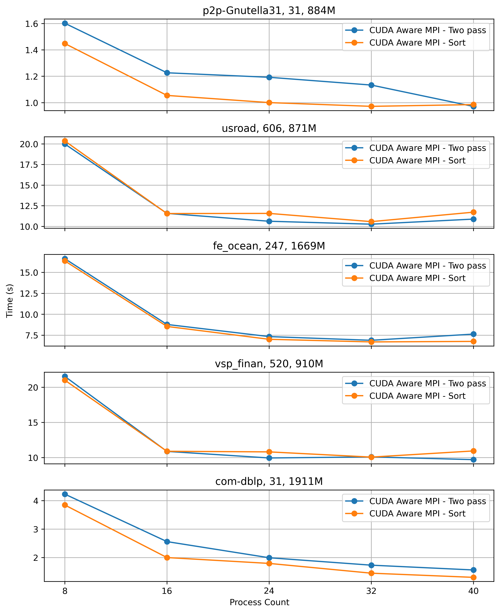
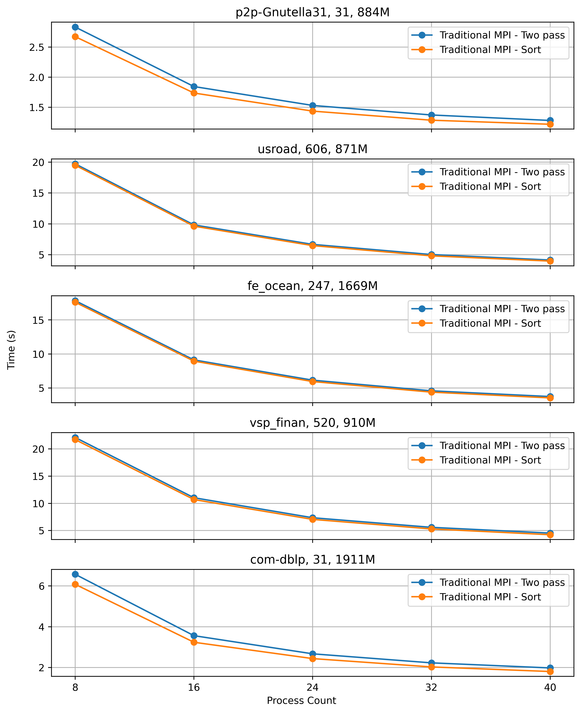
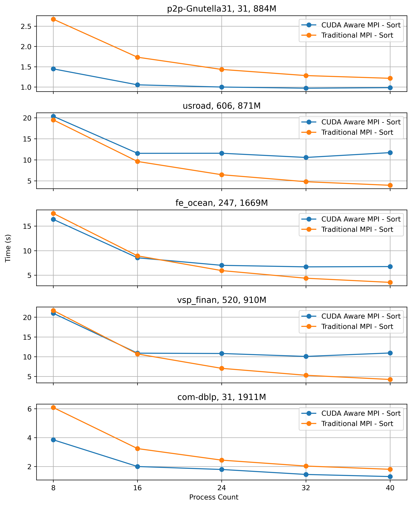

## Transitive closure using CUDA and MPI

Compute Transitive Closure using CUDA and MPI for a given relation.

### Flowchart


### Requirements
- `OpenMPI` package
- GCC
- Python 3 (for utility program)

### System configuration
#### Local machine
- Processor: 13th Gen Intel® Core™ i9-13900HK × 20
- Memory: 32.0 GiB
- OS: Ubuntu 22.04
- GCC: gcc (Ubuntu 11.4.0-1ubuntu1~22.04) 11.4.0
- MPI: Open MPI 4.1.2
- CUDA: 12.0

### Dataset

| Dataset        | # Input     | # Iterations | # TC          | # TC / Iteration | Path                                   |
|----------------|-------------|--------------|---------------|------------------|----------------------------------------|
| com-dblp       | 1,049,866   | 31           | 1,911,754,892 | 61,670,160       | data/com-dblpungraph.bin               |
| vsp_finan      | 552,020     | 520          | 910,070,918   | 1,750,136        | data/vsp_finan512_scagr7-2c_rlfddd.bin |
| fe_ocean       | 409,593     | 247          | 1,669,750,513 | 6,760,526        | data/data_409593.bin                   |
| usroad         | 165,435     | 606          | 871,365,688   | 1,437,840        | data/data_165435.bin                   |
| p2p-Gnutella31 | 147,892     | 31           | 884,179,859   | 28,522,576       | data/data_147892.bin                   |
| TG.cedge       | 23,874      | 58           | 481,121       | 8,295            | data/data_23874.bin                    |
| OL.cedge       | 7,035       | 64           | 146,120       | 2,283            | data/data_7035.bin                     |
| Small          | 10          | 3            | 18            | 6                | data/data_10.bin                       |
| Extra small    | 5           | 3            | 9             | 3                | data/hipc_2019.bin                     |

### Dataset Utility Program
When using `MPI_File_read_at` and `MPI_File_write_at` at offset in MPI programs, this utility program becomes essential because these MPI functions operate directly on binary files. `MPI_File_read_at` reads binary data from a specified offset, and `MPI_File_write_at` writes binary data to a specified offset.
The utility program provides the necessary functionality to convert between text and binary formats.
The utility program supports two main operations: converting text to binary (`txt_to_bin`) and converting binary to text (`bin_to_txt`).
- To convert text to binary:
```shell
python3 binary_file_utils.py txt_to_bin input_text_file output_binary_file
# example usage:
# python3 binary_file_utils.py txt_to_bin data/data_23874.txt data/data_23874.bin
# python3 binary_file_utils.py txt_to_bin data/data_147892.txt data/data_147892.bin
# python3 binary_file_utils.py txt_to_bin data/data_165435.txt data/data_165435.bin
# python3 binary_file_utils.py txt_to_bin data/data_409593.txt data/data_409593.bin
# python3 binary_file_utils.py txt_to_bin data/vsp_finan512_scagr7-2c_rlfddd.mtx data/vsp_finan512_scagr7-2c_rlfddd.bin
# python3 binary_file_utils.py txt_to_bin data/com-dblpungraph.txt data/com-dblpungraph.bin
```
- To convert binary to text:
```shell
python3 binary_file_utils.py bin_to_txt input_binary_file output_text_file
# python3 binary_file_utils.py bin_to_txt data/data_10.bin_tc.bin data/data_10_tc.txt
# python3 binary_file_utils.py bin_to_txt data/data_23874.bin_tc.bin data/data_23874_tc.txt
# python3 binary_file_utils.py bin_to_txt data/hipc_2019.bin_tc.bin data/hipc_2019_tc.txt
```
### Local run instructions
#### Semi naive evaluation
- Run the `tc_semi_naive.cu` program to generate transitive closure for a given data file. 
- Command like arguments: 
  - `NPROCS=<n>` to set the number of processes
  - `DATA_FILE=<BINARY DATA FILE>` to set the binary datafile path
  - `CUDA_AWARE_MPI=<0/1>` to use CUDA AWARE MPI. Set it to `1` if system supports CUDA AWARE MPI, otherwise `0`.
  - `METHOD=<0/1>` to use two pass approach (0) or sorting technique (1) for all to all communication. 

```shell
# Using two pass method for communication
make runsemi DATA_FILE=data/data_23874.bin NPROCS=8 CUDA_AWARE_MPI=0 METHOD=0
nvcc tc_semi_naive.cu -o tc_semi_naive.out -I/usr/lib/x86_64-linux-gnu/openmpi -I/usr/lib/x86_64-linux-gnu/openmpi/include -L/usr/lib/x86_64-linux-gnu/openmpi/lib -lmpi -lm --extended-lambda
mpirun -np 8 ./tc_semi_naive.out data/data_23874.bin 0 0
| # Input | # Process | # Iterations | # TC | Total Time | Initialization | File I/O | Hashtable | Join | Buffer preparation | Communication | Merge | Finalization | Output |
| --- | --- | --- | --- | --- | --- | --- | --- | --- | --- | --- | --- | --- | --- | --- |
| 23,874 | 8 | 58 | 481,121 |   0.3950 |   0.0004 |   0.0119 |   0.0007 |   0.0595 |   0.0993 |   0.0236 |   0.1958 |   0.0037 | data/data_23874.bin_tc.bin |

# Using sorting method for communication
make runsemi DATA_FILE=data/data_23874.bin NPROCS=8 CUDA_AWARE_MPI=0 METHOD=1
nvcc tc_semi_naive.cu -o tc_semi_naive.out -I/usr/lib/x86_64-linux-gnu/openmpi -I/usr/lib/x86_64-linux-gnu/openmpi/include -L/usr/lib/x86_64-linux-gnu/openmpi/lib -lmpi -lm --extended-lambda
mpirun -np 8 ./tc_semi_naive.out data/data_23874.bin 0 1
| # Input | # Process | # Iterations | # TC | Total Time | Initialization | File I/O | Hashtable | Join | Buffer preparation | Communication | Merge | Finalization | Output |
| --- | --- | --- | --- | --- | --- | --- | --- | --- | --- | --- | --- | --- | --- | --- |
| 23,874 | 8 | 58 | 481,121 |   0.4793 |   0.0008 |   0.0127 |   0.0007 |   0.0524 |   0.2016 |   0.0275 |   0.1799 |   0.0036 | data/data_23874.bin_tc.bin |

```
It generated `data/data_23874.bin_tc.bin` file that contains all paths of the transitive closure for the input relation.
- Convert the generated binary to text file using `binary_file_utils.py`.
```shell
python3 binary_file_utils.py bin_to_txt data/data_23874.bin_tc.bin data/data_23874_tc.txt
```

### Results (Semi Naive) 
#### Local machine (`CUDA_AWARE_MPI` = 0, Two pass method)
| # Input | # Process | # Iterations | # TC | Total Time | Initialization | File I/O | Hashtable | Join | Buffer preparation | Communication | Merge | Finalization | Output |
| --- | --- | --- | --- | --- | --- | --- | --- | --- | --- | --- | --- | --- | --- |
| 23,874 | 2 | 58 | 481,121 |   0.1196 |   0.0003 |   0.0042 |   0.0002 |   0.0184 |   0.0257 |   0.0075 |   0.0607 |   0.0025 | data/data_23874.bin_tc.bin |
| 23,874 | 3 | 58 | 481,121 |   0.1692 |   0.0003 |   0.0054 |   0.0003 |   0.0252 |   0.0368 |   0.0102 |   0.0889 |   0.0022 | data/data_23874.bin_tc.bin |
| 23,874 | 4 | 58 | 481,121 |   0.2297 |   0.0003 |   0.0072 |   0.0004 |   0.0341 |   0.0568 |   0.0127 |   0.1156 |   0.0028 | data/data_23874.bin_tc.bin |
| 23,874 | 5 | 58 | 481,121 |   0.2585 |   0.0003 |   0.0078 |   0.0004 |   0.0395 |   0.0620 |   0.0171 |   0.1290 |   0.0023 | data/data_23874.bin_tc.bin |
| 23,874 | 6 | 58 | 481,121 |   0.2854 |   0.0003 |   0.0105 |   0.0005 |   0.0410 |   0.0688 |   0.0196 |   0.1416 |   0.0030 | data/data_23874.bin_tc.bin |
| 23,874 | 7 | 58 | 481,121 |   0.3473 |   0.0004 |   0.0101 |   0.0007 |   0.0514 |   0.0848 |   0.0244 |   0.1721 |   0.0034 | data/data_23874.bin_tc.bin |
| 23,874 | 8 | 58 | 481,121 |   0.3950 |   0.0004 |   0.0119 |   0.0007 |   0.0595 |   0.0993 |   0.0236 |   0.1958 |   0.0037 | data/data_23874.bin_tc.bin |

#### Local machine (`CUDA_AWARE_MPI` = 0, Sort method)
| # Input | # Process | # Iterations | # TC | Total Time | Initialization | File I/O | Hashtable | Join | Buffer preparation | Communication | Merge | Finalization | Output |
| --- | --- | --- | --- | --- | --- | --- | --- | --- | --- | --- | --- | --- | --- |
| 23,874 | 2 | 58 | 481,121 |   0.1554 |   0.0003 |   0.0044 |   0.0001 |   0.0182 |   0.0580 |   0.0077 |   0.0641 |   0.0026 | data/data_23874.bin_tc.bin |
| 23,874 | 3 | 58 | 481,121 |   0.2148 |   0.0002 |   0.0058 |   0.0003 |   0.0236 |   0.0835 |   0.0100 |   0.0890 |   0.0023 | data/data_23874.bin_tc.bin |
| 23,874 | 4 | 58 | 481,121 |   0.2810 |   0.0004 |   0.0085 |   0.0004 |   0.0309 |   0.1134 |   0.0138 |   0.1109 |   0.0027 | data/data_23874.bin_tc.bin |
| 23,874 | 5 | 58 | 481,121 |   0.3220 |   0.0005 |   0.0134 |   0.0005 |   0.0349 |   0.1300 |   0.0177 |   0.1222 |   0.0028 | data/data_23874.bin_tc.bin |
| 23,874 | 6 | 58 | 481,121 |   0.3820 |   0.0003 |   0.0096 |   0.0005 |   0.0419 |   0.1590 |   0.0241 |   0.1427 |   0.0040 | data/data_23874.bin_tc.bin |
| 23,874 | 7 | 58 | 481,121 |   0.4512 |   0.0004 |   0.0114 |   0.0006 |   0.0520 |   0.1873 |   0.0292 |   0.1672 |   0.0032 | data/data_23874.bin_tc.bin |
| 23,874 | 8 | 58 | 481,121 |   0.5179 |   0.0006 |   0.0221 |   0.0007 |   0.0577 |   0.2112 |   0.0319 |   0.1890 |   0.0046 | data/data_23874.bin_tc.bin |


### Run using Docker (`CUDA_AWARE_MPI` = 1)
```shell
mnmgjoin@afe1ab5e7adc:/opt/mnmgjoin$ /opt/nvidia/hpc_sdk/Linux_x86_64/24.1/comm_libs/hpcx/bin/mpicxx tc_semi_naive.cu -o tc_semi_naive.out

# Two pass method
mnmgjoin@afe1ab5e7adc:/opt/mnmgjoin$ /opt/nvidia/hpc_sdk/Linux_x86_64/24.1/comm_libs/hpcx/bin/mpirun -np 4 ./tc_semi_naive.out data/data_23874.bin 1 0
| # Input | # Process | # Iterations | # TC | Total Time | Initialization | File I/O | Hashtable | Join | Buffer preparation | Communication | Merge | Finalization | Output |
| --- | --- | --- | --- | --- | --- | --- | --- | --- | --- | --- | --- | --- | --- |
| 23874 | 4 | 58 | 481121 |   0.6453 |   0.1964 |   0.0252 |   0.0004 |   0.0297 |   0.0398 |   0.1983 |   0.1530 |   0.0025 | data/data_23874.bin_tc.bin |

# Sort method
mnmgjoin@afe1ab5e7adc:/opt/mnmgjoin$ /opt/nvidia/hpc_sdk/Linux_x86_64/24.1/comm_libs/hpcx/bin/mpirun -np 4 ./tc_semi_naive.out data/data_23874.bin 1 1
| # Input | # Process | # Iterations | # TC | Total Time | Initialization | File I/O | Hashtable | Join | Buffer preparation | Communication | Merge | Finalization | Output |
| --- | --- | --- | --- | --- | --- | --- | --- | --- | --- | --- | --- | --- | --- |
| 23874 | 4 | 58 | 481121 |   0.7154 |   0.2117 |   0.0389 |   0.0004 |   0.0289 |   0.1017 |   0.1901 |   0.1411 |   0.0027 | data/data_23874.bin_tc.bin |
```

## Run in Polaris (Semi naive)
The job script [polaris-job-semi.sh](polaris-job.sh) contains the multi node multi GPU configuration for Polaris.
Change this file to change the number of nodes in `PBS -l select=10:system=polaris` (default 10).
Also, change the data file as necessary.
Currently, it is spawning 4 ranks per node and sets 1 GPU per MPI rank.
```shell
ssh arsho@polaris.alcf.anl.gov
arsho::polaris-login-02 { ~ }-> cd mnmgJOIN
arsho::polaris-login-02 { ~/mnmgJOIN }-> git fetch
arsho::polaris-login-02 { ~/mnmgJOIN }-> git reset --hard origin/main
arsho::polaris-login-02 { ~/mnmgJOIN }-> chmod +x polaris-job-semi.sh
arsho::polaris-login-02 { ~/mnmgJOIN }-> chmod +x set_affinity_gpu_polaris.sh
arsho::polaris-login-02 { ~/mnmgJOIN }-> qsub polaris-job-semi.sh 
2056945.polaris-pbs-01.hsn.cm.polaris.alcf.anl.gov

arsho::polaris-login-02 { ~/mnmgJOIN }-> qstat -u $USER

polaris-pbs-01.hsn.cm.polaris.alcf.anl.gov: 
                                                                 Req'd  Req'd   Elap
Job ID               Username Queue    Jobname    SessID NDS TSK Memory Time  S Time
-------------------- -------- -------- ---------- ------ --- --- ------ ----- - -----
2041991.polaris-pbs* arsho    small    polaris-j*    --   10 640    --  00:30 Q   -- 
arsho::polaris-login-02 { ~/mnmgJOIN }-> qstat -Qf small
Queue: small
    queue_type = Execution
    Priority = 150
    total_jobs = 40
    state_count = Transit:0 Queued:27 Held:13 Waiting:0 Running:0 Exiting:0 Beg

cat polaris-job-semi.out
cat polaris-jop-semi.error
# Manage disk quota limit of 50GB in Polaris /home directory
# Check quota
myquota
# Check large folders
du -h --max-depth=1 | sort -hr
# Delete large folders
rm -rf ./local_join
# Delete the generated bin files
make clean

# Interactive 1 node run tc
ssh arsho@polaris.alcf.anl.gov
qsub -I -l select=1 -l filesystems=home:eagle -l walltime=1:00:00 -q debug -A dist_relational_alg
cd mnmgJOIN
module load craype-accel-nvidia80
export MPICH_GPU_SUPPORT_ENABLED=1
CC tc_semi_naive.cu -o tc_semi_naive_interactive.out
arsho::x3101c0s19b0n0 { ~/mnmgJOIN }-> mpiexec --np 4 --ppn 4 --depth=4 --cpu-bind depth ./set_affinity_gpu_polaris_semi.sh ./tc_semi_naive_interactive.out data/data_165435.bin 1 0
arsho::x3101c0s19b0n0 { ~/mnmgJOIN }-> mpiexec --np 4 --ppn 4 --depth=4 --cpu-bind depth ./set_affinity_gpu_polaris_semi.sh ./tc_semi_naive_interactive.out data/data_165435.bin 1 1
```


## Performance evaluation on Polaris 


### CUDA AWARE MPI and Two pass method
[See the table in drawing/cam_two_pass.md](drawing/cam_two_pass.md)

### CUDA AWARE MPI and Sort method

[See the table in drawing/cam_sort.md](drawing/cam_sort.md)

### Traditional MPI and Two pass method

[See the table in drawing/traditional_two_pass.md](drawing/traditional_two_pass.md)


### Traditional MPI and Sort method

[See the table in drawing/traditional_sort.md](drawing/traditional_sort.md)

### Utility program for chart generation
- To parse Polaris results, use [`parse_results.py`](parse_results.py) program.
- To generate charts, create a virtual environment, install necessary packages, and use [`generate_graphs.py`](generate_graphs.py) program.
```shell
python3 -m venv venv
source venv/bin/activate
pip install -r requirements.txt
python generate_graphs.py
```

### Results visualization
#### CUDA AWARE MPI: Two pass vs sort 


#### Traditional MPI: Two pass vs sort


#### CUDA AWARE MPI vs Traditional MPI (Two pass)


#### CUDA AWARE MPI vs Traditional MPI (Sort)


#### Event Breakdown
[drawing/breakdown](drawing/breakdown) has individual event breakdown results.

### References
- [Polaris User Guides](https://docs.alcf.anl.gov/polaris/getting-started/)
- [Polaris running jobs](https://docs.alcf.anl.gov/polaris/running-jobs/)
- [Polaris CUDA MPI job example](https://github.com/argonne-lcf/GettingStarted/tree/master/Examples/Polaris/affinity_gpu)
- [ALCF disk quota](https://docs.alcf.anl.gov/data-management/filesystem-and-storage/disk-quota/)
- [Stackoverflow answer for all gather vs all to all](https://stackoverflow.com/a/34113431/3129414)
- [Blog on MPI](https://www.codeproject.com/Articles/896437/A-Gentle-Introduction-to-the-Message-Passing-Inter)
- [MPI all to all](https://mpi.deino.net/mpi_functions/MPI_Alltoall.html)
- [Thrust: The C++ Parallel Algorithms Library](https://nvidia.github.io/cccl/thrust/)
- [SO question on CudaFree](https://stackoverflow.com/questions/13100615/cudafree-is-not-freeing-memory)
- [SO question on CudaMemset](https://stackoverflow.com/questions/62055890/does-cudamalloc-initialize-the-array-to-0)
- [NVHPC MPI docs](https://docs.nvidia.com/hpc-sdk//compilers/hpc-compilers-user-guide/index.html#mpi-use)