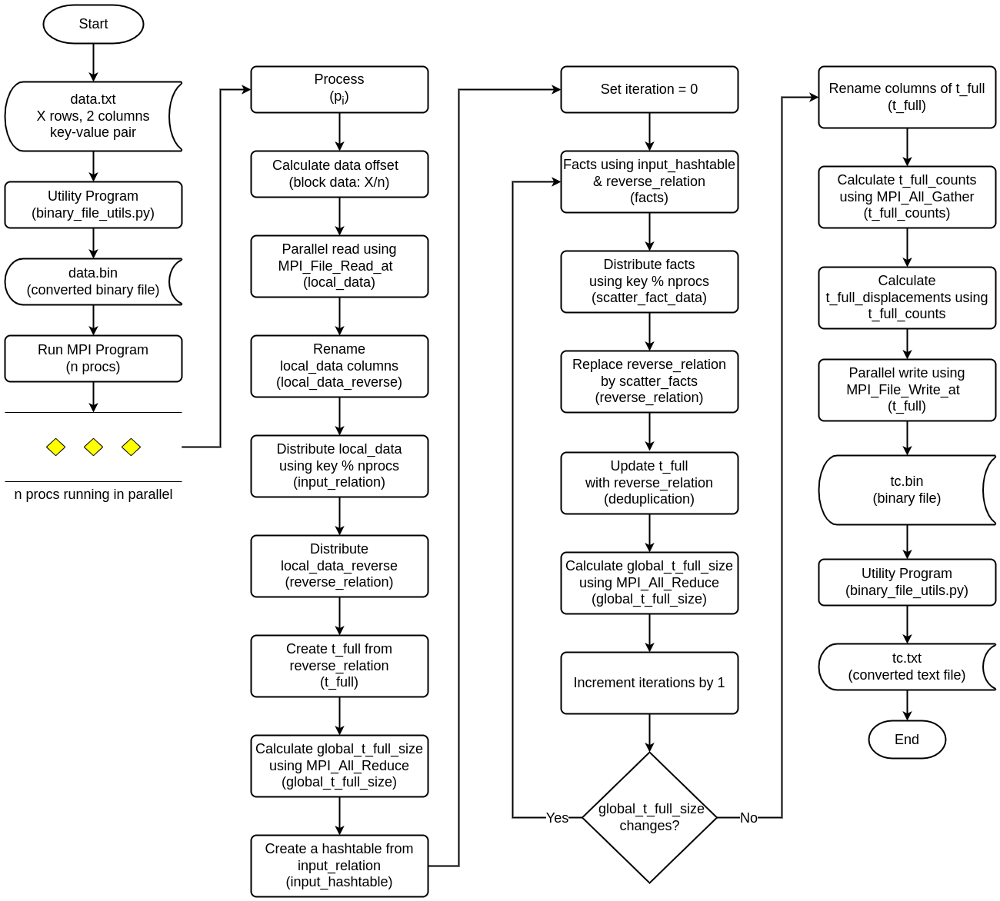

## Transitive closure using CUDA and MPI

Compute Transitive Closure using CUDA and MPI for a given relation.

### Flowchart



### Requirements
- `OpenMPI` package
- GCC
- Python 3 (for utility program)

### System configuration
#### Local machine
- Processor: 13th Gen Intel® Core™ i9-13900HK × 20
- Memory: 32.0 GiB
- OS: Ubuntu 22.04
- GCC: gcc (Ubuntu 11.4.0-1ubuntu1~22.04) 11.4.0
- MPI: Open MPI 4.1.2
- CUDA: 12.2

### Dataset

| Dataset        | # Input   | Path                                   | 
|----------------|-----------|----------------------------------------|
| fe_ocean       | 4,09,593  | data/data_409593.bin                   |
| usroad         | 1,65,435  | data/data_165435.bin                   |
| p2p-Gnutella31 | 1,47,892  | data/data_147892.bin                   |
| com-dblp       | 1,049,866 | data/com-dblpungraph.bin               |
| vsp_finan      | 552,020   | data/vsp_finan512_scagr7-2c_rlfddd.bin |
| TG.cedge       | 23,874    | data/data_23874.bin                    |
| OL.cedge       | 7,035     | data/data_7035.bin                     |
| Small          | 10        | data/data_10.bin                       |
| Extra small    | 5         | data/hipc_2019.bin                     |

### Dataset Utility Program
When using `MPI_File_read_at` and `MPI_File_write_at` at offset in MPI programs, this utility program becomes essential because these MPI functions operate directly on binary files. `MPI_File_read_at` reads binary data from a specified offset, and `MPI_File_write_at` writes binary data to a specified offset.
The utility program provides the necessary functionality to convert between text and binary formats.
The utility program supports two main operations: converting text to binary (`txt_to_bin`) and converting binary to text (`bin_to_txt`).
- To convert text to binary:
```shell
python3 binary_file_utils.py txt_to_bin input_text_file output_binary_file
# example usage:
# python3 binary_file_utils.py txt_to_bin data/data_23874.txt data/data_23874.bin
# python3 binary_file_utils.py txt_to_bin data/data_147892.txt data/data_147892.bin
# python3 binary_file_utils.py txt_to_bin data/data_165435.txt data/data_165435.bin
# python3 binary_file_utils.py txt_to_bin data/data_409593.txt data/data_409593.bin
# python3 binary_file_utils.py txt_to_bin data/vsp_finan512_scagr7-2c_rlfddd.mtx data/vsp_finan512_scagr7-2c_rlfddd.bin
# python3 binary_file_utils.py txt_to_bin data/com-dblpungraph.txt data/com-dblpungraph.bin
```
- To convert binary to text:
```shell
python3 binary_file_utils.py bin_to_txt input_binary_file output_text_file
# python3 binary_file_utils.py bin_to_txt data/data_23874.bin_tc.bin data/data_23874_tc.txt
# python3 binary_file_utils.py bin_to_txt data/hipc_2019.bin_tc.bin data/hipc_2019_tc.txt
```
### Local run instructions
- Run the program to generate transitive closure for a given data file. Use `NPROCS=<n>` to set the number of processes and `DATA_FILE=<BINARY DATA FILE>` to set the binary datafile path.
```shell
make run DATA_FILE=data/data_23874.bin NPROCS=8
nvcc tc_naive.cu -o tc_naive.out -I/usr/lib/x86_64-linux-gnu/openmpi -I/usr/lib/x86_64-linux-gnu/openmpi/include -L/usr/lib/x86_64-linux-gnu/openmpi/lib -lmpi -w -lm
mpirun -np 8 ./tc_naive.out data/data_23874.bin

Total iterations 58, TC size 481121, generated file data/data_23874.bin_tc.bin
Total time: 5.1932 seconds

| # Input | # Process | # Iterations | # TC | Time (s) |
| --- | --- | --- | --- | --- |
| 23,874 | 8 | 58 | 481,121 |   5.1932 |

```
It generated `data/data_23874.bin_tc.bin` file that contains all paths of the transitive closure for the input relation.
- Convert the generated binary to text file using `binary_file_utils.py`.
```shell
python3 binary_file_utils.py bin_to_txt data/data_23874.bin_tc.bin data/data_23874_tc.txt
```

### Results
#### Results (Local machine)

| # Input  | # Process | # Iterations | # TC   | Time (s) |
|----------|-----------|--------------|--------|----------|
| 23,874   | 2         | 58           | 481,121 | 11.8016  |
| 23,874   | 3         | 58           | 481,121 | 8.5318   |
| 23,874   | 4         | 58           | 481,121 | 7.0842   |
| 23,874   | 5         | 58           | 481,121 | 5.4608   |
| 23,874   | 6         | 58           | 481,121 | 4.9189   |
| 23,874   | 7         | 58           | 481,121 | 4.9597   |
| 23,874   | 8         | 58           | 481,121 | 5.1932   |


#### Performance improvement using semi-naive:
```shell
// naive
make run DATA_FILE=data/data_23874.bin NPROCS=8
// 7.3803, 5.5220, 4.7417, 4.5751, 4.5915
make runsemi DATA_FILE=data/data_23874.bin NPROCS=8 CUDA_AWARE_MPI=0
// 0.8464, 0.8506, 0.8679, 0.9242, 1.0613

# CUDA Aware MPI (if system supports)
make runsemi DATA_FILE=data/data_23874.bin NPROCS=8 CUDA_AWARE_MPI=0
nvcc tc_semi_naive.cu -o tc_semi_naive.out -I/usr/lib/x86_64-linux-gnu/openmpi -I/usr/lib/x86_64-linux-gnu/openmpi/include -L/usr/lib/x86_64-linux-gnu/openmpi/lib -lmpi -w -lm
mpirun -np 8 ./tc_semi_naive.out data/data_23874.bin 0
Total iterations 58, TC size 481121, generated file data/data_23874.bin_tc.bin
Total time: 0.8484 seconds

| # Input | # Process | # Iterations | # TC | Time (s) |
| --- | --- | --- | --- | --- |
| 23,874 | 8 | 58 | 481,121 |   0.8484 |


# CPU based MPI communication naive evaluation
make run DATA_FILE=data/data_23874.bin NPROCS=8
nvcc tc_naive.cu -o tc_naive.out -I/usr/lib/x86_64-linux-gnu/openmpi -I/usr/lib/x86_64-linux-gnu/openmpi/include -L/usr/lib/x86_64-linux-gnu/openmpi/lib -lmpi -w -lm
mpirun -np 8 ./tc_naive.out data/data_23874.bin
Total iterations 58, TC size 481121, generated file data/data_23874.bin_tc.bin
Total time: 5.1148 seconds

| # Input | # Process | # Iterations | # TC | Time (s) |
| --- | --- | --- | --- | --- |
| 23,874 | 8 | 58 | 481,121 |   5.1148 |

```

### Run using Docker
```shell
docker build -t mnmgjoindocker .
#docker run --rm --entrypoint=bash -it -v $(pwd):/workspace mnmgjoindocker
docker run --rm --entrypoint=bash -it --gpus all -v $(pwd):/opt/mnmgjoin mnmgjoindocker

mnmgjoin@6b53317e0449:/opt/mnmgjoin$ /opt/nvidia/hpc_sdk/Linux_x86_64/24.1/comm_libs/hpcx/bin/mpicxx tc_semi_naive.cu -o tc_semi_naive.out
mnmgjoin@6b53317e0449:/opt/mnmgjoin$ whereis mpirun
mpirun: /usr/bin/mpirun /opt/nvidia/hpc_sdk/Linux_x86_64/24.1/comm_libs/hpcx/bin/mpirun
mnmgjoin@6b53317e0449:/opt/mnmgjoin$ /opt/nvidia/hpc_sdk/Linux_x86_64/24.1/comm_libs/hpcx/bin/mpirun -np 4 ./tc_semi_naive.out data/data_23874.bin 1
--------------------------------------------------------------------------
WARNING: Open MPI tried to bind a process but failed.  This is a
warning only; your job will continue, though performance may
be degraded.

  Local host:        6b53317e0449
  Application name:  ./tc_semi_naive.out
  Error message:     failed to bind memory
  Location:          ../../../../../orte/mca/rtc/hwloc/rtc_hwloc.c:447

--------------------------------------------------------------------------
[LOG_CAT_ML] You must specify a valid HCA device by setting:
-x HCOLL_MAIN_IB=<dev_name:port> or -x UCX_NET_DEVICES=<dev_name:port>.
If no device was specified for HCOLL (or the calling library), automatic device detection will be run.
In case of unfounded HCA device please contact your system administrator.
[LOG_CAT_ML] You must specify a valid HCA device by setting:
-x HCOLL_MAIN_IB=<dev_name:port> or -x UCX_NET_DEVICES=<dev_name:port>.
If no device was specified for HCOLL (or the calling library), automatic device detection will be run.
In case of unfounded HCA device please contact your system administrator.
[6b53317e0449:00209] Error: ../../../../../ompi/mca/coll/hcoll/coll_hcoll_module.c:310 - mca_coll_hcoll_comm_query() Hcol library init failed
[6b53317e0449:00210] Error: ../../../../../ompi/mca/coll/hcoll/coll_hcoll_module.c:310 - mca_coll_hcoll_comm_query() Hcol library init failed

Generated file data/data_23874.bin_tc.bin
| # Input | # Process | # Iterations | # TC | Time (s) |
| --- | --- | --- | --- | --- |
| 23874 | 2 | 58 | 481121 |   0.3150 |
[6b53317e0449:00205] 1 more process has sent help message help-orte-odls-default.txt / memory not bound
[6b53317e0449:00205] Set MCA parameter "orte_base_help_aggregate" to 0 to see all help / error messages


mnmgjoin@6b53317e0449:/opt/mnmgjoin$ mpirun -np 2 ./tc_semi_naive.out data/data_23874.bin 1
--------------------------------------------------------------------------
WARNING: Open MPI tried to bind a process but failed.  This is a
warning only; your job will continue, though performance may
be degraded.

  Local host:        6b53317e0449
  Application name:  ./tc_semi_naive.out
  Error message:     failed to bind memory
  Location:          ../../../../../orte/mca/rtc/hwloc/rtc_hwloc.c:447

--------------------------------------------------------------------------
[LOG_CAT_ML] You must specify a valid HCA device by setting:
-x HCOLL_MAIN_IB=<dev_name:port> or -x UCX_NET_DEVICES=<dev_name:port>.
If no device was specified for HCOLL (or the calling library), automatic device detection will be run.
In case of unfounded HCA device please contact your system administrator.
[LOG_CAT_ML] You must specify a valid HCA device by setting:
-x HCOLL_MAIN_IB=<dev_name:port> or -x UCX_NET_DEVICES=<dev_name:port>.
If no device was specified for HCOLL (or the calling library), automatic device detection will be run.
In case of unfounded HCA device please contact your system administrator.
[6b53317e0449:00179] Error: ../../../../../ompi/mca/coll/hcoll/coll_hcoll_module.c:310 - mca_coll_hcoll_comm_query() Hcol library init failed
[6b53317e0449:00180] Error: ../../../../../ompi/mca/coll/hcoll/coll_hcoll_module.c:310 - mca_coll_hcoll_comm_query() Hcol library init failed

Generated file data/data_23874.bin_tc.bin
| # Input | # Process | # Iterations | # TC | Time (s) |
| --- | --- | --- | --- | --- |
| 23874 | 2 | 58 | 481121 |   0.3108 |
[6b53317e0449:00175] 1 more process has sent help message help-orte-odls-default.txt / memory not bound
[6b53317e0449:00175] Set MCA parameter "orte_base_help_aggregate" to 0 to see all help / error messages


# Run container with privilege root
docker run --rm --entrypoint=bash --user root -it --gpus all mnmgjoindocker
apt update
apt install valgrind
/opt/nvidia/hpc_sdk/Linux_x86_64/24.1/comm_libs/hpcx/bin/mpicxx tc_semi_naive.cu -o tc_semi_naive.out
mpirun -np 2 ./tc_semi_naive.out data/data_23874.bin 0
OMPI_ALLOW_RUN_AS_ROOT=1 mpirun --allow-run-as-root -np 2 valgrind ./tc_semi_naive.out data/data_23874.bin 1

# successful run of cam
nvc++ -cuda cam.cu -o cam -I/opt/nvidia/hpc_sdk/Linux_x86_64/24.1/comm_libs/12.3/hpcx/hpcx-2.17.1/ompi -I/opt/nvidia/hpc_sdk/Linux_x86_64/24.1/comm_libs/12.3/hpcx/hpcx-2.17.1/ompi/include -L/opt/nvidia/hpc_sdk/Linux_x86_64/24.1/comm_libs/12.3/hpcx/hpcx-2.17.1/ompi/lib -lmpi
mpirun -np 2 ./cam
--------------------------------------------------------------------------
WARNING: Open MPI tried to bind a process but failed.  This is a
warning only; your job will continue, though performance may
be degraded.

  Local host:        9057ed676ae2
  Application name:  ./cam
  Error message:     failed to bind memory
  Location:          ../../../../../orte/mca/rtc/hwloc/rtc_hwloc.c:447

--------------------------------------------------------------------------
[LOG_CAT_ML] You must specify a valid HCA device by setting:
-x HCOLL_MAIN_IB=<dev_name:port> or -x UCX_NET_DEVICES=<dev_name:port>.
If no device was specified for HCOLL (or the calling library), automatic device detection will be run.
In case of unfounded HCA device please contact your system administrator.
[9057ed676ae2:00089] Error: ../../../../../ompi/mca/coll/hcoll/coll_hcoll_module.c:310 - mca_coll_hcoll_comm_query() Hcol library init failed
[LOG_CAT_ML] You must specify a valid HCA device by setting:
-x HCOLL_MAIN_IB=<dev_name:port> or -x UCX_NET_DEVICES=<dev_name:port>.
If no device was specified for HCOLL (or the calling library), automatic device detection will be run.
In case of unfounded HCA device please contact your system administrator.
[9057ed676ae2:00088] Error: ../../../../../ompi/mca/coll/hcoll/coll_hcoll_module.c:310 - mca_coll_hcoll_comm_query() Hcol library init failed
received: 0 1 2 3 4 5 6 7 8 9 10 11 12 13 14 15 16 17 18 19 
[9057ed676ae2:00084] 1 more process has sent help message help-orte-odls-default.txt / memory not bound
[9057ed676ae2:00084] Set MCA parameter "orte_base_help_aggregate" to 0 to see all help / error messages
```


## Run in Polaris
The job script [polaris-job.sh](polaris-job.sh) contains the multi node multi GPU configuration for Polaris.
Change this file to change the number of nodes in `PBS -l select=10:system=polaris` (default 10).
Also, change the data file as necessary. 
Currently, it is spawning 4 ranks per node and sets 1 GPU per MPI rank.
```shell
ssh arsho@polaris.alcf.anl.gov
cd local_join
git fetch
git reset --hard origin/main
chmod +x polaris-job.sh
chmod +x set_affinity_gpu_polaris.sh
qsub polaris-job.sh 
1262708.polaris-pbs-01.hsn.cm.polaris.alcf.anl.gov
arsho::polaris-login-02 { ~/local_join }-> qstat -u $USER
cat polaris-job.out
NUM_OF_NODES= 10 TOTAL_NUM_RANKS= 40 RANKS_PER_NODE= 4 THREADS_PER_RANK= 1
CC tc_naive.cu -o tc_naive.out -w -lm
mpiexec -n 40 --ppn 4 --depth=4 --cpu-bind depth ./set_affinity_gpu_polaris.sh ./tc_naive.out data/data_147892.bin
Total iterations 31, TC size 884179859, generated file data/data_147892.bin_tc.bin
Total time: 292.3941 seconds

| # Input | # Process | # Iterations | # TC | Time (s) |
| --- | --- | --- | --- | --- |
| 147,892 | 40 | 31 | 884,179,859 | 292.3941 |
```
- Benchmark using different number of nodes:

| # Input | # Process | # Iterations | # TC | Time (s) |
| --- | --- | --- | --- | --- |
| 147,892 | 8 | 31 | 884,179,859 | 1,573.6058 |
| 147,892 | 40 | 31 | 884,179,859 | 292.3941 |
| 147,892 | 120 | 31 | 884,179,859 |  97.5625 |

## Run in Polaris (Semi naive)
The job script [polaris-job-semi.sh](polaris-job.sh) contains the multi node multi GPU configuration for Polaris.
Change this file to change the number of nodes in `PBS -l select=10:system=polaris` (default 10).
Also, change the data file as necessary.
Currently, it is spawning 4 ranks per node and sets 1 GPU per MPI rank.
```shell
ssh arsho@polaris.alcf.anl.gov
arsho::polaris-login-02 { ~ }-> cd mnmgJOIN
arsho::polaris-login-02 { ~/mnmgJOIN }-> git fetch
arsho::polaris-login-02 { ~/mnmgJOIN }-> git reset --hard origin/main
arsho::polaris-login-02 { ~/mnmgJOIN }-> chmod +x polaris-job-semi.sh
arsho::polaris-login-02 { ~/mnmgJOIN }-> chmod +x set_affinity_gpu_polaris.sh
arsho::polaris-login-02 { ~/mnmgJOIN }-> qsub polaris-job-semi.sh 
2041991.polaris-pbs-01.hsn.cm.polaris.alcf.anl.gov
2048766.polaris-pbs-01.hsn.cm.polaris.alcf.anl.gov
arsho::polaris-login-02 { ~/mnmgJOIN }-> qstat -u $USER

polaris-pbs-01.hsn.cm.polaris.alcf.anl.gov: 
                                                                 Req'd  Req'd   Elap
Job ID               Username Queue    Jobname    SessID NDS TSK Memory Time  S Time
-------------------- -------- -------- ---------- ------ --- --- ------ ----- - -----
2041991.polaris-pbs* arsho    small    polaris-j*    --   10 640    --  00:30 Q   -- 
arsho::polaris-login-02 { ~/mnmgJOIN }-> qstat -Qf small
Queue: small
    queue_type = Execution
    Priority = 150
    total_jobs = 40
    state_count = Transit:0 Queued:27 Held:13 Waiting:0 Running:0 Exiting:0 Beg

cat polaris-job-semi.out
cat polaris-jop-semi.error

# Interactive node run tc
ssh arsho@polaris.alcf.anl.gov
qsub -I -l select=1 -l filesystems=home:eagle -l walltime=1:00:00 -q debug -A dist_relational_alg
cd mnmgJOIN
module load craype-accel-nvidia80
export MPICH_GPU_SUPPORT_ENABLED=1

CC tc_semi_naive.cu -o tc_semi_naive_interactive.out
arsho::x3101c0s19b0n0 { ~/mnmgJOIN }-> mpiexec --np 4 --ppn 4 --depth=4 --cpu-bind depth ./set_affinity_gpu_polaris_semi.sh ./tc_semi_naive_interactive.out data/data_165435.bin 1
“RANK= 0 LOCAL_RANK= 0 gpu= 0”
“RANK= 3 LOCAL_RANK= 3 gpu= 3”
“RANK= 1 LOCAL_RANK= 1 gpu= 1”
“RANK= 2 LOCAL_RANK= 2 gpu= 2”

Generated file data/data_165435.bin_tc.bin
| # Input | # Process | # Iterations | # TC | Time (s) |
| --- | --- | --- | --- | --- |
| 165,435 | 4 | 606 | 871,365,688 |  46.4964 |
arsho::x3101c0s19b0n0 { ~/mnmgJOIN }-> mpiexec --np 4 --ppn 4 --depth=4 --cpu-bind depth ./set_affinity_gpu_polaris_semi.sh ./tc_semi_naive_interactive.out data/data_7035.bin 1
“RANK= 1 LOCAL_RANK= 1 gpu= 1”
“RANK= 2 LOCAL_RANK= 2 gpu= 2”
“RANK= 3 LOCAL_RANK= 3 gpu= 3”
“RANK= 0 LOCAL_RANK= 0 gpu= 0”

Generated file data/data_7035.bin_tc.bin
| # Input | # Process | # Iterations | # TC | Time (s) |
| --- | --- | --- | --- | --- |
| 7,035 | 4 | 64 | 146,120 |   2.7993 |
arsho::x3101c0s19b0n0 { ~/mnmgJOIN }-> mpiexec --np 4 --ppn 4 --depth=4 --cpu-bind depth ./set_affinity_gpu_polaris_semi.sh ./tc_semi_naive_interactive.out data/data_23874.bin 1
“RANK= 1 LOCAL_RANK= 1 gpu= 1”
“RANK= 3 LOCAL_RANK= 3 gpu= 3”
“RANK= 2 LOCAL_RANK= 2 gpu= 2”
“RANK= 0 LOCAL_RANK= 0 gpu= 0”

Generated file data/data_23874.bin_tc.bin
| # Input | # Process | # Iterations | # TC | Time (s) |
| --- | --- | --- | --- | --- |
| 23,874 | 4 | 58 | 481,121 |   2.7517 |
```

#### TC on fe_ocean

| # Input | # Process | # Iterations | # TC | Time (s) |
| --- | --- | --- | --- | --- |
| 409,593 | 40 | 247 | 1,669,750,513 | 10.0284 |
| 409,593 | 32 | 247 | 1,669,750,513 | 10.4754 |
| 409,593 | 24 | 247 | 1,669,750,513 | 11.9613 |
| 409,593 | 16 | 247 | 1,669,750,513 | 11.6706 |
| 409,593 | 8 | 247 | 1,669,750,513 | 20.1498 |

#### TC on vsp_finan

| # Input | # Process | # Iterations | # TC | Time (s) |
| --- | --- | --- | --- | --- |
| 552,020 | 40 | 520 | 910,070,918 | 13.5197 |
| 552,020 | 32 | 520 | 910,070,918 | 12.3224 |
| 552,020 | 24 | 520 | 910,070,918 | 20.1347 |
| 552,020 | 16 | 520 | 910,070,918 | 19.6395 |
| 552,020 | 8 | 520 | 910,070,918 | 29.1619 |

#### TC on com-dblp

| # Input | # Process | # Iterations | # TC | Time (s) |
| --- | --- | --- | --- | --- |
| 1,049,866 | 40 | 31 | 1,911,754,892 | 6.6690 |
| 1,049,866 | 32 | 31 | 1,911,754,892 | 8.4425 |
| 1,049,866 | 24 | 31 | 1,911,754,892 | 7.7934 |
| 1,049,866 | 16 | 31 | 1,911,754,892 | 8.5105 |
| 1,049,866 | 8 | 31 | 1,911,754,892 | 12.0870 |


#### TC on p2p-Gnutella31

| # Input | # Process | # Iterations | # TC | Time (s) |
| --- | --- | --- | --- | --- |
| 147,892 | 40 | 31 | 884,179,859 | 2.6287 |
| 147,892 | 32 | 31 | 884,179,859 | 3.2223 |
| 147,892 | 24 | 31 | 884,179,859 | 3.6492 |
| 147,892 | 16 | 31 | 884,179,859 | 3.8662 |
| 147,892 | 8 | 31 | 884,179,859 | 5.7059 |

#### TC on usroad

| # Input | # Process | # Iterations | # TC | Time (s) |
| --- | --- | --- | --- | --- |
| 165,435 | 40 | 606 | 871,365,688 | 11.4508 |
| 165,435 | 32 | 606 | 871,365,688 | 11.9498 |
| 165,435 | 24 | 606 | 871,365,688 | 12.4402 |
| 165,435 | 16 | 606 | 871,365,688 | 13.3520 |
| 165,435 | 8 | 606 | 871,365,688 | 24.4126 |

#### TC on fe_ocean

| # Input | # Process | # Iterations | # TC | Time (s) |
| --- | --- | --- | --- | --- |
| 409,593 | 40 | 247 | 1,669,750,513 | 10.9424 |
| 409,593 | 32 | 247 | 1,669,750,513 | 9.6925 |
| 409,593 | 24 | 247 | 1,669,750,513 | 11.4334 |
| 409,593 | 16 | 247 | 1,669,750,513 | 11.7146 |

### Experiment: CUDA Aware MPI
```shell
# Polaris (working with cam)
CC cam.cu -o cam.out
# 2 MPI ranks, 2 ranks per node, 2 depth, 1 thread per rank
mpiexec --np 2 --ppn 2 --depth=2 --cpu-bind depth ./../set_affinity_gpu_polaris_semi.sh ./cam.out
arsho::x3002c0s37b0n0 { ~/mnmgJOIN/rough }-> mpiexec --np 2 --ppn 2 --depth=2 --cpu-bind depth ./../set_affinity_gpu_polaris_semi.sh ./cam.out
“RANK= 0 LOCAL_RANK= 0 gpu= 0”
“RANK= 1 LOCAL_RANK= 1 gpu= 1”
received: 0 1 2 3 4 5 6 7 8 9 10 11 12 13 14 15 16 17 18 19 

# Polaris (working with cam) without the module load
ssh arsho@polaris.alcf.anl.gov
qsub -I -l select=1 -l filesystems=home:eagle -l walltime=1:00:00 -q debug -A dist_relational_alg
cd rough
export MPICH_GPU_SUPPORT_ENABLED=1
arsho::x3206c0s37b0n0 { ~/mnmgJOIN/rough }-> CC cam.cu -o cam.out /opt/cray/pe/mpich/8.1.28/gtl/lib/libmpi_gtl_cuda.so
cam.cu:
/usr/bin/ld: warning: /var/tmp/pbs.2038492.polaris-pbs-01.hsn.cm.polaris.alcf.anl.gov/pgcudafatUQ5JckieWnySs.o: missing .note.GNU-stack section implies executable stack
/usr/bin/ld: NOTE: This behaviour is deprecated and will be removed in a future version of the linker
# 2 MPI ranks, 2 ranks per node, 2 depth, 1 thread per rank
arsho::x3206c0s37b0n0 { ~/mnmgJOIN/rough }-> mpiexec --np 2 --ppn 2 --depth=2 --cpu-bind depth ./../set_affinity_gpu_polaris_semi.sh ./cam.out
“RANK= 0 LOCAL_RANK= 0 gpu= 0”
“RANK= 1 LOCAL_RANK= 1 gpu= 1”
received: 0 1 2 3 4 5 6 7 8 9 10 11 12 13 14 15 16 17 18 19 


arsho::x3006c0s25b0n0 { ~ }-> cd mnmgJOIN
arsho::x3006c0s25b0n0 { ~/mnmgJOIN }-> module load craype-accel-nvidia80
arsho::x3006c0s25b0n0 { ~/mnmgJOIN }-> module load valgrind4hpc
arsho::x3006c0s25b0n0 { ~/mnmgJOIN }-> export MPICH_GPU_SUPPORT_ENABLED=1

# Local machine
nvcc cam.cu -o cam -I/usr/lib/x86_64-linux-gnu/openmpi -I/usr/lib/x86_64-linux-gnu/openmpi/include -L/usr/lib/x86_64-linux-gnu/openmpi/lib -lmpi -w -lm
mpirun -np 2 ./cam

find /usr -name mpicc 
export PATH=/opt/nvidia/hpc_sdk/Linux_x86_64/24.1/comm_libs/openmpi/openmpi-3.1.5/bin:$PATH
nvcc cam.cu -o cam -I/opt/nvidia/hpc_sdk/Linux_x86_64/24.1/comm_libs/openmpi/openmpi-3.1.5/ -I/opt/nvidia/hpc_sdk/Linux_x86_64/24.1/comm_libs/openmpi/openmpi-3.1.5/include -L/opt/nvidia/hpc_sdk/Linux_x86_64/24.1/comm_libs/openmpi/openmpi-3.1.5/lib -lmpi
```

### References
- [Polaris User Guides](https://docs.alcf.anl.gov/polaris/getting-started/)
- [Polaris running jobs](https://docs.alcf.anl.gov/polaris/running-jobs/)
- [Polaris CUDA MPI job example](https://github.com/argonne-lcf/GettingStarted/tree/master/Examples/Polaris/affinity_gpu)
- [Stackoverflow answer for all gather vs all to all](https://stackoverflow.com/a/34113431/3129414)
- [Blog on MPI](https://www.codeproject.com/Articles/896437/A-Gentle-Introduction-to-the-Message-Passing-Inter)
- [MPI all to all](https://mpi.deino.net/mpi_functions/MPI_Alltoall.html)
- [Thrust: The C++ Parallel Algorithms Library](https://nvidia.github.io/cccl/thrust/)
- [SO question on CudaFree](https://stackoverflow.com/questions/13100615/cudafree-is-not-freeing-memory)
- [SO question on CudaMemset](https://stackoverflow.com/questions/62055890/does-cudamalloc-initialize-the-array-to-0)
- [NVHPC MPI docs](https://docs.nvidia.com/hpc-sdk//compilers/hpc-compilers-user-guide/index.html#mpi-use)