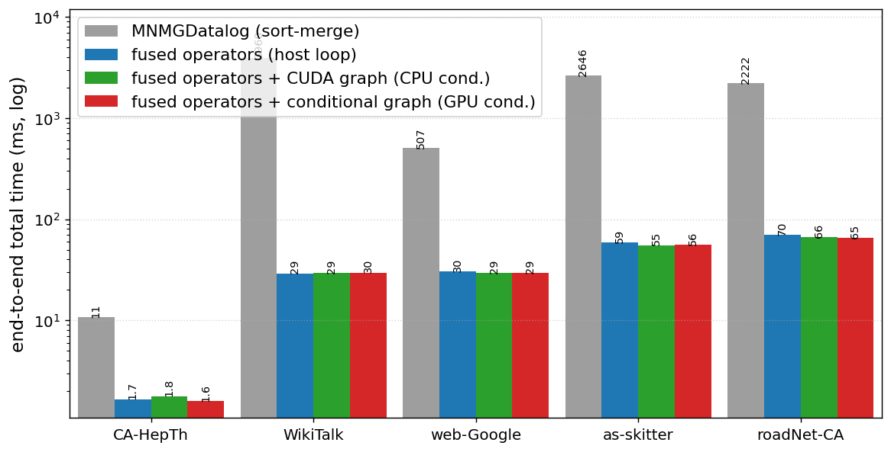
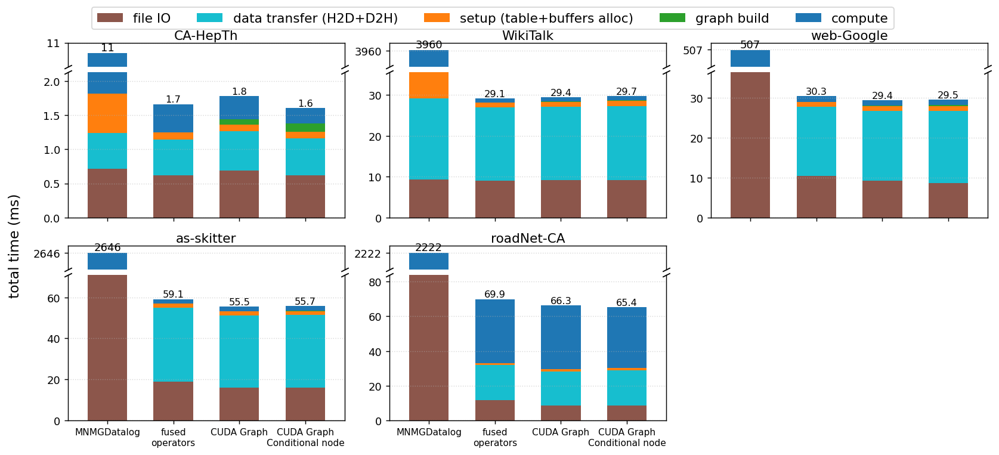
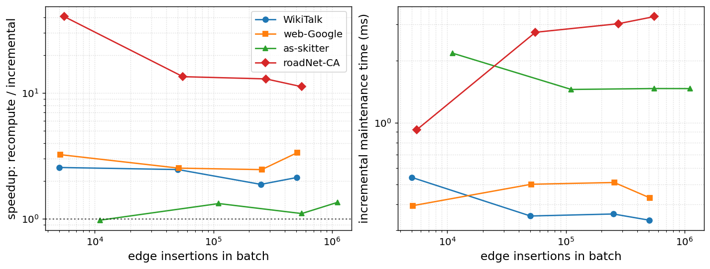

# Connected Components (CC) on one GPU: sort-merge vs. fused vs. CUDA graphs

Four single-GPU implementations of **(Weakly) Connected Components** as a Datalog
min-label fixpoint, in the same structure as `tc_benchmark`. All four compute the
identical `(node, component)` labeling; they differ only in how the propagation
fixpoint is executed.

```
edge(x, y) :- edge(y, x).             (symmetric / weakly connected)
cc(x, x)   :- edge(x, _).              (each node seeds itself)
cc(y, c)   :- cc(x, c), edge(x, y).    (propagate; keep the minimum c per node)
```

CC is different from TC/SG: the derived fact is not an insert-only pair — each
node keeps a single, monotonically decreasing label. The fused versions use a
dense label array `label[node]` updated with `atomicMin` along every (symmetric)
edge, driven by a `changed` flag; the reference uses the original MNMGDatalog
sort/unique(min)/merge/set_difference machinery.

## The four versions

| Dir | Version | What it changes |
|-----|---------|-----------------|
| `v0_reference/`   | **MNMGDatalog (sort-merge)** | faithful single-GPU port of `MNMGDatalog/wcc.cu`: hash join + Thrust sort/unique(min-label)/merge/set_difference. Performance **reference**. |
| `v1_baseline/`    | **fused operators (host loop)** | one `atomicMin` propagation kernel over the symmetric edge list; host `while` loop checks a changed flag. |
| `v2_cudagraph/`   | **+ CUDA Graph (CPU condition)** | the propagation round captured into a CUDA graph, replayed each round; host checks the changed flag. |
| `v3_conditional/` | **+ Conditional CUDA Graph (GPU condition)** | the whole fixpoint as a CUDA-graph conditional WHILE node; one launch runs the entire loop on the GPU. |

`v0 → v1` is an *algorithm* change (materialized min-label sort-merge → dense
atomicMin propagation); `v1 → v2 → v3` are *execution* changes.

## Correctness note (rounds may differ)

The reference (v0) and the fused versions (v1-v3) can converge in a **different
number of rounds** — `atomicMin` pulls a node's label to its final value faster
than one-hop-per-round sort-merge. This is expected. What must match (and is
checked by `make test`) is the final **(node, component) set** and the node count;
round counts are reported but not required to be equal.

## Build & run (JLSE)

**v3 needs CUDA 12.4+** (conditional graph nodes); `cuda/12.9.1` is recommended.

```
module load cuda/12.9.1
make GPU_ARCH=sm_80 all       # A100 = sm_80; Hopper = sm_90
make test                     # v1-v3 (node,component) sets == v0
make benchmark REPEATS=3      # writes results/benchmark_<ts>.csv
make plot                     # -> results/charts/{total_time,breakdown}.{png,pdf}
```

Run a single version: `make run0 DATA=../data/WikiTalk.bin REPEATS=3`
(similarly `run1`/`run2`/`run3`).

## Results

JLSE A100-PCIE-40GB, CUDA 12.9.1, median of 3 runs. End-to-end **total time** (ms)
with total-time speedup (`t↑`) and **compute-only** speedup (`c↑`) vs MNMGDatalog.
All four versions produce the identical `(node, component)` labeling (`make test`);
`# Rounds` lists v0 vs the fused versions — they legitimately differ (see below).



| Dataset | # Rounds (v0/fused) | # Nodes | mnmg | fused | +graph | +cond | fused t↑/c↑ | +graph t↑/c↑ | +cond t↑/c↑ |
|---------|:-------------------:|--------:|-----:|------:|-------:|------:|:-----------:|:------------:|:-----------:|
| CA-HepTh (`data_51971`)   | 13/12 |    68,746  |    10.7 |  1.7 |  1.8 |  1.6 | 6.5/22 | 6.0/26 | 6.7/40 |
| WikiTalk (`WikiTalk`)     | 8/4   | 2,394,385  | 3,960.1 | 29.1 | 29.4 | 29.7 | 136/2640 | 135/2664 | 134/2734 |
| web-Google (`web-Google`) | 16/7  |   916,428  |   506.8 | 30.3 | 29.4 | 29.5 | 17/82 | 17/81 | 17/84 |
| as-skitter (`as-skitter`) | 22/9  | 1,696,415  | 2,646.0 | 59.1 | 55.5 | 55.7 | 45/252 | 48/243 | 47/248 |
| roadNet-CA (`roadNet-CA`) | 555/222 | 1,971,281 | 2,221.8 | 69.9 | 66.3 | 65.4 | 32/50 | 34/50 | 34/52 |



**Reading the results — fusion is a massive win for CC (up to ~136× total, ~2700×
compute).** Two effects compound:

- **Dense `atomicMin` beats materialized min-label sort-merge** by orders of
  magnitude in compute: MNMGDatalog joins/sorts/merges/dedups a growing relation
  every round, whereas the fused kernel is one atomicMin pass over the edge array
  per round with an in-place label array. On WikiTalk the fixpoint compute drops
  from 2.6 s to ~1 ms (~2700×).
- **Fewer rounds, too:** atomicMin lets a label jump multiple hops within a single
  round (a thread reads a neighbour's already-lowered label), so the fused versions
  converge in fewer rounds than one-hop-per-round sort-merge (WikiTalk 8→4,
  roadNet-CA 555→222). The result set is identical (min-label has a unique
  fixpoint), which is why `make test` passes despite different round counts.
- **Fused CC is now IO/transfer-bound, not compute-bound** (see the breakdown:
  file IO + data transfer dominate the tiny fused bars). Because compute is already
  ~1 ms, **`+graph`/`+cond` add essentially nothing** — there is no meaningful
  per-round launch overhead left to remove.
- **MNMGDatalog `setup` is a visible cost on big graphs** (e.g. WikiTalk: a ~1.3 s
  one-shot memset), part of why its total towers over the fused versions.

## Incremental / streaming maintenance under edge insertions

WCC is **monotone under edge insertions** (adding an edge can only lower labels),
so the fused versions double as an incremental/streaming engine: after a batch of
new edges arrives, keep the resident label array and re-run the propagation
fixpoint. Starting from the previous (stale but $\geq$ true) labeling, `atomicMin`
reconverges to the correct new labeling — usually in far fewer rounds than a
from-scratch recompute — and, because the min-label fixpoint is unique, the
maintained labeling is **identical** to a recompute (verified every batch).

```
make all
bash tests/incremental.sh 3                 # default graphs + fractions
# or: FRACS="0.001 0.01 0.05 0.10" BATCHES=1 bash tests/incremental.sh 3 WikiTalk.bin
python3 tests/plot_incremental.py           # -> results/charts/incremental.{png,pdf}
```

The driver splits each graph in-driver (first `1-f` rows = base graph `G`, last
`f` rows = the insertion stream), then per fraction times **incremental
maintenance** (reuse resident labels) vs. **full recompute** (re-init labels) on
the identical cumulative graph and kernels — isolating the benefit of
incrementality. It writes `results/incremental_<ts>.csv` with per-batch
`inc_rounds/inc_ms`, `rec_rounds/rec_ms`, `speedup`, and a `correct` flag
(maintained == recomputed labeling). The captured graph (v2/v3) stays valid across
appends because the edge count is read from device memory (`d_n_edges`).

Env: `CC_DELTA_FRAC` (insertion fraction, triggers incremental mode),
`CC_DELTA_BATCHES` (batches per fraction), `CC_INC_CSV` (output CSV, appended),
`CC_NAME` (human dataset name). **Scope:** insertions only (monotone); deletions
are non-monotone and out of scope, and incremental TC/SG are future work.



## Datasets

Defaults present in `../data`: CA-HepTh (`data_51971`), WikiTalk, web-Google,
as-skitter, roadNet-CA. The paper's target graphs **com-Orkut**, **wiki-topcats**,
**ML_Geer** are not shipped here — drop their `.bin` files (int32 src,dst pairs)
into `../data` and pass them explicitly:

```
make benchmark DS="com-Orkut.bin wiki-topcats.bin"
```

## Phase timing / memory

- **Phase timing:** `H2D` = build symmetric edge list + transfer; `D2H` =
  device→host copy of the compacted `(node,component)` pairs (memcpy only);
  `fileio` = input read + optional result write; the label compaction is counted
  in `compute`.
- `make benchmark` writes no `_cc.bin` files by default (`CC_NO_OUTPUT=1`); pass
  `BENCH_KEEP_OUTPUT=1` to also write them.

## Files

```
common/cc_core.cuh       shared kernels, IO, setup/reset/main, CSV output
v0_reference/cc_v0.cu    MNMGDatalog min-label sort-merge reference
v1_baseline/cc_v1.cu     fused atomicMin propagation, host while-loop
v2_cudagraph/cc_v2.cu    fused propagation, replayed CUDA graph (CPU condition)
v3_conditional/cc_v3.cu  fused propagation, conditional WHILE node (GPU condition)
tests/verify.sh          correctness: v1-v3 (node,component) == MNMGDatalog
tests/benchmark.sh       timing + breakdown + speedups, writes results CSV
tests/plot_results.py    two charts (total time, per-phase breakdown)
Makefile
```
