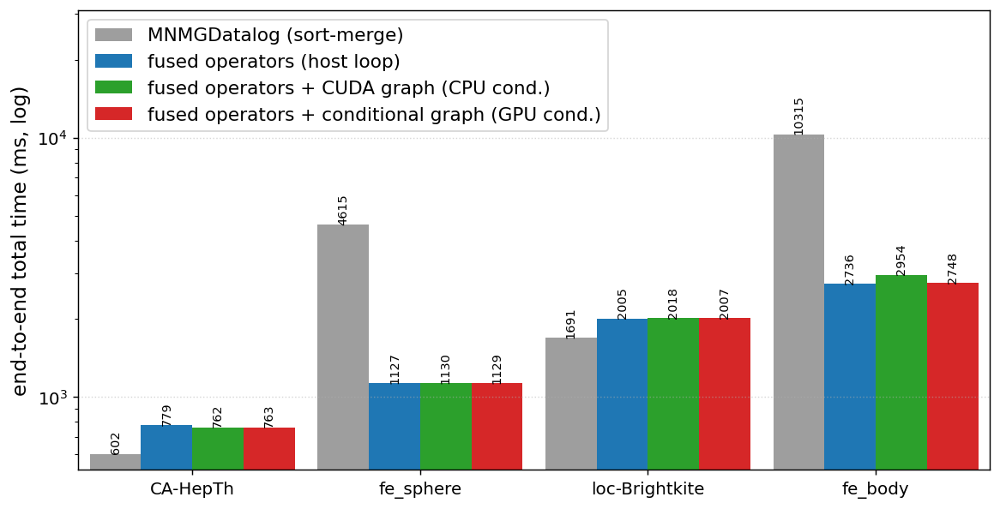
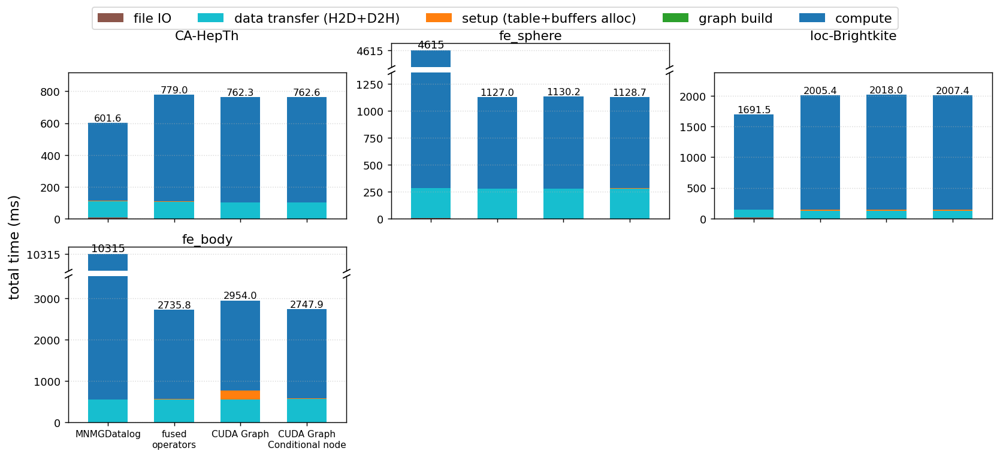

# Same Generation (SG) on one GPU: sort-merge vs. fused vs. CUDA graphs

Four single-GPU implementations of the **Same Generation** Datalog query, in the
same structure as `tc_benchmark`. All four compute the identical SG relation and
iteration count; they differ only in how the recursive fixpoint is executed.

```
sg(X, Y) :- edge(P, X), edge(P, Y), X != Y.        (base)
sg(X, Y) :- edge(A, X), sg(A, B), edge(B, Y).      (recursive)
```

SG is structurally harder than transitive closure: each recursive step is a
**two-hop (two-join)** derivation — for a fact `sg(a,b)` we pair every `edge(a,x)`
with every `edge(b,y)` and emit `sg(x,y)`. The derived fact is still a pair, so
novelty/dedup use a single open-addressing hash set (as in TC); only the expand
kernel is a two-hop join.

## The four versions

| Dir | Version | What it changes |
|-----|---------|-----------------|
| `v0_reference/`   | **MNMGDatalog (sort-merge)** | faithful single-GPU port of `MNMGDatalog/sg.cu`: hash joins + Thrust sort/unique/set_difference/merge, two joins per iteration. Performance **reference**. |
| `v1_baseline/`    | **fused operators (host loop)** | the two-hop join + projection + dedup/union/novelty fused into one CUDA kernel over a hash set; host `while` loop. |
| `v2_cudagraph/`   | **+ CUDA Graph (CPU condition)** | the per-iteration kernel sequence captured into a CUDA graph, replayed each iteration; host checks the new-fact count. |
| `v3_conditional/` | **+ Conditional CUDA Graph (GPU condition)** | the whole fixpoint as a CUDA-graph conditional WHILE node; one launch runs the entire loop on the GPU. |

`v0 → v1` is an *algorithm* change (materialized sort-merge → fused hash set);
`v1 → v2 → v3` are *execution* changes (host loop → replayed graph → on-GPU loop).

## Build & run (JLSE)

**v3 needs CUDA 12.4+** (conditional graph nodes); `cuda/12.9.1` is recommended.

```
module load cuda/12.9.1
make GPU_ARCH=sm_80 all       # A100 = sm_80; Hopper = sm_90
make test                     # v1-v3 SG tuples must be byte-identical to v0
make benchmark REPEATS=3      # writes results/benchmark_<ts>.csv
make plot                     # -> results/charts/{total_time,breakdown}.{png,pdf}
```

Run a single version: `make run0 DATA=../data/data_51971.bin MULT=4096 REPEATS=3`
(similarly `run1`/`run2`/`run3`).

## Results

Populate after a JLSE run: `make benchmark && make plot` writes the two charts to
`results/charts/`. End-to-end **total time** (ms) with total-time speedup (`t↑`)
and **compute-only** speedup (`c↑`) vs MNMGDatalog; all versions produce identical
SG size, iteration count, and byte-identical tuple sets (`make test`).




## Phase timing / memory

- **Phase timing:** `H2D` = input edge transfer; `D2H` = device→host copy of the
  compacted SG relation (memcpy only); `fileio` = input read + optional result
  write; the result compaction is counted in `compute` (symmetric with
  MNMGDatalog, which keeps its result dense inside the fixpoint).
- `make benchmark` writes no `_sg.bin` files by default (`SG_NO_OUTPUT=1`); the
  D2H transfer is still timed. Pass `BENCH_KEEP_OUTPUT=1` to also write them.
- `capacity_mult` (arg 2) sizes the result set as `next_pow2(n_edges * mult)`.
  SG closures grow fast; too small a mult trips the overflow guard with a clear
  "increase capacity_mult" error. Per-dataset mults live in `tests/benchmark.sh`.

## Files

```
common/sg_core.cuh       shared kernels, IO, setup/reset/main, CSV output
v0_reference/sg_v0.cu    MNMGDatalog sort-merge (two-join) reference
v1_baseline/sg_v1.cu     fused two-hop operators, host while-loop
v2_cudagraph/sg_v2.cu    fused operators, replayed CUDA graph (CPU condition)
v3_conditional/sg_v3.cu  fused operators, conditional WHILE node (GPU condition)
tests/verify.sh          correctness: v1-v3 SG tuples == MNMGDatalog (content diff)
tests/benchmark.sh       timing + breakdown + speedups, writes results CSV
tests/plot_results.py    two charts (total time, per-phase breakdown)
Makefile
```
