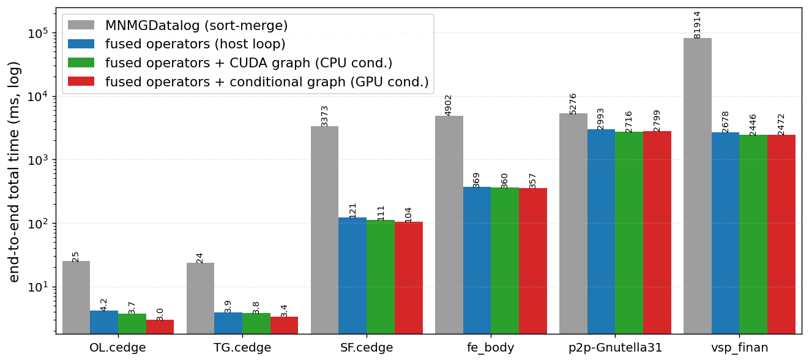
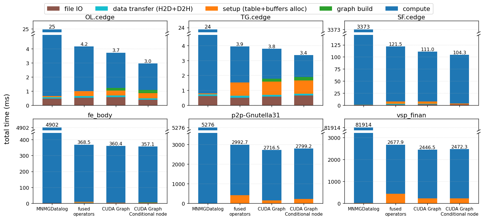

# TC Benchmark: four execution strategies for Datalog Transitive Closure

Four single-GPU implementations of the same Datalog-style **Transitive Closure**
fixpoint:

```
path(a, c) :- path(a, b), edge(b, c).
```

All four compute **identical TC size and iteration count**. They differ only in
*how the fixpoint is executed* — that difference is the whole point of this
benchmark.

## The four versions (this is the core difference)

| # | Name | Fixpoint machinery | Loop driver | Convergence test |
|---|------|--------------------|-------------|------------------|
| v0 | **mnmg (sort-merge)** | discrete iterative relational algebra: `get_join` ⋈ → `sort`+`unique` (dedup) → `set_difference` (∖) → `merge` (∪), with per-iteration `cudaMalloc`/`free` | host `while` | CPU: relation stopped growing |
| v1 | **fused operators** | join + projection + dedup/union/difference **fused into one kernel** (`tc_expand` + one `atomicCAS` into a hash set); fixed pre-allocated buffers | host `while` | CPU: `new_count == 0` |
| v2 | **fused + CUDA graph** | same fused kernel sequence | one iteration **captured into a CUDA graph** and replayed | **CPU** copies `new_count` and relaunches |
| v3 | **fused + conditional graph** | same fused kernel sequence | the whole loop is a CUDA graph **conditional WHILE node** — one `cudaGraphLaunch` | **GPU**: `cudaGraphSetConditional(new_count > 0)` |

- **v0 → v1** is an *algorithm* change: the original engine's materialized
  relational-algebra operators (sort-merge) are replaced by a **single fused
  kernel**. One `atomicCAS` insert into a pair hash set does dedup **and** the
  "is this fact new?" test at once (what `unique` + `set_difference` did together).
- **v1 → v2 → v3** is an *execution-strategy* change over the same kernels:
  host loop → replayed CUDA graph (CPU still checks convergence) → on-GPU
  conditional loop (convergence checked on the device, zero per-iteration CPU).

The per-iteration kernel sequence for v1/v2/v3 is identical; sizes live in
**device memory** (`d_frontier_size`, `d_new_count`) and the kernels read them at
launch, over **fixed pre-allocated buffers** — which is exactly what lets v2
replay one captured graph and v3 drive the loop entirely on-GPU. v3's WHILE
condition is the fixpoint termination test `new_count > 0`, evaluated on the GPU
via `cudaGraphSetConditional` (v2 evaluates the same test on the CPU).

> Note: v0 also runs semi-naïve evaluation — the difference is *representation +
> operators* (sorted relation + discrete RA operators) vs *fused kernel + hash
> set*, not the fixpoint strategy itself.

## Results (JLSE A100-PCIE-40GB, CUDA 12.9.1, 3 timed repeats)

End-to-end **total time** (ms) and **total-time speedup vs mnmg**. All versions
produce identical TC size / iteration count per dataset.



| Dataset | # Iter | # TC | mnmg | fused | fused+graph | fused+cond | fused↑ | +graph↑ | +cond↑ |
|---------|-------:|-----:|-----:|------:|------------:|-----------:|-------:|--------:|-------:|
| OL.cedge (`data_7035`)        |  64 | 146,120       | 24.9 | 4.2 | 3.7 | 3.0 | 6.0× | 6.7× | 8.4× |
| TG.cedge (`data_23874`)       |  58 | 481,121       | 23.7 | 3.9 | 3.8 | 3.4 | 6.0× | 6.3× | 7.0× |
| SF.cedge (`data_223001`)      | 287 | 80,498,014    | 3,373.4 | 121.5 | 111.0 | 104.3 | 27.8× | 30.4× | 32.4× |
| fe_body (`data_163734`)       | 188 | 156,120,489   | 4,901.5 | 368.5 | 360.4 | 357.1 | 13.3× | 13.6× | 13.7× |
| p2p-Gnutella31 (`data_147892`)|  31 | 884,179,859   | 5,275.7 | 2,992.6 | 2,716.5 | 2,799.2 | 1.8× | 1.9× | 1.9× |
| vsp_finan                     | 520 | 910,070,918   | 81,913.8 | 2,677.9 | 2,446.5 | 2,472.3 | 30.6× | 33.5× | 33.1× |

Per-phase breakdown (absolute stacked — bar height = total time in ms; phases:
file IO, data transfer = H2D+D2H, setup, graph build, compute). Each dataset uses
a **broken y-axis**: the thin top slice shows `mnmg`'s true (large) total, and the
zoomed bottom makes the fused versions' composition readable — otherwise `mnmg`
(10–80× taller, ~100% compute) would flatten everything.



What it shows:
- On small graphs (OL/TG) the fixed overheads — file IO, data transfer, `setup`,
  and `graph build` (only in `+graph`/`+cond`) — are a real fraction of the few-ms
  total.
- On `p2p-Gnutella31` and `vsp_finan`, `setup` (the `cudaMemset` of a 17–21 GB
  hash set) is the largest non-compute cost, which is why a smaller
  `capacity_mult` helps end-to-end time there.
- `mnmg` is essentially all `compute`; everywhere else `compute` still dominates
  the fused versions, and `+graph`/`+cond` trim it via the CUDA graph.

Reading it:

- **fused operators vs mnmg sort-merge is the big win** (up to ~33×), and it
  grows with iteration count: `vsp_finan` (520 iters) → ~33×, because mnmg
  re-sorts/merges a ~910 M-tuple relation every round while the fused hash set is
  flat cost per fact.
- **CUDA graph (v2) adds a further ~5–10%** where iterations are many and short;
  **v3 (GPU condition) ≈ v2** here — once the graph is replayed, removing the
  per-iteration CPU sync buys little for this workload.
- **`p2p-Gnutella31` is the outlier (~1.9×)**: only 31 iterations, so mnmg's
  sort-merge isn't amortized, and the fused versions' `setup` (memset of a 17 GB
  hash set) is a visible fraction of total time (see the breakdown).
- **mnmg (v0) validates against the source engine**: `fe_body` = 4.9 s, `vsp_finan`
  = 81.9 s — the expected regime for discrete sort-merge RA.

Charts/CSV above are committed under `docs/`; regenerate on your machine with
`make benchmark && make plot`.

## Build & run (JLSE)

**v3 needs CUDA 12.4+** (conditional graph nodes); `cuda/12.9.1` is recommended.

```shell
module load cuda/12.9.1               # 12.3.0 is too old for v3
cd MNMGDatalog/tc_benchmark
make GPU_ARCH=sm_80 all               # A100 = sm_80 (H100 = sm_90; or GPU_ARCH=native)

make test                             # correctness: TC size + iterations (16 checks)
make benchmark REPEATS=3              # times all four, writes results/*.csv
make plot                             # -> results/charts/{total_time,breakdown}.{png,pdf}
```

Notes:
- No `gcc` module needed; the system compiler builds this `-std=c++17` code.
- Single binary run: `./v1_baseline/tc_v1.out <data.bin> [capacity_mult] [repeats] [frontier_slots]`.
- Each binary prints one sentinel-tagged CSV row
  (`__TCROW__,<version>,input,iters,tc,total,fileio,h2d,setup,build,compute,compute_min,d2h,peak_mem_mb,repeats,data`);
  `benchmark.sh` matches the sentinel so stray stdout can't corrupt parsing.

## Memory / capacity

The result hash set is sized `next_pow2(n_edges * capacity_mult)` and must be
**≥ ~2× the TC size** (else the run fails fast with an overflow message). Frontier
buffers are decoupled (`min(result_cap, 2^28)` slots each), so only the set grows
with TC — letting even billion-pair closures fit 40 GB. `benchmark.sh` picks a
sensible per-dataset `capacity_mult` automatically (`ds_mult`). An over-sized
capacity inflates `setup` (a `cudaMemset`) and peak memory but not `compute`.

## Files

```
common/tc_core.cuh       shared kernels, IO, setup/teardown, main (v1-v3)
v0_reference/tc_v0.cu    mnmg sort-merge (discrete iterative RA) reference
v1_baseline/tc_v1.cu     fused operators, host while-loop
v2_cudagraph/tc_v2.cu    fused operators, replayed CUDA graph (CPU condition)
v3_conditional/tc_v3.cu  fused operators, conditional WHILE node (GPU condition)
tests/verify.sh          correctness: TC size + iteration count
tests/benchmark.sh       timing + breakdown + speedups, writes results CSV
tests/plot_results.py    two charts (total time, per-phase breakdown)
docs/                    committed example CSV + charts for this README
Makefile
```

## Why the fused versions beat a general engine (e.g. GPUlog)

They compute the **same reachability/TC**, but this is a specialized **single
rule**, not a general Datalog engine. A general engine (GPUlog/Soufflé) compiles
each rule to **discrete relational-algebra operators** over a sorted, range-indexed
relation (GPUlog's HISA — the paper reports join ≈ 39%, merge ≈ 42% of runtime).
v1–v3 **fuse** join + projection + dedup/union/difference into one kernel with a
hash set, doing far less work (no sort/merge/index) at the cost of more memory
(sparse hash set). The **execution-strategy ideas (CUDA graph, conditional loop)
transfer** to a general engine; the fused hash-set storage is TC-specific (it
works only because the derived tuple *is* the whole key — general multi-column
joins need a range-indexed structure like HISA).
