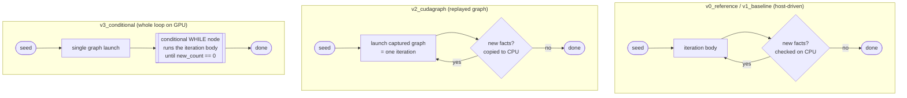

# TC Benchmark: one reference + three CUDA execution strategies

Four versions of the same single-GPU, Datalog-style **Transitive Closure (TC)**
computation:

```
path(a, c) :- path(a, b), edge(b, c).
```

- **`v0_reference`** is a faithful single-GPU port of the original
  `MNMGDatalog/tc.cu` (MPI removed). It keeps the original *sort–merge*
  machinery. It is the **performance reference**: everything else is measured
  against it.
- **`v1`–`v3`** are a redesign that replaces the sort–merge machinery with a
  single open-addressing **hash set**, then progressively move loop control onto
  the GPU. They share identical kernels and differ *only* in how the recursive
  `while` loop is driven.

| Version          | Dedup / fixpoint machinery                         | Loop driver                                    | Control → CPU        |
|------------------|----------------------------------------------------|------------------------------------------------|----------------------|
| `v0_reference`   | Thrust `sort`+`unique`+`set_difference`+`merge`    | host `while` loop, kernels + Thrust calls      | every iteration      |
| `v1_baseline`    | open-addressing hash set (`atomicCAS`)             | host `while` loop, direct kernel launches      | every iteration      |
| `v2_cudagraph`   | open-addressing hash set (`atomicCAS`)             | one iteration captured in a CUDA graph, replayed | every iteration    |
| `v3_conditional` | open-addressing hash set (`atomicCAS`)             | CUDA graph **conditional WHILE node**          | never (single launch)|

`v1`–`v3` mirror the Murmur3 hashing and open-addressing join from
`MNMGDatalog/common/*`; all four are single-GPU and self-contained. All four
produce **identical TC sizes and iteration counts**.

## Why two different designs?

The original `v0` fixpoint relies on Thrust algorithms (`reduce`, `unique`,
`set_difference`, `merge`) that **synchronize the device and return sizes to the
host**, plus a per-iteration `cudaMalloc`/`cudaFree`. That pattern:

- is fine for a host-driven loop (v0, v1),
- **cannot be captured into a CUDA graph** (stream capture forbids synchronizing
  calls), and
- **cannot run inside a conditional WHILE node** (which must be pure device
  kernels/memops, no host-side size decisions).

So to make v2/v3 possible at all, `v1`–`v3` replace the whole
`sort → unique → set_difference → merge` pipeline with **one `atomicCAS` insert**
into a pair hash set: the insert simultaneously deduplicates *and* answers "is
this fact new?" — exactly what `unique` + `set_difference` computed together —
while being fully device-resident. Comparing v1/v2/v3 against v0 shows the gain
from (a) the hash-set redesign and (b) moving loop control onto the GPU.

## The four versions, side by side

```
                         v0_reference (ORIGINAL)          v1 / v2 / v3 (REDESIGN)
                         --------------------------        -------------------------
 per-iteration body:     hash join                         hash join (tc_expand)
                         + thrust::sort                     + atomicCAS insert into
                         + thrust::unique                     a global pair hash set
                         + thrust::set_difference             (dedup + novelty in one)
                         + thrust::merge  (new t_full)
                         + cudaMalloc/cudaFree each iter    fixed pre-allocated buffers
 convergence test:       t_full stopped growing (host)     new_count == 0
 loop driver:            host while                         v1 host while
                                                            v2 replayed CUDA graph
                                                            v3 GPU conditional WHILE
```

Loop-control flow for each version:



In `v0`/`v1`/`v2` the CPU evaluates the convergence test every iteration; in
`v3` the test is done on the GPU via `cudaGraphSetConditional`, so the entire
fixpoint runs from **one** `cudaGraphLaunch`.

## Algorithm (v1–v3, semi-naive with a frontier)

1. **Setup** – load edges, build an open-addressing edge hash table keyed by
   source, seed the frontier and a global pair hash set with the base edges.
2. **Iterate** (`tc_expand`) – for each frontier fact `path(a,b)`, probe the
   edge table for every `edge(b,c)` and try to insert `path(a,c)` into the pair
   set. Only pairs that win the `atomicCAS` insert are appended to the next
   frontier.
3. **Stop** when an iteration produces no new facts.

Sizes change every iteration, so they live in **device memory**
(`d_frontier_size`, `d_new_count`) and the kernels read them at launch. That is
what lets a single instantiated graph be reused (v2) and self-drive (v3).

Per-iteration kernel sequence (identical in v1, v2, v3):

```
tc_reset      -> new_count = 0
tc_expand     -> join frontier with edges, insert new facts, fill new_frontier
tc_promote    -> copy new_frontier -> frontier
tc_set_sizes  -> frontier_size = new_count   (v3 also sets the WHILE condition)
```

`v0` instead runs the original per-iteration body:
`get_join → sort → unique → set_difference → merge` (see `v0_reference/tc_v0.cu`).

## Files

```
common/tc_core.cuh       shared kernels, IO, setup/teardown, shared main (v1-v3)
v0_reference/tc_v0.cu    ORIGINAL thrust sort/merge algorithm (perf reference)
v1_baseline/tc_v1.cu     hash-set redesign, host while-loop
v2_cudagraph/tc_v2.cu    stream-captured graph, replayed per iteration
v3_conditional/tc_v3.cu  conditional WHILE node, whole fixpoint on GPU
tests/verify.sh          runs all 4 on 4 datasets, checks TC size
tests/benchmark.sh       times all 4, speedups vs v0, writes results CSV
Makefile
```

## Build

Requires CUDA. **v3 needs CUDA 12.4+** (conditional graph nodes) and a recent
driver; `cudaStreamBeginCaptureToGraph` needs CUDA 12.3+.

```shell
# Set GPU_ARCH to your device if `native` is not detected, e.g. sm_90 / sm_80.
make all
make GPU_ARCH=sm_90 all
```

### On JLSE (verified)

Verified on a JLSE **A100-PCIE-40GB** node (driver 610.43.02 / CUDA UMD 13.3):

```shell
module load cuda/12.9.1          # 12.4+ required for v3; 12.9.1 recommended
make GPU_ARCH=sm_80 all          # A100 = sm_80  (H100 = sm_90)
make test                        # -> Passed: 16  Failed: 0  (4 versions x 4 datasets)
```

Notes:
- `cuda/12.3.0` is too old for v3 (no conditional node API). Use `cuda/12.9.1`
  (or `cuda/13.3.1`).
- No `gcc` module is required; the system compiler builds this `-std=c++17`
  code. If you do load a newer `gcc` (e.g. `gcc/12.2.0`) for the build, load the
  same module at run time so `libstdc++` matches.
- `GPU_ARCH=native` also works when compiling on the GPU node itself.

## Run

Datasets come from the parent `../data` checkout.

```shell
make run0 DATA=../data/data_7035.bin   # reference (thrust sort/merge)
make run1 DATA=../data/data_7035.bin   # baseline (hash set)
make run2 DATA=../data/data_7035.bin   # cudagraph
make run3 DATA=../data/data_7035.bin   # conditional

# or directly:  ./v1_baseline/tc_v1.out <data.bin> [capacity_mult] [repeats] [frontier_slots]
```

Every version (v0–v3) prints the **same** CSV line with a full timing breakdown,
peak memory, and an end-to-end total. The data row begins with a fixed
**sentinel token `__TCROW__`** so the scripts can pick it out unambiguously even
if the program (or a linked library / driver) prints stray text to stdout:

```
# __TCROW__,Version,Input,Iterations,TC,TotalTime,FileIO,H2D,Setup,Build,Compute,ComputeMin,D2H,PeakMemMB,Repeats,Data
__TCROW__,baseline,7035,64,146120,0.006000,0.001000,0.000500,0.002000,0.000000,0.003600,0.003500,0.000010,300.00,10,../data/data_7035.bin
```

`tests/benchmark.sh` matches the `__TCROW__` line, strips the sentinel, and works
with the remaining 15 columns; the combined CSV under `results/` is written
without the sentinel (plus `dataset` file and README `name`). Anything that isn't
a sentinel row (a stray `72`, a CUDA warning, etc.) is ignored.

### Reported metrics

| Column       | Meaning                                                              |
|--------------|---------------------------------------------------------------------|
| `Iterations` | fixpoint rounds. **Reported by every version** and they must agree. |
| `TC`         | transitive-closure size (correctness).                              |
| `FileIO`     | host read of the `.bin` file.                                       |
| `H2D`        | host→device copy of the edges (data transfer in).                   |
| `Setup`      | edge-table build + buffer allocation + first seed.                  |
| `Build`      | one-time CUDA-graph capture+instantiate (**0** for v0 and v1).      |
| `Compute`    | fixpoint loop, **median** over the timed repeats.                   |
| `ComputeMin` | fixpoint loop, minimum over the timed repeats.                      |
| `D2H`        | device→host copy of the result count (0 for v0, host counter).      |
| `TotalTime`  | **end-to-end** = FileIO+H2D+Setup+Build+Compute(median)+D2H.        |
| `PeakMemMB`  | peak device memory in use (MB).                                     |

So both the **end-to-end total** and the **breakdown** (data transfer vs compute
vs build vs setup) are available. A warm-up run always precedes the timed
repeats. `Setup`/`FileIO`/`H2D`/`Build` are one-time costs measured once; only
`Compute` is repeated.

### `capacity_mult` (arg 2)

The result hash set is sized `next_pow2(n_edges * capacity_mult)` and must be
**≥ ~2× the TC size**. If it is too small the run **fails fast** with
`ERROR: result set / frontier overflow ... increase capacity_mult` (a bounded
probe count prevents the old infinite-hang).

The two frontier buffers are **decoupled** from the set: each is
`min(result_cap, 2^28)` slots by default (arg 4 `frontier_slots` overrides). So
memory is `~ result_cap*8 B (set) + 2 * frontier_cap*8 B` — the frontiers add at
most ~4 GB regardless of TC, which is what lets billion-pair closures fit 40 GB.

**Setup time scales with capacity.** `Setup` includes a `cudaMemset` over the
whole result set, so an over-sized `capacity_mult` inflates both `PeakMemMB` and
the end-to-end `TotalTime` (the fixpoint `Compute` is unaffected). If `Setup`
dominates `TotalTime` for a dataset, lower `capacity_mult` toward ~2× its real TC
size. Example: `data_223001` (TC ≈ 80 M) with `capacity_mult=4096` allocates a
~1 B-slot set (~25 GB, tens of ms of memset); `capacity_mult=1024` is plenty and
much faster, while still avoiding overflow.

## Benchmark

`tests/benchmark.sh` runs all four versions (warm-up + N timed runs) over a set
of datasets and prints, **per version**, the end-to-end total time plus the major
time consumers (compute, setup, io, build) and peak memory, with **speedups
relative to the original reference (v0)**. It labels each dataset with its
README name, cross-checks that iteration counts agree across versions, **skips**
any version that OOMs/overflows (instead of aborting), and writes the full
breakdown CSV under `results/` for plotting.

```shell
make benchmark                       # REPEATS=10, BENCH_MULT=4096, default datasets
make benchmark REPEATS=20            # more timed runs
make benchmark DS="data_7035.bin data_49152.bin"   # pick datasets
make benchmark BENCH_MULT=8192       # larger result-set capacity

# or directly (TIMEOUT=<sec> optionally caps each run; BENCH_DEBUG=1 dumps each
# binary's raw stdout to stderr for troubleshooting):
bash tests/benchmark.sh [REPEATS] [MULT] [dataset.bin ...]
BENCH_DEBUG=1 bash tests/benchmark.sh 5 1024 data_223001.bin
```

Example output (one block per dataset — labelled with its README name — one row
per version). Columns: `total` (end-to-end), `comp` (fixpoint), `setup`
(alloc+memset+seed), `io` (fileio+h2d+d2h), `build` (graph), `mem` (peak):

```
### data_223001.bin  [SF.cedge]  (capacity_mult=1024)
version      iters            TC total(ms)  comp(ms) setup(ms)  io(ms) build(ms) mem(MB)   sp_tot  sp_comp
reference    287        80498014   116.930   110.026    50.000   1.510     0.000  6574.8    1.00x    1.00x
baseline     287        80498014   116.930   110.026    50.000   1.510     0.000  6574.8    ...      ...
```

If a version emits no valid CSV row (OOM/overflow/crash) it is shown as `SKIP`
with a `NOTE:` echoing its raw stdout, so you can see exactly what happened
instead of a garbled row.

`sp_comp` isolates the compute win; `sp_tot` is the end-to-end win (which also
carries the one-time FileIO/H2D/Setup/Build). `sp_tot` for v1 shows the gain from
the **hash-set redesign**; v2 adds **CUDA graphs**; v3 adds the **on-GPU loop**.

### Why is this faster than published Datalog engines (e.g. GPUlog)?

These versions compute the **same reachability/TC** result as general engines
(the TC sizes match, e.g. Gnutella31 = 884,179,859), yet finish in far less time
than GPUlog (ASPLOS'25) reports on an H100 — even though we run on a slower A100.
That is expected, and **not** an apples-to-apples comparison:

- **Specialized vs general.** This is a hand-written **single-rule** TC
  (`path(a,c) :- path(a,b), edge(b,c)`). GPUlog is a *general* Datalog engine
  (arbitrary rules, multi-column/n-way joins, same-generation, program analysis).
- **No sort, no merge, no index.** GPUlog maintains a **sorted, range-indexed**
  relation (HISA) and spends most of its time there — the paper reports
  **join ≈ 39%** and **merge ≈ 42%** of runtime. Our fixpoint has *neither*: a
  single `atomicCAS` into an unordered open-addressing hash set does
  deduplication **and** the "is this new?" test in one operation. We never sort
  or rebuild an index.
- **Memory traded for speed.** We over-allocate a sparse hash set (low load
  factor → few collisions → fast atomics), so our `PeakMemMB` is high. GPUlog's
  HISA is far more memory-efficient. If you shrink `capacity_mult` toward the TC
  size, our atomics slow down as the set fills.
- **Scope of the timer.** `Compute` is the fixpoint kernels only; but even our
  end-to-end `TotalTime` beats the engine numbers because the algorithmic work
  is simply less.
- **Not a general engine.** This benchmark cannot run arbitrary Datalog; it only
  measures how the three CUDA execution strategies compare *on this one query*.
  It is a controlled microbenchmark for the graph-execution study, not a
  replacement for GPUlog.

Bottom line: the speed comes from doing **less work** (no relational-algebra
machinery) and using **more memory**, on a fixed single rule — so it complements,
rather than competes with, a general engine like GPUlog.

### Datasets and single-GPU memory

The dominant cost is the result hash set (`~2*TC` slots × 8 B). Frontier buffers
are **decoupled** and small (each `min(result_cap, 2^28)` slots), so only the set
grows with TC. That lets even billion-pair closures fit one **40 GB** GPU.

Because TC/edge ratios vary enormously, `tests/benchmark.sh` picks a
**per-dataset `capacity_mult`** (see `ds_mult`) so `result_cap ≈ next_pow2(2*TC)`.
The default spread has increasing compute and TC size:

| Dataset (file)                     | TC size | `capacity_mult` | set mem | fits 40 GB |
|------------------------------------|---------|-----------------|---------|------------|
| `data_7035.bin`   (OL.cedge)       | 146 K   | 64              | small   | yes        |
| `data_23874.bin`  (TG.cedge)       | 481 K   | 64              | small   | yes        |
| `data_223001.bin` (SF.cedge)       | 80 M    | 1024            | ~2 GB   | yes        |
| `data_163734.bin` (fe_body)        | 156 M   | 2048            | ~4 GB   | yes        |
| `data_147892.bin` (p2p-Gnutella31) | 884 M   | 12288           | ~17 GB  | yes        |
| `vsp_finan…rlfddd.bin` (vsp_finan) | 910 M   | 3456            | ~17 GB  | yes        |

Two larger datasets sit near the 40 GB limit (result set alone ~34 GB). They use
smaller frontier buffers (`ds_frontier`) and are **opt-in** — add them explicitly
and they'll run if memory permits, else report `SKIP (OOM/...)`:

```shell
make benchmark DS="data_409593.bin com-dblpungraph.bin"   # fe_ocean 1.67B, com-dblp 1.91B
```

| Dataset (file)         | TC size       | `capacity_mult` | set mem | note                 |
|------------------------|---------------|-----------------|---------|----------------------|
| `data_409593.bin`      | 1,669,750,513 | 8192            | ~34 GB  | fe_ocean, tight      |
| `com-dblpungraph.bin`  | 1,911,754,892 | 3800            | ~34 GB  | com-dblp, tight      |

Note: the **reference (v0)** may OOM or overflow `int` sizes on the billion-pair
datasets (its thrust `t_full`+merge can transiently need ~2×TC Entities); if so it
shows `SKIP` and `sp_*` become `-`, while v1–v3 still report their own numbers.

To size a custom dataset by hand: `capacity_mult ≈ ceil(2 * TC / n_edges)` (the
run fails fast with an overflow error if it is too small).

The combined CSV in `results/` has one row per (version, dataset) with every
breakdown column (`total_time`, `fileio`, `h2d`, `setup`, `build`, `compute`,
`compute_min`, `d2h`, `peak_mem_mb`) plus the `dataset` file and its README
`name` (e.g. `data_223001.bin,SF.cedge`) for plotting (e.g. with the repo's
`generate_graphs.py`).

## Verify

`tests/verify.sh` runs all four versions on four datasets and asserts **both**
the TC size **and** the iteration count against the `MNMGDatalog` README. A run
only passes if both match (TC size = correct result; iteration count = the
semi-naive fixpoint converged in the expected number of rounds).

| Dataset      | File            | # Input | # Iterations | # TC    |
|--------------|-----------------|---------|--------------|---------|
| Extra small  | `hipc_2019.bin` | 5       | 3            | 9       |
| Small        | `data_10.bin`   | 10      | 3            | 18      |
| OL.cedge     | `data_7035.bin` | 7,035   | 64           | 146,120 |
| TG.cedge     | `data_23874.bin`| 23,874  | 58           | 481,121 |

```shell
make test
# or
bash tests/verify.sh
```

Each line reports `PASS`/`FAIL` per version per dataset; the script exits
non-zero if any TC size **or** iteration count is wrong. All four versions must
produce identical TC sizes and iteration counts (4 versions × 4 datasets = 16
checks).
